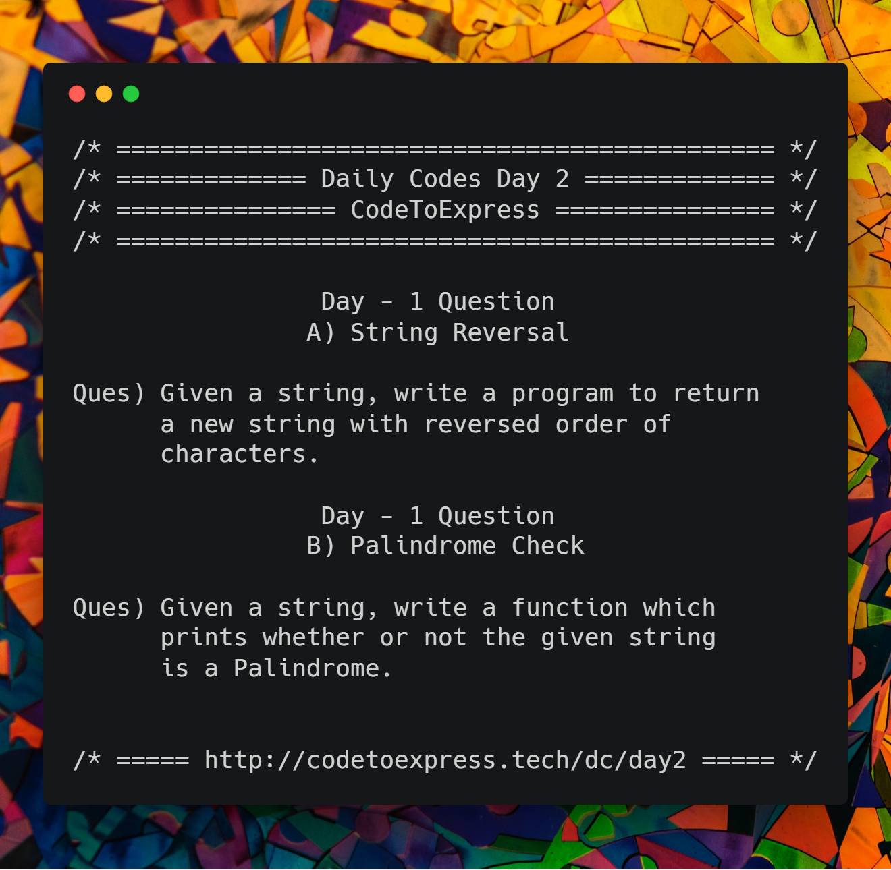



# Day 2 -- String Reversal and Palindrome

## Part A -- String Reversal

**Question** - Given a string, write a program to return a new string with reversed order of characters.



## JavaScript Implementation

### [Solution 1](./JavaScript/sol1.js)

```js
/**
 * @author MadhavBahlMD
 * @date 21/12/2018
 */

// Step 1: Strings are immutable (in JavaScript), hence convert it into array.
// Step 2: Run a loop from 0 to (size of array)/2 and interchange the element at i index with element at position size-1-i 
// Step 3: Join the array to form a string

function strRev (str) {
    var i, j, temp, len = str.length;

    // Strings are immutable in javascript, hence we convert the string into an array
    str = str.split('');

    // Reverse the array elements by interchanging the elements which are equidistant from start and end
    for (i=0, j=len-1; i<=len/2; i++, j--) {
        temp = str[i];
        str[i] = str[j];
        str[j] = temp;
    }

    // Join the reversed array into a string
    str = str.join('');

    // Return the reversed string
    return str;
}

console.log(strRev('Hello!'));
```

### [Solution 2](./JavaScript/sol2.js)

```js
/**
 * @author MadhavBahlMD
 * @date 21/12/2018
 */

// Step 1: Declare a temporary array, say tempArr[]
// Step 2: Run a loop from size-1 to 0 and add corresponding character of string to the tempArr[] from beginning
// Method 2.1 (Add using index)
// for (i=0, j=len-1; i<len; i++, j--) {
//     tempArr[i] = str[j];
// }
// Method 2.2 (Add using `push()` )
// for (j=len-1; j>=0; j--) {
//     tempArr.push(str[j]);
// }
// Step 3: Join the elements of the tempArr[] to form a string

function strRev (str) {
    var i, j,
      len = str.length,
      tempArr = [];

    // Read string in reverse order and store each letter in the array
    for (j=len-1; j>=0; j--) {
        tempArr.push(str[j]);
    }

    // Join the tempArr to convert it into a string
    tempArr = tempArr.join('');

    // Return tempArr
    return tempArr;
}

console.log(strRev('Hello!'));
```

### [Solution 3](./JavaScript/sol2.1.js)

```js
/**
 * @author MadhavBahlMD
 * @date 21/12/2018
 */

function strRev (str) {
    var i, j,
      len = str.length,
      tempArr = [];

    // Read string in reverse order and store each letter in the array
    for (i=0, j=len-1; i<len; i++, j--) {
        tempArr[i] = str[j]; // You can use push() instead of assigning by index
    }

    // Join the tempArr to convert it into a string
    tempArr = tempArr.join('');

    // Return tempArr
    return tempArr;
}

console.log(strRev('Hello!'));
```

### [Solution 4](./JavaScript/sol3.js)

```js
/**
 * @author MadhavBahlMD
 * @date 21/12/2018
 */

// Step 1: Split the given string into array
// Step 2: Reverse the array using reverse() function
// Step 3: Join the reversed array to form a string

// This solution works with JS only (or any other language which supports in built methods)
function strRev (str) {
    // Convert str to array
    // Reverse the array
    // Join the array to form a string

    // let arr = str.split('');
    // arr.reverse();
    // return arr.join('');

    // One Liner answer
    return str.split('').reverse().join('');
}

console.log(strRev('Hello!'));
```

### [Solution 5](./JavaScript/sol4.js)

```js
/**
 * @author MadhavBahlMD
 * @date 21/12/2018
 */

// Step 1: Declare an empty string, say reverse = ''
// Step 2: Run a loop from 0 to length of string
// Step 3: For each letter of original string, concatenate reverse with it. (concatenate each element of string with reverse string, such that element gets concatenated before the current reverse string)

// Using basic string concatenation
function strRev (str) {
    // Initialize an empty string "Reverse"
    let reverse = '';

    for (i=0; i<str.length; i++) {
        // for each letter of original string, concatenate reverse with it
        reverse = str[i] + reverse;
    }

    return reverse;
}

console.log(strRev('Hello!'));
```

### [Solution 6](./JavaScript/sol5.js)

```js
/**
 * @author MadhavBahlMD
 * @date 21/12/2018
 */

// Method 5 -- Using reduce helper

// Using reduce helper function (JS only)
function strRev(str) {
    // return str.split('').reduce((reversed, character) => {
    //     return character+reversed;
    // }, '');

    // One Liner
    return str.split('').reduce((rev, letter) => letter + rev, '');
}

console.log(strRev('Hello!'));
```

## Java Implementation

### [Solution 1](./Java/Reverse.java)

```java
/**
 * @author MadhavBahlMD
 * @date 21/12/2018
 */

import java.util.Scanner;

public class Reverse {
    public static void main(String[] args) {
        System.out.println("/* ===== String Reversal ===== */");
        System.out.print("\nPlease enter the string: ");
        Scanner input = new Scanner(System.in);
        String str = input.next();
        String reversed = "";

        for (int i=0; i<str.length(); i++) {
            reversed = str.charAt(i) + reversed;
        }

        System.out.println("Reversed String: " + reversed);
    }
}
```

### [Solution by @nomitpahuja] (./Java/ReverseString.java)

```java
/*
 * @author Nomit Pahuja
 * date: 29/01/2018
 */

import java.util.Scanner;

 public class ReverseString {
    
    public static String reverseString(String word, int length){
        String reverseWord = "";
        for(int i=length-1; i>=0; i--){
            reverseWord += word.charAt(i);
        }
        return reverseWord;
    }
    
    public static void main(String[] args){
         Scanner input = new Scanner(System.in);
         System.out.print("Enter the String: ");
         String word = input.next();
         int length = word.length();
         String reverse = reverseString(word, length);
         System.out.println("The reversed string is: " + reverse);
         input.close();
     }
 }
```

### [Solution by @malhotra1432](./Java/StringReversal.java)

```java
/* @date 03/10/2020
 * @author Prabhat Malhotra
 */

import org.junit.jupiter.api.Test;

import static org.junit.jupiter.api.Assertions.*;

/*
 * Solution A - String Reversal
 */
public class StringReversal {
    public String stringReversal(String randomString) {
        byte[] randomStringAsByteArray = randomString.getBytes();
        byte[] byteArrayResult = new byte[randomStringAsByteArray.length];
        for (int i = 0; i < byteArrayResult.length; i++) {
            byteArrayResult[i] = randomStringAsByteArray[randomStringAsByteArray.length - i - 1];
        }
        return new String(byteArrayResult);
    }
}

/*
 * Test A - String Reversal
 */
class StringReversalTest {
    @Test
    public void reverseString() {
        String randomString = "prabhat";
        StringReversal stringReversal = new StringReversal();
        System.out.println("The reverse of string " + randomString + " is " + stringReversal.stringReversal(randomString));
    }
}

/*
 * Solution B - Palindrome Check
 */
class PalindromeCheck {
    public boolean palindromeChek(String randomString) {
        StringReversal stringReversal = new StringReversal();
        String reversedString = stringReversal.stringReversal(randomString);
        return reversedString.equals(randomString);
    }
}

/*
 * Test B - Palindrome Check
 */
class PalindromeCheckTest {
    @Test
    public void shouldBePalindrome() {
        String randomString = "LOL";
        PalindromeCheck palindromeCheck = new PalindromeCheck();
        if (palindromeCheck.palindromeChek(randomString)) {
            System.out.println(randomString + " is a palindrome");
        }
        assertTrue(palindromeCheck.palindromeChek(randomString));
    }

    @Test
    public void shouldNotToBePalindrome() {
        String randomString = "HOT";
        PalindromeCheck palindromeCheck = new PalindromeCheck();
        if (!palindromeCheck.palindromeChek(randomString)) {
            System.out.println(randomString + " is not a palindrome");
        }
        assertFalse(palindromeCheck.palindromeChek(randomString));
    }
}

```


## C++ Implementation

### [Solution by @imkaka](./C++/reverseString.cpp)

```cpp
/*
* @author: imkaka
* @date :  21/12/2018
*/

#include<iostream>
#include<string>

using namespace std;

int main(){

    string str;
    cin >> str ;

    int size = str.size();
    for(int i = 0; i< size/2; i++)
    {
        char temp = str[i];
        str[i] = str[size-i-1];
        str[size-1-i] = temp;
    }

    cout << str << endl;
return 0;
}
```

###[Solution by @profgrammer](./C++/profgrammer_reversepalindrome.cpp)
```c
/*
  *@author: profgrammer
  *@date: 30-12-2018
*/

#include <bits/stdc++.h>
using namespace std;


int main() {
  string s;
  cin>>s;

  // method 1: print the string in reverse order
  cout<<"The reversed string is: ";
  for(int i = s.size()-1;i >= 0;i--) cout<<s[i];
  cout<<endl;

  // method 2: swap characters at either end
  string s1 = s;
  for(int i = 0, j = s1.size()-1;i <= j;i++, j--){
    char temp = s1[i];
    s1[i] = s1[j];
    s1[j] = temp;
  }
  cout<<"The reversed string is: "<<s1<<endl;

  // method 3: library functions
  s1 = s;
  reverse(s1.begin(), s1.end());
  cout<<"The reversed string is: "<<s1<<endl;

  // to check if the string is a palindrome, we need to check if it is equal to its reverse.

  if(s.compare(s1) == 0) cout<<"The string is a palindrome"<<endl;
  else cout<<"The string is not a palindrome\n";
}
```

### [Solution by @divyakhetan](./C++/reverseday2.cpp)

```cpp
/**
 * @author:divyakhetan
 * @date: 30/12/2018
 */


#include<bits/stdc++.h>
using namespace std;


int main(){
	string s;
	cin >> s;
	reverse(s.begin(), s.end());
	cout <<s;
	return 0;
}
```

## Python Implementation

### [Solution 1](./Python/Reverse.py)

```python
'''
 * @author: ashwek
 * @date: 21/12/2018
'''

Str = input("Enter a string : ")

print("Reverse of", Str, "=", Str[::-1])
```

## C++ Implementation

### [reverse.cpp](./C++/reverse.cpp)

```cpp
/**
 * @author: Rajdeep Roy Chowdhury<rrajdeeproychowdhury@gmail.com>
 * @github: https://github.com/razdeep
 * @date: 21/12/2018
 */
#include<iostream>

using namespace std;

string strRev(const string& s)
{
    static string temp=s;
    int k=0;
    for(int i=s.size()-1;i>=0;i--)
    {
        temp[k++]=s[i];
    }
    return temp;
}

int main()
{
    string s="Hello";
    string rev=strRev(s);
    cout<<rev<<endl;
    return 0;
}
```
## C Implementation

### [Solution 1](./C/Reverse.c)

```c
/**
  * @author : ashwek
  * @date : 21/12/2018
  */

#include<stdio.h>
#include<string.h>

void reverse(char Str[]){
    char temp;
    int i;

    for(i=0; i<(strlen(Str)/2); i++){
        temp = Str[i];
        Str[i] = Str[strlen(Str)-i-1];
        Str[strlen(Str)-i-1] = temp;
    }
}

void main(){

    char Str[50], Rev[50];
    printf("Enter a string = ");
    scanf("%s", Str);

    strcpy(Rev, Str);
    reverse(Rev);

    printf("Reverse = %s", Rev);
}
```

## Ruby Implementation

### [reverse.rb](./Ruby/reverse.rb)

```ruby
=begin
 @author: aaditkamat
 @date: 22/12/2018
=end

def short_solution(str)
  if str.class != String or str === nil
    return false
  end
  str.reverse
end

def long_solution_iterative(str)
  if str.class != String or str === nil
    return false
  end
  reverse = ''
  i = 0
  until i >= str.length do
    reverse.insert(0, str[i])
    i += 1
  end
  reverse
end

def long_solution_recursive(str)
  if str.class != String or str === nil
    return false
  end
  if str === ''
    return ''
  end
  temp = str[0]
  str[0] = str[-1]
  str[-1] = temp
  return long_solution(str[1..-2])
end
```

<hr />

## Part B -- Palindrome Check

**Question** - Given a string, write a function which prints whether or not the given string is a Palindrome

## JavaScript Implementation

### [Solution 1](./JavaScript/palindrome1.js)

```js
/**
 * @author MadhavBahlMD
 * @date 21/12/2018
 */

// Method 1 (Check the equidistant characters)
// Step 1: Set a flag variable ( = 1 )
// Step 2: Run a loop from 0 to stringLength/2 
// Step 3: In each iteration check whether character at ith position is equal to the character at length-i-1 position.
// Step 4: If the condition is satisfied even once, set the flag to 0
// Step 5: After the iterations are over, if the flag = 1, print "Palindrome" else print "Not Palindrome"

function isPalindrome (str) {
    let i, len = str.length, flag = 1;

    // Check the equidistant characters
    for (i=0; i>=len/2; i++) {
        if (str[i] !== str[len-1-i]) {
            flag = 0;
            break;
        }
    }

    // Print the result based on flag
    if (flag === 1) {
        console.log("The given string \"" + str + "\" is a palindrome");
    } else {
        console.log("The given string \"" + str + "\" is not a palindrome");
    }
}

isPalindrome("hello");
isPalindrome("level");
```

### [Solution 2](./JavaScript/palindrome2.js)

```js
/**
 * @author MadhavBahlMD
 * @date 21/12/2018
 */

// Step 1: Find the reverse of the given string
// Step 2: If reverse is equal to original string, print "Palindrome", else print "Not Palindrome".

function isPalindrome (str) {
    let reversed = str.split('').reverse().join('');
    if (str === reversed) {
        console.log("The given string \"" + str + "\" is a palindrome");
    } else {
        console.log("The given string \"" + str + "\" is not a palindrome");
    }
}

isPalindrome('hello');
isPalindrome('level');
```

### [Solution 3](./JavaScript/palindrome3.js) -- One Liner

```js
/**
 * @author MadhavBahlMD
 * @date 21/12/2018
 */

// One Liner
function isPalindrome (str) {
    (str === (str.split('').reverse().join(''))) ? console.log("Palindrome") : console.log("Not Palindrome");
}

isPalindrome('hello');
isPalindrome('level');
```

## Java Implementation

### [Solution 1](./Java/Palindrome1.java)

```java
/**
 * @author MadhavBahlMD
 * @date 21/12/2018
 */

import java.util.Scanner;

public class Palindrome {
    public static void main (String[] args) {
        System.out.println("/* ===== Palindrome Check ===== */");
        System.out.print("\nPlease enter a string to check: ");

        // Read the string
        Scanner input = new Scanner(System.in);
        String str = input.next();
        int size = str.length(), flag =1;

        // Check whether it is palindrome
        for (int i=0, j=size-1; i<=size/2; i++, j--) {
            // Check whether the characters equidistant from start and end are same or not
            if (str.charAt(i) != str.charAt(j)) {
                flag = 0;
                break;
            }
        }

        // Print results according to flag
        if (flag == 0) {
            System.out.println("The given string \"" + str + "\" is not a palindrome");
        } else {
            System.out.println("The given string \"" + str + "\" is a palindrome");
        }
    }
}
```

### [Solution 2](./Java/Palindrome2.java)

```java
/**
 * @author MadhavBahlMD
 * @date 21/12/2018
 */

import java.util.Scanner;
// Method 2: Check whether reversed string is equal to the original string

public class Palindrome2 {
    public static void main (String[] args) {
        System.out.println("/* ===== Palindrome Check ===== */");
        System.out.print("\nPlease enter a string to check: ");

        // Read the string
        Scanner input = new Scanner(System.in);
        String str = input.next();
        String reversed = "";
        int size = str.length();

        // Reverse the string
        for (int i=0; i<str.length(); i++) {
            reversed = str.charAt(i) + reversed;
        }

        // Check if the reversed string is same as the original string
        if (str.equals(reversed)) {
            System.out.println ("The given string \"" + str + "\" is a Palindrome");
        } else {
            System.out.println ("The given string \"" + str + "\" is not a Palindrome");
        }
    }
}
```
### [Solution 3](./Java/day2_neha.java)

```java
/**
 * @date 29th jan 2019
 * @author nehabindal
 */
import java.util.*;
public class day22 {
    public static void main(String[] args)
    {
        System.out.println("Input a string to check it it's a pallindrome or not");
        Scanner sc = new Scanner(System.in);
        String st = sc.nextLine();
        int l = st.length();
        int flag=0;
        for(int i=0;i<l/2;i++)
        {
            if(st.charAt(i)!=st.charAt(l-1-i))
            {
                flag=1;
            }
        }
        if(flag==1)
        {
            System.out.println("Not a pallindrome");
        }
        else{
            System.out.println("Yay a pallindorme");
        }

    }

}
```

### [Solution by @nomitpahuja](./Java/Palindrome_nomit.java)

```java 
/*
 * @author Nomit Pahuja
 * date: 29/01/2019
 */

 import java.util.Scanner;

 public class Palindrome {
     public static void main(String[] args){
         Scanner input = new Scanner(System.in);
         System.out.print("Enter the String: ");
         String word = input.next();
         word = word.toLowerCase();
         int size = word.length();
         int flag = 1;

         //checking if string is palindrome or not
         for(int i = 0, j = size-1; i<size/2; i++, j--){
             if(word.charAt(i) != word.charAt(j)){
                 flag = 0;
             }
         }

         //print if string is palindrome or not
         if(flag == 0){
             System.out.println("The given string is not a palindrome.");
         } else {
             System.out.println("The given string is a palindrome.");
         }

         input.close();
     }
 }
 ```

## C++ Implementation

### [Solution by @imkaka](./C++/checkPalindrome.cpp)

```cpp
/*
* @author: imkaka
* @date :  21/12/2018
*/

#include<iostream>
#include<string>

using namespace std;

int main(){

    string str;
    cin >> str ;

    int size = str.size();
    bool flag = false;
    for(int i = 0; i< size/2; i++)
    {
        if(str[i] != str[size-i-1])
        {
           flag = true;
           break;
        }
    }

    if(!flag)
        cout << str <<" is a Palindrome!!"  << endl;
    else
        cout << str << " is NOT a Palindrome!" << endl;

    return 0;
}
```

### [Solution by @divyakhetan](./C++/palindromeday2.cpp)

```cpp
/**
 * @author:divyakhetan
 * @date: 30/12/2018
 */


#include<bits/stdc++.h>
using namespace std;


int main(){
	string s;
	cin >> s;
	string t = s;
	reverse(s.begin(), s.end());
	if(s.compare(t) == 0) cout << "Palindrome!";
	else cout << "Not a palindrome";
	return 0;
}
```

## Python Implementation

### [Solution 1](./Python/Palindrome.py)

```python
'''
 * @author: ashwek
 * @date: 21/12/2018
'''

Str = input("Enter a string : ")

print(Str, "is", end=" ")

if( Str != Str[::-1] ):
    print("Not", end=" ")

print("Palindrome")
```

## C Implementation

### [Solution 1](./C/Palindrome.py)

```c
/**
  * @author : ashwek
  * @date : 21/12/2018
  */

#include<stdio.h>
#include<string.h>

void reverse(char Str[]){
    char temp;
    int i;

    for(i=0; i<(strlen(Str)/2); i++){
        temp = Str[i];
        Str[i] = Str[strlen(Str)-i-1];
        Str[strlen(Str)-i-1] = temp;
    }
}

void main(){

    char Str[50], Rev[50];
    printf("Enter a string = ");
    scanf("%s", Str);

    strcpy(Rev, Str);
    reverse(Rev);

    printf("%s is ", Str);
    if( strcmp(Str, Rev) != 0)
        printf("not ");
    printf("palindrome\n");
}

```
## Python implementation

### String reversing and pallindrome checking(./python3/String_and_pallindrome.py)

```python
"""
 * @author Shashank
 * @date 21/12/2018
"""

a=input("Enter the input string:")
d=a.replace(" ","")
c=list(d)
c.reverse()
e="".join(c)
if d==e:
    print("String is pallindrome")
else:
    print("Not a pallindrome")
```
## Ruby implementation

### [palindrome.rb](./Ruby/palindrome.rb)

```ruby
=begin
 @author: aaditkamat
 @date: 22/12/2018
=end
require './reverse'

def palindrome(str)
  str != nil and str === short_solution(str)
end

```java

/* date - 23/09/2020
 * author - @Shashwat Gupta (shashwatxdevelop)
 */
import java.util.Scanner;
public class StringReverseAndPalin {

	public static void main(String[] args) {
		String s,s1=""; int i, l;
		char ch = 0;
         Scanner sc= new Scanner (System.in);
         s = sc.nextLine();   // Input the string
         l = s.length();     // Taking the length of string
         for(i=l-1; i>=0; i--)       // For loop for the extraction of character from the string s
         {
        	 ch = s.charAt(i);
        	 s1 = s1+ ch;               // Storing the extracted character in new string s1 
         }
          System.out.println(s1);             // Printing the new reversed string s1
          if (s.equals(s1))               // if block to  check if the reversed string is palindrome or not
        	  System.out.println("String is Palindrome");
        	  else
        		  System.out.println("String is not Palindrome");
	}

}
```

## Kotlin Implementation
### [ReverseAndPalindrome.kts](./Kotlin/ReverseAndPalindrome.kts)

##### To run this script `kotlinc -script ReverseAndPalindrome.kts`
 _*Prereq: Kotlin must be installed._
```
/**
 * @author: d-l-mcbride
 * @date: 10/11/2020
 **/

fun reverse(subject:String):String {
        var reversed = StringBuilder()

        for( j in (subject.length -1) downTo 0){
            reversed.append(subject[j])
        }
        return reversed.toString()
}


fun palindrome(subject:String){
    val reversed = reverse(subject)
    if (reversed == subject) println("${subject} is a palindrome") else println("${subject} is not a palindrome")
}

val hello = "Hello"
val goodbye = "Goodbye"
val single = "S"

println("Reverse String Tests")
println("${hello} reversed is ${reverse(hello)}")
println("${goodbye} reversed is ${reverse(goodbye)}")
println ("${single} reversed is ${reverse(single)}")

println("\n\nPalindrome Tests")
palindrome("I")
palindrome("otto")
palindrome("tacocat")
palindrome("dog")
```

### Have Another solution?

The beauty of programming lies in the fact that there is never a single solution to any problem.

In case you have an alternative way to solve this problem, do contribute to this repository (https://github.com/CodeToExpress/dailycodebase) :)
