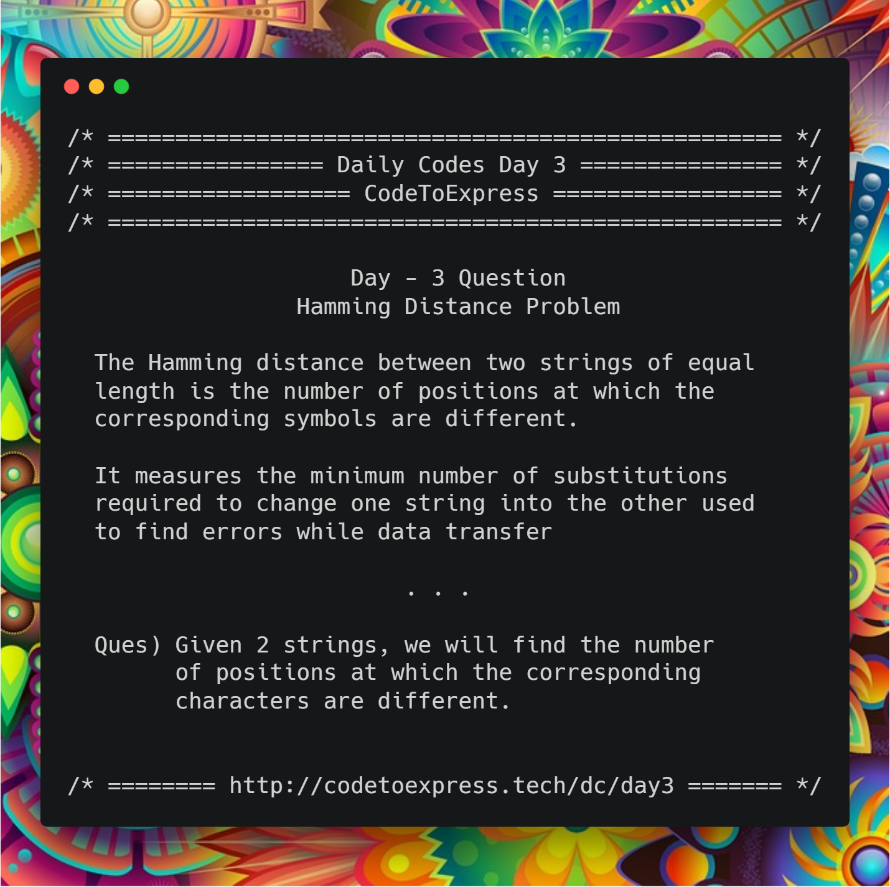



# Day 3 -- The Hamming Distance Problem

The Hamming distance between two strings of equal length is the number of positions at which the corresponding symbols are different.

It measures the minimum number of substitutions required to change one string into the other or the minimum number of errors that could have transformed one string into the other.

Read more about Hamming Distance [here…](https://en.wikipedia.org/wiki/Hamming_distance)

**Question**- Given 2 strings, we will find the number of positions at which the corresponding characters are different.



**Example**

```
The hamming distance between
- "karolin" and "kathrin" is 3
- "karolin" and "kerstin" is 3
- 1011101 and 1001001 is 2
- 2173896 and 2233796 is 3
```

## JavaScript Implementation

### [Solution](./JavaScript/hamming.js)

```js
function hammingDistance (str1, str2) {
    let size1 = str1.length,
      size2 = str2.length,
      distance = 0;

    // Check if the strings are of equal length
    if (size1 !== size2) {
        console.log ("The strings \"" + str1 + "\" and \"" + str2 + "\" do not have equal lengths");
        return -1;
    }

    // Check the different characters at corresponding positions
    for (let i=0; i<size1; i++) {
        if (str1[i] !== str2[i]) {
            distance++;
        }
    }

    // Print the result and return the hamming distance
    console.log(`The hamming distance between "${str1}" and "${str2}" is ${distance}`);
    return distance;
}

hammingDistance('karolin', 'kathrin');
hammingDistance('karolin', 'kerstin');
hammingDistance('1011101', '1001001');
hammingDistance('2173896', '2233796');
```

## Java Implementation

### [Solution](./Java/HammingDistance.java)

```java
import java.util.Scanner;

public class HammingDistance {
    public static void main (String[] args) {
        System.out.println("/* ===== The Hamming Distance Problem ===== */");

        // Input the strings
        Scanner input = new Scanner(System.in);
        System.out.print("Enter the first string: ");
        String str1 = input.next();
        System.out.print("Enter the second string: ");
        String str2 = input.next();

        // set distance equal to zero
        int distance = 0;

        // check whether the strings are equal
        if (str1.length() != str2.length()) {
            System.out.println("Wrong Input! \"" + str1 + "\" and \"" + str2 + "\" are not of equal length");
            System.exit(-1);
        }

        // Check the different characters at corresponding positions
        for (int i=0; i<str1.length(); i++) {
            if (str1.charAt(i) != str2.charAt(i)) {
                distance++;
            }
        }

        // Print the result and return the hamming distance
        System.out.println("The Hamming Distance between the strings \"" + str1 + "\" and \"" + str2 + "\" is = " + distance);
        System.exit(0);
    }
}
```

## C++ Implementation

### [hamming.cpp](./C++/hamming.cpp)

```cpp
/*
 * @author: aaditkamat
 * @date: 24/12/2018
 */
 #include<iostream>
 #include<string>

 using namespace std;

 int hammingDistance(string first_word, string second_word) {
     int count = 0;
     if (first_word.size() != second_word.size()) {
        return -1;
     }
     for (int i = 0; i < first_word.size(); i++) {
         if (first_word[i] != second_word[i]) {
             count++;
         }
     }
     return count;
 }

 int main() {
     string first_word, second_word;
     cout << "Enter the first word: ";
     cin >> first_word;
     cout << "Enter the second word: ";
     cin >> second_word;
     cout << "The hamming distance between " << first_word << " and " << second_word << " is: " << hammingDistance(first_word, second_word) << endl;
     return 0;
 }
```

### [hamingDistance](./C++/hamingDistance.cpp)

```cpp

/*
* @author : imkaka
* @date : 24/12/2018
*/

#include<iostream>
#include<string>

using namespace std;

int main(){

    string str1, str2;

    cin >> str1 >> str2;

    int dis = 0;
    if(str1.size() != str2.size())
        cout << "Not Valid Strings for Hamming Distance Problem!!" << endl;
    else{

        for(int i=0; i < str1.size(); ++i){

            if(str1[i] != str2[i]) dis++;

        }

        cout << "Hamming Distance b/w " << str1 << " and " << str2 << " is " << dis << "." << endl;
    }

    return 0;
}
```

###[Solution by @profgrammer](./C++/profgrammer_hammingdistance.cpp)
```c
/*
  *@author: profgrammer
  *@date: 30-12-2018
*/


#include <bits/stdc++.h>
using namespace std;

int main() {
  string s1, s2;
  cin>>s1>>s2;
  cout<<"The hamming distance is : ";
  // the hamming distance is calculated for strings of EQUAL length. hence if the lengths differ we return -1 as an invalid case.
  if(s1.size() != s2.size()) cout<<-1<<endl;
  else{
    // iterate through both strings and find the number of indices where the strings differ. the total of these indices is the hamming distance
    int hammingDistance = 0;
    for(int i = 0;i < s1.size();i++){
      if(s1[i] != s2[i]) hammingDistance++;
    }
    cout<<hammingDistance<<endl;
  }
}
```

### [hamingDistance](./C++/hammingDistanceday3.cpp)

```cpp
/**
 * @author:divyakhetan
 * @date: 30/12/2018
 */


#include<bits/stdc++.h>
using namespace std;


int main(){
	string s1, s2;
	cin >> s1 >> s2;
	if(s1.length() != s2.length()) cout << "Enter strings of equal length";
	else{
		int count = 0; 
		for(int i = 0; i < s1.length(); i++){
			if(s1[i] != s2[i]) count++;
		}
		cout << "The Hamming Distance is: " << count;
	}
	return 0;
}

## C Implementation

### [hamming.c](./C/hamming.c)

```c
/**
 * @author: Rajdeep Roy Chowdhury<rrajdeeproychowdhury@gmail.com>
 * @github: https://github.com/razdeep
 * @date: 24/12/2018
 */

#include <stdio.h>
#include <string.h>

int hammingDistance(const char *first_word, const char *second_word)
{
    int count = 0;
    if (strlen(first_word) != strlen(second_word))
    {
        return -1;
    }
    for (int i = 0; i < strlen(first_word); i++)
    {
        if (first_word[i] != second_word[i])
        {
            count++;
        }
    }
    return count;
}

int main()
{
    char first_word[100], second_word[100];
    printf("Enter the first word: ");
    scanf("%s", first_word);
    printf("Enter the second word: ");
    scanf("%s", second_word);
    printf("The hamming distance between %s and %s is: %d\n", first_word, second_word, hammingDistance(first_word, second_word));
    return 0;
}
```

### [Solution](./C/HammingDistance.c)

```c
#include<stdio.h>
#include<string.h>

int HammingDistance(char Str1[], char Str2[]){

    int i, count = 0;

    if( strlen(Str1) != strlen(Str2) )
        return -1;

    for(i=0; i<strlen(Str1); i++){
        if( Str1[i] != Str2[i])
            count++;
    }

    return count;
}

void main(){

    char Str1[50], Str2[50];
    int HD;

    printf("Enter string 1 = ");
    scanf("%s", Str1);
    printf("Enter string 2 = ");
    scanf("%s", Str2);

    HD = HammingDistance(Str1, Str2);

    if( HD == -1 )
        printf("Strings are of different length");
    else
        printf("Hamming Distance = %d", HD);
}
```
## Python Implementation

### [Solution](./Python/HammingDistance.py)

```python
def HammingDistance(Str1, Str2):

    count = 0

    if( len(Str1) != len(Str2) ):
        return None

    for i in range(len(Str1)):
        if( Str1[i] != Str2[i]):
            count += 1

    return count

Str1 = input("Enter string 1 = ")
Str2 = input("Enter string 2 = ")

HD = HammingDistance(Str1, Str2)

if( HD is None ):
    print("Strings are of different length")
else:
    print("Hamming Distance = ", HD)
```
##Python Implementation

### [Solution](./Python/Shashankham.py)
``` Python
"""
 * @author: Shashank Jain
 * @date: 24/12/2018
"""
### [Solution](./Python/Shashankham.py)
``` Python
"""
 * @author: Shashank Jain
 * @date: 24/12/2018
"""
a=input("Enter the first string?")
b=input("Enter the second string?")
c=list(a.replace(" ",""))
d=list(b.replace(" ",""))
k=[i for i,j in zip(c,d) if i!=j]
print("list of unmatched characters are:",k)
print("number of characters not matching are:",len(k))

```

## Why Hamming Distance?

The #1 reason for not being successful is inconsistency, and it is a common trend that people start something and on give up on the third day itself, and one of the major reasons behind that is that they find it difficult to continue. 
So, to keep everyone (who is following the DailyCodes challenge) consistent, I have decided to keep today's question very simple and straightforward.

### Have Another solution?

The beauty of programming lies in the fact that there is never a single solution to any problem.

In case you have an alternative way to solve this problem, do contribute to this repository (https://github.com/CodeToExpress/dailycodebase) :)