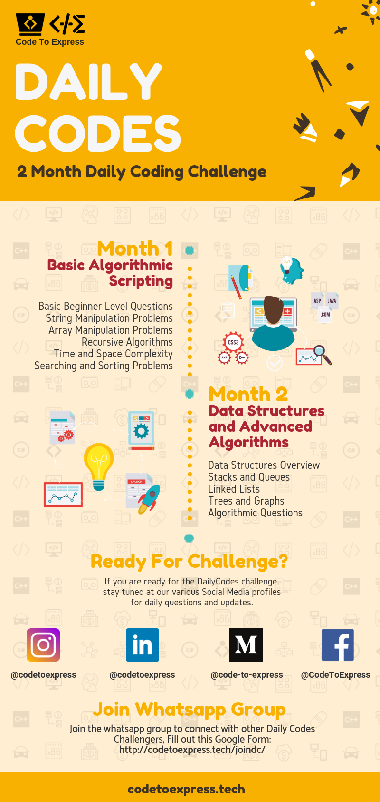

<h1 align="center">
  Daily Codes
</h1>

<p align="center">
  Coding is Fun! Do it everyday 💯💯
  <br />
  Code Daily, add your solutions to the given problem, submit a PR (and don't forget to add your name in the contributors list)
</p>

<a style="margin: 0" href="https://t.me/codetoexpress"></a>
<a style="margin: 0" href="http://codetoexpress.tech/joindc/"></a>
<a style="margin: 0" href="https://codetoexpress.tech/invite/"></a>

***

[](http://hits.dwyl.io/CodeToExpress/dailycodebase) [](https://GitHub.com/CodeToExpress/dailycodebase/commit-activity) [](http://codetoexpress.tech/dailycodebase) [](http://madhavbahl.tech/contact/) [](http://commonmark.org) [](http://ansicolortags.readthedocs.io/?badge=latest) 


## Want To Be a Contributor?

Read [CONTRIBUTING.md](./CONTRIBUTING.md) for contribution guidelines.

## Code Today!

1. [Day 1 -- The Fizz Buzz Problem](./Day1/) -- [http://codetoexpress.tech/dc/day1](http://codetoexpress.tech/dc/day1)
2. [Day 2 -- String Reversal + Palindrome](./Day2/) -- [http://codetoexpress.tech/dc/day2/](http://codetoexpress.tech/dc/day2)
3. [Day 3 -- The Hamming Distance Problem](./Day3/) -- [http://codetoexpress.tech/dc/day3/](http://codetoexpress.tech/dc/day3/)
4. [Day 4 -- Num Vowels + Max Chars](./day4/) -- [http://codetoexpress.tech/dc/day4/](http://codetoexpress.tech/dc/day4/)
5. [Day 5 -- Pattern Printing Problems](./day5/) -- [http://codetoexpress.tech/dc/day5/](http://codetoexpress.tech/dc/day5/)
6. [Day 6 -- Sentence Cap + Word Reversal + Anagram](./day6/) -- [http://codetoexpress.tech/dc/day6/](http://codetoexpress.tech/dc/day6/)
7. [Day 7 -- One Edit Away](./day7/) -- [http://codetoexpress.tech/dc/day7/](http://codetoexpress.tech/dc/day7/)
8. [Day 8 -- Minimum Edit Distance](./day8/) -- [http://codetoexpress.tech/dc/day8/](http://codetoexpress.tech/dc/day8/)
9. [Day 9 -- Smallest Substring Problem](./day9/) -- [http://codetoexpress.tech/dc/day9/](http://codetoexpress.tech/dc/day9/)
10. [Day 10 -- String Permutation Problem](./day10/) -- [http://codetoexpress.tech/dc/day10/](http://codetoexpress.tech/dc/day10/)
11. [Day 11 -- Longest Common Substring](./day11/) -- [http://codetoexpress.tech/dc/day11/](http://codetoexpress.tech/dc/day11/)
12. [Day 12 -- Substring Search Algorithms](./day12/) -- [http://codetoexpress.tech/dc/day12/](http://codetoexpress.tech/dc/day12/)
13. [Day 13 -- Factorial and Fibonacci](./day13/) -- [http://codetoexpress.tech/dc/day13/](http://codetoexpress.tech/dc/day13/)
14. [Day 14 -- Sum of digits and product of numbers](./day14) -- [http://codetoexpress.tech/dc/day14/](http://codetoexpress.tech/dc/day14/)
15. [Day 15 -- Pascal's Triangle](./day15) -- [http://codetoexpress.tech/dc/day15/](http://codetoexpress.tech/dc/day15/)
16. [Day 16 -- Tower of Hanoi](./day16) -- [http://codetoexpress.tech/dc/day16/](http://codetoexpress.tech/dc/day16/)
17. [Day 17 -- N Queens Problem](./day17) -- [http://codetoexpress.tech/dc/day17/](http://codetoexpress.tech/dc/day17/)
18. [Day 18 -- Frequency Count and Check Power N](./day18) -- [http://codetoexpress.tech/dc/day18/](http://codetoexpress.tech/dc/day18/)
19. [Day 19 -- Cartesian Product and Shuffle Algorithm](./day19) -- [http://codetoexpress.tech/dc/day19/](http://codetoexpress.tech/dc/day19/)
20. [Day 20 -- Array Partition](./day20) -- [http://codetoexpress.tech/dc/day20/](http://codetoexpress.tech/dc/day20/)
21. [Day 21 -- Pair Sum N and Max Subarray Sum](./day21) -- [http://codetoexpress.tech/dc/day21/](http://codetoexpress.tech/dc/day21/)
22. [Day 22 -- Common Elements Search](./day22) -- [http://codetoexpress.tech/dc/day22/](http://codetoexpress.tech/dc/day22/)

## [More Problems](./BONUS/README.md)

A real coder should not be satisfied by doing only one problem daily, rather he/she should keep coding as much as possible. So, here I ([@MadhavBahlMD](https://github.com/MadhavBahlMD)) am adding some more problems that you can practise 😃

Also, these problems have been taking form various sources, so ig you think you own any of the given problems, just send me an email at theleanprogrammer@gmail.com and I will be more than happy to give proper credits 😊

#### Want to contribute?

The file structure is as follows

```
\DAILY CODE BASE
├───BONUS
│   ├───Algorithms
│   ├───Arrays
│   ├───Graphs
│   ├───LinkedLists
│   ├───Queues
│   ├───Recursion
│   ├───Stacks
│   ├───Strings
│   └───Trees
```

In this main `README.md`, there are links to the README of `BONUS` directory, and the `README.md` of sub topics
In the `README.md` of `BONUS` directory, there is the list of all topics and under that there are all questions
In the `README.md` of any topic directory, say `Arrays` there is a README which contains all questions of that topic along with the link to the `README.md` of the directory containing the question
The `README.md` of directory containing the question must contain all the information about the question with some examples and the solution, and a little writeup about the algorithm used.

**Before contributing any question, make sure that this structure is followed properly**

#### NOTE

In case you just want to contribute a question and not code, there is no need to do so many things, just open an issue with the topic **Problem Submission** and the problem in the comments. I'll add it myself, and will give you proper credits 😃

## Practise Problems 😁

1. [**Strings**](./BONUS/Strings/README.md)
2. [**Recursion**](./BONUS/Recursion/README.md)
3. [**Array**](./BONUS/Arrays/README.md)
4. [**Algorithms**](./BONUS/Algorithms/README.md)
5. [**Stacks**](./BONUS/Stacks/README.md)
6. [**Queues**](./BONUS/Queues/README.md)
7. [**Linked Lists**](./BONUS/LinkedLists/README.md)
8. [**Trees**](./BONUS/Trees/README.md)
9. [**Graphs**](./BONUS/Graphs/README.md)

## Timeline

<p align="center">
  
</p>