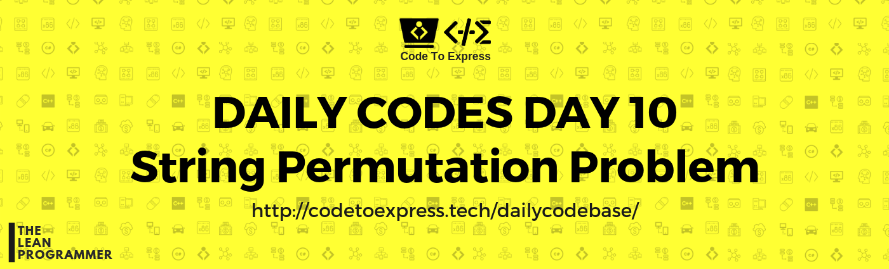
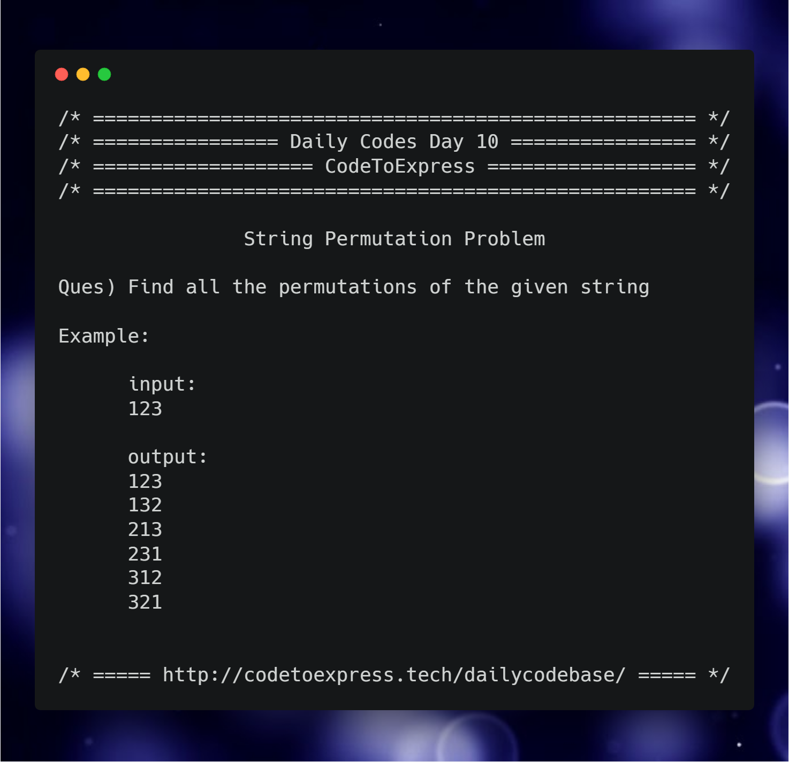

# Day 10 -- String Permutation Problem

**Question** Find all the permutations of the given string

```
Example:
input: 
123

output:
123
132
213
231
312
321
```



## JavaScript Implementation

### [Solution using recursion](./JavaScript/stringPermute.js)

```js
function stringPermutations (str) {
    let permutations = [];

    if (str.length <= 1) {
        permutations.push (str);
        return permutations;
    } else {
        for (let i=0; i<str.length; i++) {
            let start = str[i],
                remainingString= str.slice(0, i) + str.slice(i+1),
                permutationsforRemainingString = stringPermutations(remainingString);
            
            for (let j=0; j<permutationsforRemainingString.length; j++) {
                permutations.push (start + permutationsforRemainingString[j]);
            }
        }
    }

    return permutations;
}

console.log (stringPermutations('123'));
```

### [Solution using backtracking](./JavaScript/stringPermute2.js)

```js
/**
 * METHOD -- Backtracking
 * Algorithm taken from GeeksForGeeks (https://www.geeksforgeeks.org/write-a-c-program-to-print-all-permutations-of-a-given-string/)
 * Implemented in JS by @MadhavBahlMD
 * @date 02/01/2019
 */

function swap (str, pos1, pos2) {
    // console.log (`pos1 = ${pos1}, pos2 = ${pos2} old`, str);
    str = str.split('');
    let temp = str[pos1];
    str[pos1] = str[pos2];
    str[pos2] = temp;
    str = str.join('');
    // console.log ('new str', str);
    return str;
}

function stringPermutations (str, start, end) {
    if (start === end) {
        console.log (str);
    } else {
        for (let i=start; i<end; i++) {
            str = swap (str, start, i);
            stringPermutations (str, start+1, end);
            str = swap (str, i, start);
        }
    }
}

let inputStr = '123';
stringPermutations (inputStr, 0, inputStr.length);
```

### [Solution by @Karthikeyan](./JavaScript/sol.js)

```js
/*
* @author : Karthikeyan
* @date : 02/01/2019
*/

function permut(string) {
    if (string.length < 2) return string; // This is our break condition

    var permutations = []; // This array will hold our permutations

    for (var i=0; i<string.length; i++) {
        var char = string[i];

        // Cause we don't want any duplicates:
        if (string.indexOf(char) != i) // if char was used already
            continue;           // skip it this time

        var remainingString = string.slice(0,i) + string.slice(i+1,string.length); //Note: you can concat Strings via '+' in JS

        for (var subPermutation of permut(remainingString))
            permutations.push(char + subPermutation)

    }
    return permutations;
}

permut('123');
```

## Python Implementation

### [Solution](./Python/permutations.py)
```python

'''
@author: aaditkamat
@date: 02/01/2019
'''

def permutations(string):
    if (len(string) <= 1):
        return [string]
    lst = []
    for i in range(len(string)):
        substring = ''
        for j in range(len(string)):
            if j != i:
                substring += string[j]
        lst.extend(list(set(map(lambda x: string[i] + x, permutations(substring)))))
    return lst


def printList(string_list):
    for string in string_list:
        print(string)

def main():
    print('Enter a string: ')
    string = input()
    print(f'The permutations of {string} are:')
    printList(permutations(string))

main()
```

## Java Implementation

### [Solution](./Java/Permutation.java)

```java
/**
 * @date 02/01/19
 * @author SPREEHA DUTTA
 */
import java.util.*;
public class Permutation {
    public static void permute(char []arr,int size,int n)
    {
        char b;int i;
        if(size==1)
        {
            for(i=0;i<n;i++)
                System.out.print(arr[i]);
            System.out.println();
        }
        for(i=0;i<size;i++)
        {
            permute(arr,size-1,n);
            if(size%2==1)
            {
                b=arr[0];
                arr[0]=arr[size-1];
                arr[size-1]=b;
            }
            else
            {
                b=arr[i];
                arr[i]=arr[size-1];
                arr[size-1]=b;
            }
        }
    }
    public static void main(String []args)
    {
        String s;
        Scanner sc=new Scanner(System.in);
        System.out.println("Enter string");
        s=sc.next();
        char []arr=s.toCharArray();
        System.out.println("The permutations are ");
        permute(arr,arr.length,arr.length);
    }
}
```

## C++ Implementation

### [Solution](./C++/permutationday10.cpp)

```cpp
/**
 * @author:divyakhetan
 * @date: 2/1/2019
 */


#include <bits/stdc++.h>
using namespace std;

int main() {
  string s;
  cin >> s;

  do{
    cout << s << endl;
  }while(next_permutation(s.begin(), s.end()));
}
```

## Python Implementation

### [Solution](./Python/permutations.py)
```python

'''
@author: aaditkamat
@date: 02/01/2019
'''

def permutations(string):
    if (len(string) <= 1):
        return [string]
    lst = []
    for i in range(len(string)):
        substring = ''
        for j in range(len(string)):
            if j != i:
                substring += string[j]
        lst.extend(list(set(map(lambda x: string[i] + x, permutations(substring)))))
    return lst


def printList(string_list):
    for string in string_list:
        print(string)

def main():
    print('Enter a string: ')
    string = input()
    print(f'The permutations of {string} are:')
    printList(permutations(string))

main()
```