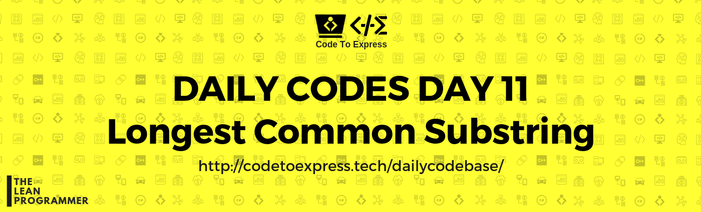
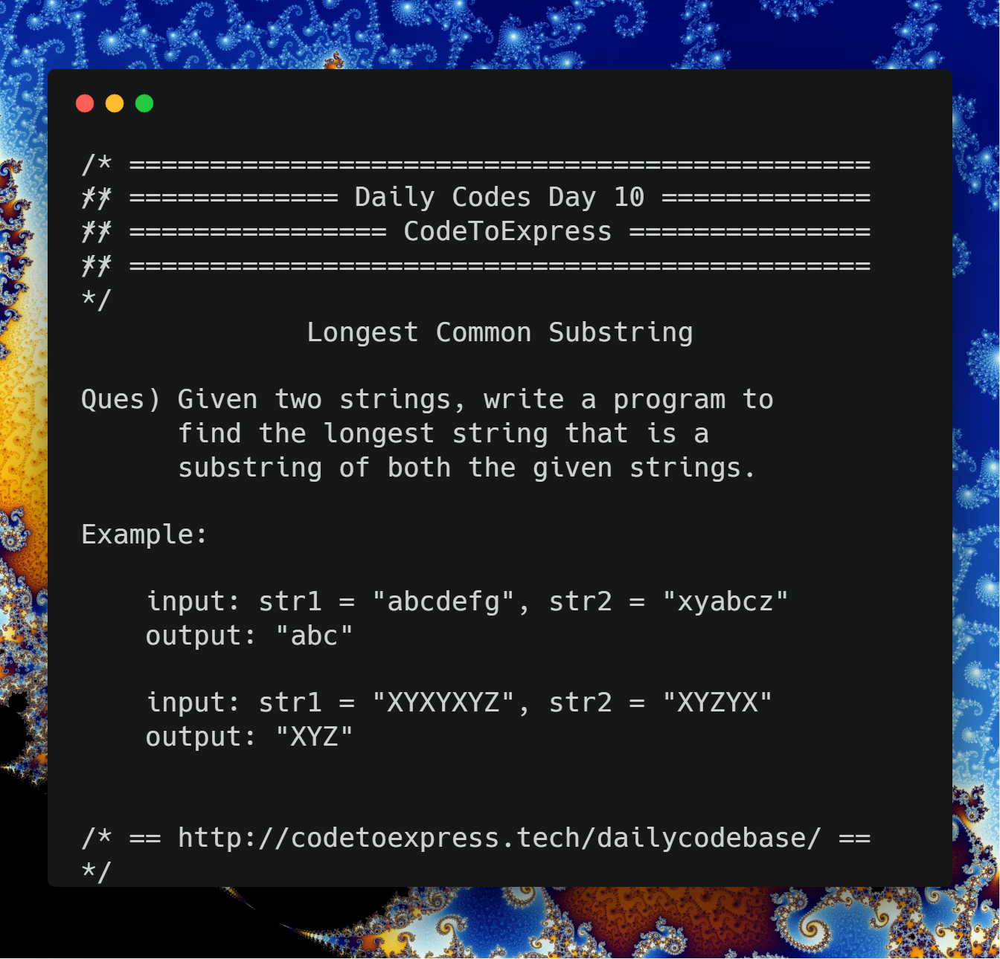

# Day 11 - Longest Common Substring

**Question** -- Given two strings, write a program to find the longest string that is a substring of both the given strings.

### Example

```
input: str1 = "abcdefg", str2 = "xyabcz"
output: "abc"

input: str1 = "XYXYXYZ", str2 = "XYZYX"
output: "XYZ"
```

### Illustration from [Wikipedia](https://en.wikipedia.org/wiki/Longest_common_substring_problem)

The longest common substring of the strings "ABABC", "BABCA" and "ABCBA" is string "ABC" of length 3. Other common substrings are "A", "AB", "B", "BA", "BC" and "C".

```
  ABABC
    |||
   BABCA
    |||
    ABCBA
```



## JavaScript Implementation

### [Solution using dynamic programming](./JavaScript/longest_substring_dynamic.js)

**Reference** -- [Wikipedia](https://en.wikipedia.org/wiki/Longest_common_substring_problem#Dynamic_programming)

```js
/**
 * @author MadhavBahlMD
 * @date 03/01/2018
 * Referance: https://en.wikipedia.org/wiki/Longest_common_substring_problem
 */

function longestSubstring (str1, str2) {
    // initialize the longest substring matrix with all zeroes
    let strMat = [],
        len1 = str1.length,
        len2 = str2.length;

    for (let i=0; i<=len2; i++) {
        let row = [];
        for (let j=0; j<=len1; j++) {
            row.push(0);
        }

        strMat.push(row);
    }

    // Fill the longest substring matrix and find the maximum element simultaneously
    let maxi = 0, maxj = 0, max = strMat[0][0];
    for (let i=1; i<=len2; i++) {
        for (let j=1; j<=len1; j++) {
            if (str2[i-1] === str1[j-1]) {
                strMat[i][j] = strMat[i-1][j-1] + 1;
                if (strMat[i][j] > max) {
                    max = strMat[i][j];
                    maxi = i;
                    maxj = j;
                }
            }
        }
    }

    // Find the longest substring
    let maxSubStr = '';
    for (i=maxi, j=maxj; i>=0; i--, j--) {
        if (!(i<=0 || j<=0) && strMat[i][j] !== 0) {
            maxSubStr += str2[i-1];
        } else {
            break;
        }
    }

    // Return the reverse of maxSubStr
    return maxSubStr.split('').reverse().join('');
}

console.log(longestSubstring ("abcdefg", "xyabcz"));
console.log(longestSubstring ("XYXYXYZ", "XYZYX"));
```

## C++ Implementation

### [Solution using dynamic programming](./C++/longestCommonSubstringday11.cpp)

```cpp
/**
 * @author:divyakhetan
 * @date: 3/1/2019
 */


#include <bits/stdc++.h>
using namespace std;

int main() {
  string s1,s2;
  cin >> s1 >> s2;

  int n = s1.length();
  int m = s2.length();

  int lcs[n + 1][m + 1];

  int ma = 0;
  int mi = 0;
  int mj = 0;
  for(int i =0; i <=n; i++){
    for(int j = 0; j <=m;j++){
      if(i == 0 || j == 0) lcs[i][j] = 0;
      else if(s1[i -1] == s2[j - 1]){
        lcs[i][j] = 1 + lcs[i - 1][j - 1];
        if(lcs[i][j] > ma){
           mi = i;
           mj = j;
           ma = lcs[i][j];
        }

      }
      else{
        lcs[i][j]= 0;
      }
    }
  }
  int i = 0;
  int j = 0;
  string ans= "";
  for (i=mi, j=mj; i>=0; i--, j--) {
        if (!(i<=0 || j<=0) && lcs[i][j] != 0) {
            ans += s1[i-1];
        } else {
            break;
        }
    }
    reverse(ans.begin(), ans.end());
  cout << "len : " << ma << " is " << ans;
}
```

### [Solution by @imkaka](./C++/longetCommonSubstring.cpp)

```cpp

/*
* @author : imkaka
* @date   : 04/01/2019
*/

#include<iostream>
#include<string>

using namespace std;

void longestCommonSubstrig(string, string);

int main(){

    string str1 = "bisect", str2 = "secret";
    longestCommonSubstrig(str1, str2); // sec
    longestCommonSubstrig("abcxyzey", "cxyazeal"); //cxy
    return 0;
}

void longestCommonSubstrig(string str1, string str2){

    int m = str1.size();
    int n = str2.size();

    int LCW[m+1][n+1];

    //Track Len and location.
    int maxLCW = 0;
    int loc = m+1;

    for(int i = 0; i <= m; ++i){
        LCW[i][n] = 0;
    }

    for(int i = 0; i <= n; ++i){
        LCW[m][i] = 0;
    }

    // Calculating the max length of common subword
    for(int c = n-1; c >= 0; --c){
        for(int r = m-1; r >= 0; --r){
            if(str1[r] == str2[c]){
                LCW[r][c]  = 1 + LCW[r+1][c+1];
            }

            else{
                LCW[r][c] = 0;
            }

            if(LCW[r][c] > maxLCW){

                maxLCW = LCW[r][c];
                loc = r;
            }
        }
    }

// Finding the Common SubWord
    string re = "";
    for(int r = loc; r < loc + maxLCW; ++r){
        re += char(str1[r]);
    }

    cout << re << endl;

}

```

## Java Implementation

### [Solution](./Java/longestCommonSubstring.java)

```java
/**
 * @date 03/01/1998
 * @author SPREEHA DUTTA
 */
import java.util.*;
public class longestCommonSubstring {
   static int max=0;static String sm;
    public static void generate(String s,String st)
    {
        String str;
        for(int i=0;i<=s.length()-1;i++)
        {
            for(int j=i+1;j<=s.length();j++)
            {
                str=s.substring(i,j);
                if(st.contains(str))
                {
                   if(max<str.length())
                   {
                       max=str.length();
                       sm=str;
                   }
                }
            }
        }
    }
    public static void main(String []args)
    {
        Scanner sc=new Scanner(System.in);
        String s1,s2;
        System.out.println("Enter the two strings ");
        s1=sc.next();
        s2=sc.next();
        generate(s1,s2);
        generate(s2,s1);
        System.out.println("Longest common substring is "+sm);
    }
}
```

## Python Implementation

### [Solution using dynamic programming](./Python/lcs.py)

```python
"""
  @author : vishalshirke7
  @date : 03/01/2019
"""


def lcs(str1, str2):
    m, n = len(str1), len(str2)

    L = [[0 for y in range(n + 1)] for x in range(m + 1)]

    for i in range(m + 1):
        for j in range(n + 1):
            if i == 0 or j == 0:
                L[i][j] = 0
            elif str1[i - 1] == str2[j - 1]:
                L[i][j] = L[i - 1][j - 1] + 1
            else:
                L[i][j] = max(L[i - 1][j], L[i][j - 1])

    index = L[m][n]

    # Create a character array to store the lcs string
    lcs_str = [""] * (index + 1)
    lcs_str[index] = ""

    # Start from the right-most-bottom-most corner and
    # one by one store characters in lcs[]
    i = m
    j = n
    while i > 0 and j > 0:

        # If current character in X[] and Y are same, then
        # current character is part of LCS
        if str1[i - 1] == str2[j - 1]:
            lcs_str[index - 1] = str1[i - 1]
            i -= 1
            j -= 1
            index -= 1

        # If not same, then find the larger of two and
        # go in the direction of larger value
        elif L[i - 1][j] > L[i][j - 1]:
            i -= 1
        else:
            j -= 1

    print("LCS of " + str1 + " and " + str2 + " is -" + "".join(lcs_str))


lcs(*(input().split()))
```

### [Solution 2](./Python/lcs.py)

```python
'''
@author: aaditkamat
@date: 03/01/2019
'''
def print_output(str1, str2):
    print(f'The longest common substring in {str1} and {str2} is: {longest_common_substring(str1, str2)}')

def substrings(string):
    lst = []
    n = len(string)
    for i in range(1, n + 1):
        for j in range(n + 1 - i):
            lst.append(string[j : j + i])
    print(set(lst))
    return set(lst)

def longest_common_substring(str1, str2):
    str1_substrings = substrings(str1)
    str2_substrings = substrings(str2)
    common_substrings = str1_substrings & str2_substrings
    if len(common_substrings) == 0:
        common_substrings.add("")
    return max(common_substrings, key = lambda x: len(x))

print_output("abcdefg", "xyabcz")
print_output("XYXYXYZ", "XYZYX")
print_output("abcd", "efgh")
```