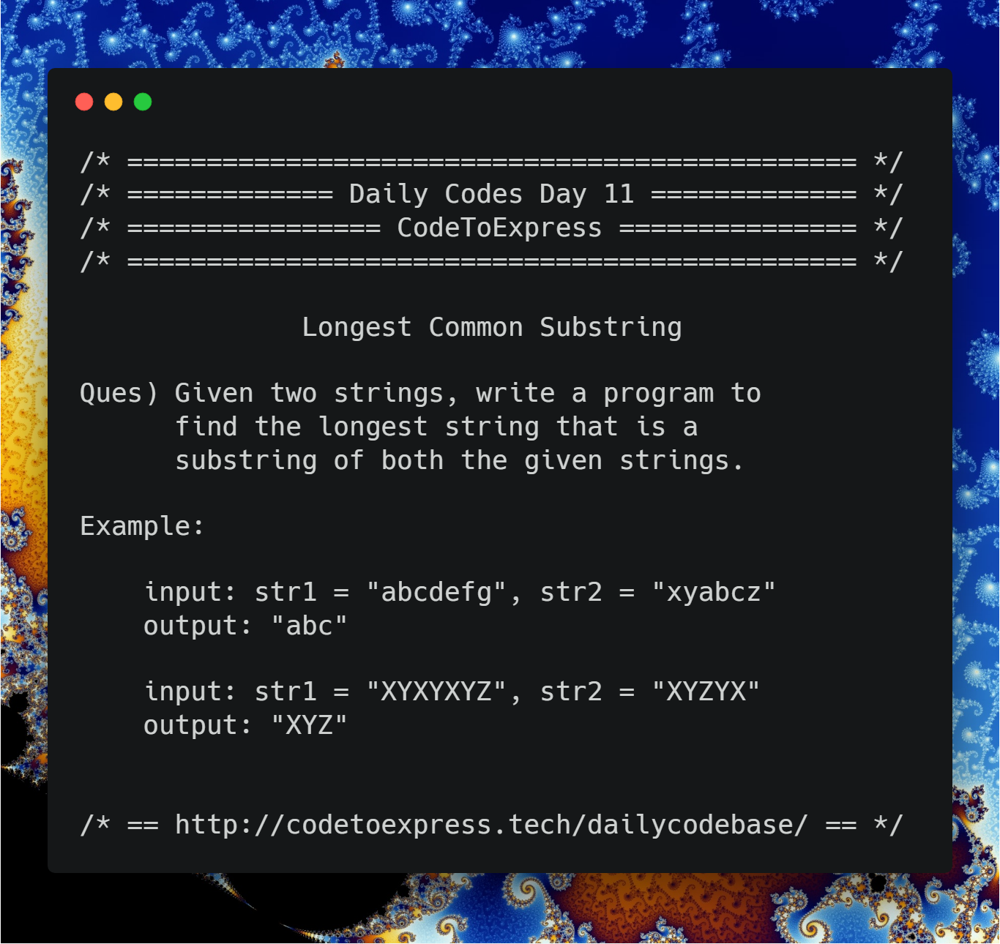

# Day 11 - Longest Common Substring

**Question** -- Given two strings, write a program to find the longest string that is a substring of both the given strings.

### Example

```
input: str1 = "abcdefg", str2 = "xyabcz"
output: "abc"

input: str1 = "XYXYXYZ", str2 = "XYZYX"
output: "XYZ"
```

### Illustration from [Wikipedia](https://en.wikipedia.org/wiki/Longest_common_substring_problem)

The longest common substring of the strings "ABABC", "BABCA" and "ABCBA" is string "ABC" of length 3. Other common substrings are "A", "AB", "B", "BA", "BC" and "C".

```
  ABABC
    |||
   BABCA
    |||
    ABCBA
```



## JavaScript Implementation

### [Solution using dynamic programming](./JavaScript/longest_substring_dynamic.js)

**Reference** -- [Wikipedia](https://en.wikipedia.org/wiki/Longest_common_substring_problem#Dynamic_programming)

```js
/**
 * @author MadhavBahlMD
 * @date 03/01/2018
 * Referance: https://en.wikipedia.org/wiki/Longest_common_substring_problem
 */

function longestSubstring (str1, str2) {
    // initialize the longest substring matrix with all zeroes
    let strMat = [],
        len1 = str1.length,
        len2 = str2.length;

    for (let i=0; i<=len2; i++) {
        let row = [];
        for (let j=0; j<=len1; j++) {
            row.push(0);
        }

        strMat.push(row);
    }

    // Fill the longest substring matrix and find the maximum element simultaneously
    let maxi = 0, maxj = 0, max = strMat[0][0];
    for (let i=1; i<=len2; i++) {
        for (let j=1; j<=len1; j++) {
            if (str2[i-1] === str1[j-1]) {
                strMat[i][j] = strMat[i-1][j-1] + 1;
                if (strMat[i][j] > max) {
                    max = strMat[i][j];
                    maxi = i;
                    maxj = j;
                }
            }
        }
    }

    // Find the longest substring
    let maxSubStr = '';
    for (i=maxi, j=maxj; i>=0; i--, j--) {
        if (!(i<=0 || j<=0) && strMat[i][j] !== 0) {
            maxSubStr += str2[i-1];
        } else {
            break;
        }
    }
    
    // Return the reverse of maxSubStr
    return maxSubStr.split('').reverse().join('');
}

console.log(longestSubstring ("abcdefg", "xyabcz"));
console.log(longestSubstring ("XYXYXYZ", "XYZYX"));
```

## Java Implementation

### [Solution](./Java/longestCommonSubstring.java)

```java
/**
 * @date 03/01/1998
 * @author SPREEHA DUTTA
 */
import java.util.*;
public class longestCommonSubstring {
   static int max=0;static String sm;
    public static void generate(String s,String st)
    {
        String str;
        for(int i=0;i<=s.length()-1;i++)
        {
            for(int j=i+1;j<=s.length();j++)
            {
                str=s.substring(i,j);
                if(st.contains(str))
                {
                   if(max<str.length())
                   {
                       max=str.length();
                       sm=str;
                   }
                }
            }
        }
    }
    public static void main(String []args)
    {
        Scanner sc=new Scanner(System.in);
        String s1,s2;
        System.out.println("Enter the two strings ");
        s1=sc.next();
        s2=sc.next();
        generate(s1,s2);
        generate(s2,s1);
        System.out.println("Longest common substring is "+sm);
    }
}
```