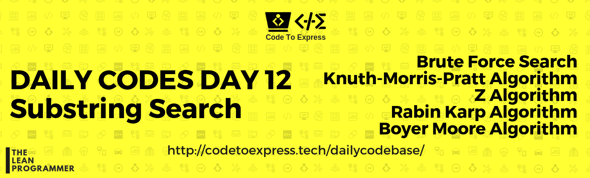
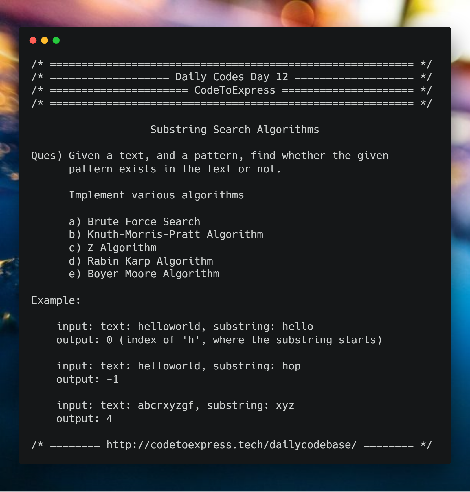

# day 12 - Substring Search Problem 

**Question** -- Given a text, and a pattern, find whether the given pattern exists in the text or not.

**Implement various algorithms**

```   
    a) Brute Force Search
    b) Knuth-Morris-Pratt Algorithm
    c) Z Algorithm
    d) Rabin Karp Algorithm
    e) Boyer Moore Algorithm
```

### Example

```
input: text: helloworld, substring: hello
output: 0 (index of 'h', where the substring starts)

input: text: helloworld, substring: hop
output: -1

input: text: abcrxyzgf, substring: xyz
output: 4
```



## A) Brute Force Search

### JavaScript Implementation

#### [Solution](./JavaScript/sol.js)

Substring search can be done using brute force. 
In this case, the worst case Time Complexity will be O(m.n), m and n are the lengths of string and pattern respectively.

```js
/**
 * @author MadhavBahlMD
 * @date 04/01/2018
 * In this case, the worst case Time Complexity will be O(m.n), 
 * m and n are the lengths of string and pattern respectively.
 */

function substringSearch (str, pattern) {
    let strLen = str.length,
        patLen = pattern.length,
        flag = 0;

    for (let i=0; i<(strLen-patLen+1); i++) {
        if (str[i] === pattern[0]) {
            flag = 1;
            for (let j=1; j<patLen; j++) {
                if (str[i+j] !== pattern[j]) {
                    flag = 0;
                    break;
                }
            }
            if (flag === 1) {
                console.log (i);
                return i;
            } 
        }
    }

    console.log (-1);
    return -1;
}

substringSearch ("helloworld", "world");
substringSearch ("abcrxyzgf", "xyz");
```

## C++ Implementation

### [Solution](./C++/BruteForce.cpp)

```C++
/**
 * @date 04/01/18
 * @author SPREEHA DUTTA
 */
#include <bits/stdc++.h>
using namespace std;
int search(string s,string w)
{
    int i,j;int k=-1;int c=0;
    int m=w.length();
    int n=s.length();
    for(i=0;i<=n-m;i++)
    {
         for(j=0,c=i;j<m;j++,c++)
            if(s[c]!=w[j])
               break;
        if(j==m)
        {
            k=i;
            break;
        }
    }
    return k;
}
int main()
{
    string s,w;
    getline(cin,s);
    getline(cin,w);
    int t=search (w,s);
    cout<<"\n"<<t<<endl;
}
```

## B) Knuth-Morris-Pratt Algorithm

### JavaScript Implementation

#### [Solution](./JavaScript/KMP.js)

```js
To Be Added
```

## C++ Implementation

### [Solution](./C++/KMP.cpp)

```C++
/**
 * @date 04/01/18
 * @author SPREEHA DUTTA
 */

#include <bits/stdc++.h>
using namespace std;
void calc(string w,int m,int p[])
{
    int l=0,i=1;p[0]=0;
    while(i<m)
    {
        if(p[i]==p[l])
        {
            l++;
            p[i]=l;
            i++;
        }
        else
        {
            if(l!=0)
                l=p[l-1];
            else
            {
                p[i]=l;
                i++;
            }
        }
    }
}
int search(string s,string w)
{
    int i=0,j=0;int k=-1;
    int m=w.length();
    int n=s.length();
    int arr[m];
    calc(w,m,arr);
    while(i<n)
    {
        if(w[j]==s[i])
        {
            j++;
            i++;
        }
        if(j==m)
        {
            k=i-j;
            break;
        }
        else if(i<n && w[j]!=s[i])
        {
            if(j!=0)
                j=arr[j-1];
            else
                i++;
        }
    }
    return k;
}
int main()
{
    string s,w;
    getline(cin,s);
    getline(cin,w);
    int t=search (w,s);
    cout<<"\n"<<t<<endl;
}
```

##  C) Z Algorithm

### JavaScript Implementation

#### [Solution](./JavaScript/ZAlgorithm.js)

```js
To Be Added
```

## D) Rabin Karp Algorithm

### JavaScript Implementation

#### [Solution](./JavaScript/rabin_karp.js)

```js
To Be Added
```

## C++ Implementation

### [Solution](./C++/RabinKarp.cpp)

```C++
/**
 * @date 04/01/18
 * @author SPREEHA DUTTA
 */
#include <bits/stdc++.h>
using namespace std;

int search(string s,string w,int q)
{
    int i=0,j=0;int k=-1;
    int m=w.length();
    int n=s.length();
    int sc=0,wc=0,h=1;
    int d=256;
    for(i=0;i<m-1;i++)
        h=(h*d)%q;
    for(i=0;i<m;i++)
    {
        wc=(d*wc+w[i])%q;
        sc=(d*sc+s[i])%q;
    }
    for(i=0;i<n-m;i++)
    {
        if(sc==wc)
        {
            for(j=0;j<m;j++)
                if(s[i+j]!=w[j])
                    break;
            if(j==m)
            {
                k=i;
                break;
            }
        }
        if(i<n-m)
        {
            sc=(d*(sc-s[i]*h)+s[i+m])%q;
            if(sc<0)
                sc+=q;
        }
    }
    return k;
}
int main()
{
    string s,w;
    getline(cin,s);
    getline(cin,w);
    int t=search (w,s,101);
    cout<<"\n"<<t<<endl;
}
```

## E) Boyer Moore Algorithm

### JavaScript Implementation

#### [Solution](./JavaScript/boyer_moore.js)

```js
To Be Added
```

### Have Another solution?

The beauty of programming lies in the fact that there is never a single solution to any problem.

In case you have an alternative way to solve this problem, do contribute to this repository (https://github.com/CodeToExpress/dailycodebase)