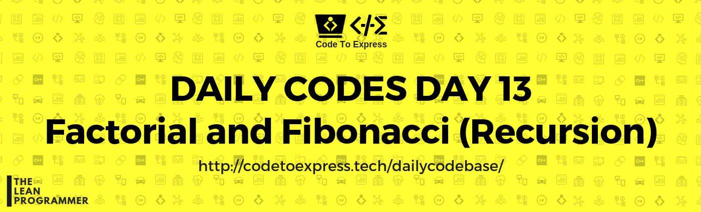

# Day 13 - Recursion Series Part A

Today's Problems - Factorial and Fibonacci Series

## Question 1 - Factorial using recursion

Given a non-negative integer, find it's factorial using recursion

### Example

```
input: 4
output: 24

input: 5
output: 120
```

## Question 2 - Fibonacci Series

Given a number n, find the nth element in fibonacci series using recursion and after that print the series till n.

### Example

```
input = 7
output:
The 7th element in fibonacci series is: 13
The sequence is: 1, 1, 2, 3, 5, 8, 13
```


## Part A - Factorial

### JavaScript Implementation

#### [Solution by @MadhavBahlMD](./JavaScript/fact_madhav.js)

```js
/**
 * @author MadhavBahlMD
 * @date 07/01/2018
 */

function factorial (num) {
    if (num <= 1)
        return 1;
    else
        return num * factorial (num-1);
}

console.log(`Factorial of 4 is: ${factorial(4)}`);
console.log(`Factorial of 5 is: ${factorial(5)}`);
```

### Java Implementation

#### [Solution](./Java/Factorial.java)

```java
/**
 * @author MadhavBahl
 * @date 07/01/2018
 */

import java.util.Scanner;

public class Factorial {
    public static int factorial (int num) {
        if (num <= 1)
            return 1;
        else
            return num * factorial(num-1);
    }

    public static void main(String[] args) {
        Scanner input = new Scanner (System.in);
        System.out.println("/* ===== Factorial Using Recursion ===== */");
        System.out.print("\nEnter a number: ");
        int num = input.nextInt();
        System.out.println("Factorial of " + num + " is: " + factorial(num));
    }
}
```

## C++ Implementation

#### [Solution](./C++/factorial.cpp)

```cpp
/**
 * @author: Rajdeep Roy Chowdhury<rrajdeeproychowdhury@gmail.com>
 * @github: https://github.com/razdeep
 * @date: 07/01/2019
 */
#include <bits/stdc++.h>
using namespace std;

long long factorial(long long n)
{
    if (n <= 1)
        return 1;
    return n*factorial(n-1);
}
int main()
{
    long long n;
    cout<<"Enter a number ";
    cin>>n;
    cout<<"The factorial of "<<n<<" is "<<factorial(n)<<endl;
    return 0;
}
```

## C Implementation

#### [Solution](./C/factorial.c)

```c
/*
 * @author: ashwek
 * @date: 7/1/2019
 */

#include <stdio.h>

long int fact(long int num){
    if( num <= 1 ){
        return 1;
    }
    return num * fact(num-1);
}

void main(){

    int num;

    printf("Enter a number = ");
    scanf("%d", &num);

    printf("Factorial of %d = %ld\n", num, fact(num));

}
```

### Python Implementation

#### [Solution by @vishalshirke7](./Python/factorial.py)
```python
"""
  @author : vishalshirke7
  @date : 07/01/2019
"""


def factorial(no):
    if no <= 1:
        return 1
    else:
        return no * factorial(no - 1)


n = int(input())
print("factorial of %d is %d" % (n, factorial(n)))

```

#### [Solution ](./Python/fact.py)
```python
'''
@author spreeha
@date 07/01/19
'''
n=int(input())
def factorial(n):
    if n==0:
        return 1
    else:
        return n*factorial(n-1)
f=factorial(n)
print(f)
```

***

***


## Part B - Fibonacci Series

### JavaScript Implementation

#### [Solution by @MadhavBahlMD](./JavaScript/fibo_madhav.js)

```js
/**
 * @author MadhavBahlMD
 * @date 07/01/2018
 */

function nthElement (n) {
    if (n <= 2) 
        return 1
    else
        return nthElement(n-1) + nthElement(n-2);
}

function fibonacci (num) {
    // Print F(n)
    console.log (`The ${num}th element in fibonacci series is: ${nthElement(num)}`);

    // Print the sequence
    let seq = '';
    for (let  i=1; i<=num; i++) 
        if (i<num)
            seq += nthElement(i) + ', ';
        else
            seq += nthElement(i);
    console.log(`The sequence is: ${seq}`);
}

fibonacci (7);
```

### Java Implementation

#### [Solution](./Java/Fibonacci.java)

```java
/**
 * @author MadhavBahl
 * @date 07/01/2018
 */

import java.util.Scanner;

public class Fibonacci {
    public static int fibonacci (int num) {
        if (num <= 2)
            return 1;
        else
            return fibonacci (num-1) + fibonacci (num-2);
    }

    public static void main(String[] args) {
        Scanner input = new Scanner (System.in);
        System.out.println("/* ===== Fibonacci Using Recursion ===== */");
        System.out.print("\nEnter a number: ");
        int n = input.nextInt();

        // Print the nth element in the sequence
        System.out.println("\nThe " + n + "th element in fibonacci series is: " + fibonacci(n));

        // Print the sequence
        System.out.print("The sequence is: ");
        for (int i=1; i<=n; i++) {
            if (i<n)
                System.out.print(fibonacci(i) + ", ");
            else
                System.out.print(fibonacci(i));
        }
    }
}
```
## C++ Implementation

#### [Solution](./C++/fibonacci.cpp)

```cpp
/**
 * @author: Rajdeep Roy Chowdhury<rrajdeeproychowdhury@gmail.com>
 * @github: https://github.com/razdeep
 * @date: 07/01/2019
 */
#include <bits/stdc++.h>
using namespace std;

long long fibonacci(long long n)
{
    if (n <= 2)
        return 1;
    return fibonacci(n-1)+fibonacci(n-2);
}
int main()
{
    long long n;
    cout<<"Enter a number ";
    cin>>n;
    string pos;
    if(n%10 == 1)
        pos="-st";
    else if(n%10 == 2)
        pos="-nd";
    else
        pos="-th";

    cout<<"The "<<n<<pos<<" number of the fibonacci series is "<<fibonacci(n)<<endl;
    return 0;
}
```

## C Implementation

#### [Solution](./C/fibonacci.c)

```c
/*
 * @author: ashwek
 * @date: 7/1/2019
 */

#include <stdio.h>

int fib(int num) {
    if( num <= 2 ){
        return 1;
    }
    return fib(num-1) + fib(num-2);
}

void main(){

    int num;

    printf("Enter a number = ");
    scanf("%d", &num);

    printf("%dth element in fibonacci series is %d\n", num, fib(num));

}
```

### Python Implementation

#### [Solution by @vishalshirke7](./Python/fibonacci.py)
```python
"""
  @author : vishalshirke7
  @date : 07/01/2019
"""


# Fibonacci Series using Dynamic Programming
def fibonacci(n):
    if n <= 1:
        return n
    else:
        if fib_series[n - 1] == 0:
            fib_series[n - 1] = fibonacci(n - 1)

        if fib_series[n - 2] == 0:
            fib_series[n - 2] = fibonacci(n - 2)

        fib_series[n] = fib_series[n - 2] + fib_series[n - 1]
    return fib_series[n]


n = int(input())
fib_series = [0, 1]
while len(fib_series) < n + 1:
    fib_series.append(0)
print(fibonacci(n))
if n == 0:
    print(0)
else:
    print(", ".join(map(str, fib_series)))

```

#### [Solution](./Python/fibo.py)
```python
'''
@author spreeha
@date 07/01/98
'''
n=int(input())
def fibonacci(n):
    if n>=1 and n<=2:
        return 1
    else:
        return fibonacci(n-1)+fibonacci(n-2)
for i in range(1,n):
    t=fibonacci(i)
    print(t,end=", ")
print(fibonacci(n))
```