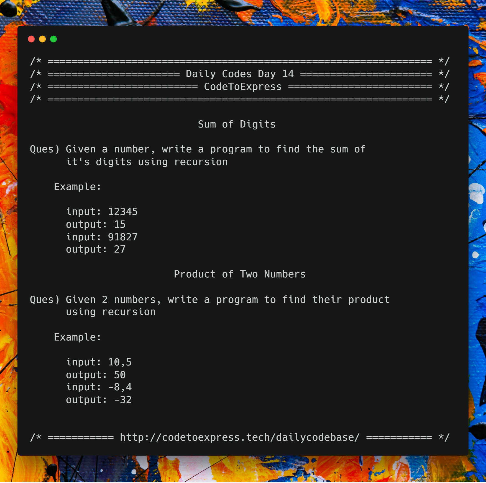

# Day 14 - Recursion Series Part B

Today's Problems - Sum of digits and product of numbers

## Question 1

Given a number, write a program to find the sum of it's digits using recursion

**Example**

```
input: 12345
output: 15

input: 91827
output: 27
```

## Question 2

Given 2 numbers, write a program to find their product using recursion

**Example**

```
input: 10,5
output: 50

input: -8,4
output: -32
```

**Hint**: Multiplication is repeated addition!



## Part A - Sum of Digits

### JavaScript Implementation

#### [Solution](./JavaScript/sum_madhav.js)

```js
/**
 * @author MadhavBahlMD
 * @date 08/01/2018
 */

function sumDigits (num) {
    if (num/10 < 1)
        return num;
    else
        return (num % 10) + sumDigits (parseInt(num/10));
}

let num1 = 12345, num2 = 91827;
console.log(`Sum of digits of ${num1} is ${sumDigits(num1)}`);
console.log(`Sum of digits of ${num2} is ${sumDigits(num2)}`);
```

### Java Implementation

#### [Solution](./Java/SumDigits.java)

```java
/**
 * @author MadhavBahlMD
 * @date 08/01//2018
 */

import java.util.Scanner;

public class SumDigits {
    public static int sum (int num) {
        if (num/10 < 1)
            return num;
        else
            return (num%10) + sum(num/10);
    }

    public static void main(String[] args) {
        Scanner input = new Scanner (System.in);
        System.out.println("/* ===== Sum of digits using recursion ===== */");
        System.out.print("\nEnter a number: ");
        int num = input.nextInt();
        System.out.println("Sum of digits of " + num + " is: " + sum(num));
    }
}
```

<hr />

## Part B - Product of numbers

### JavaScript Implementation

#### [Solution](./JavaScript/prod_madhav.js)

```js
/**
 * @author MadhavBahlMD
 * @date 08/01/2018
 * METHOD - We keep thte second argument (num2) positive and add the first arguement num2(second arg) times
 */

function recursiveProd (num1, num2) {
    // If num 2 becomes 1, return num1
    if (num2 === 1)
        return num1;

    // If any of the numbers is zero, return 0
    if (num1 === 0 || num2 === 0)
        return 0;

    // If both numbers are less than zero negative signs can be removed
    if (num1 < 0 && num2 < 0)
        return recursiveProd (-1*num1, -1*num2);
    else if (num2 < 0)
        return recursiveProd (num2, num1);
    else 
        return num1 + recursiveProd(num1, num2-1);
}

let n1 = 5, n2 = 10;
console.log (`${n1} x ${n2} = ${recursiveProd(n1, n2)}`);
let n3 = -8, n4 = 4;
console.log (`${n3} x ${n4} = ${recursiveProd(n3, n4)}`);
let n5 = 2, n6 = -7;
console.log (`${n5} x ${n6} = ${recursiveProd(n5, n6)}`);
let n7 = -4, n8 = -7;
console.log (`${n7} x ${n8} = ${recursiveProd(n7, n8)}`);
```

### Java Implementation

#### [Solution](./Java/Product.java)

```java
/**
 * @author MadhavBahlMD
 * @date 08/01//2018
 */
 
import java.util.Scanner;

public class Product {
    public static int recursiveProd (int num1, int num2) {
        if (num2 == 1)
            return num1;

        // If any of the numbers is zero, return 0
        if (num1 == 0 || num2 == 0)
            return 0;

        // If both numbers are less than zero negative signs can be removed
        if (num1 < 0 && num2 < 0)
            return recursiveProd (-1*num1, -1*num2);
        else if (num2 < 0)
            return recursiveProd (num2, num1);
        else
            return num1 + recursiveProd(num1, num2-1);
    }

    public static void main(String[] args) {
        Scanner input = new Scanner (System.in);
        System.out.println("/* ===== Product of numbers using recursion ===== */");

        // Take input
        System.out.print("\nEnter first number: ");
        int num1 = input.nextInt();
        System.out.print("Enter second number: ");
        int num2 = input.nextInt();

        // Print the result
        System.out.println("Product of numbers " + num1 + " and " + num2 + " is: " + recursiveProd(num1, num2));
    }
}
```