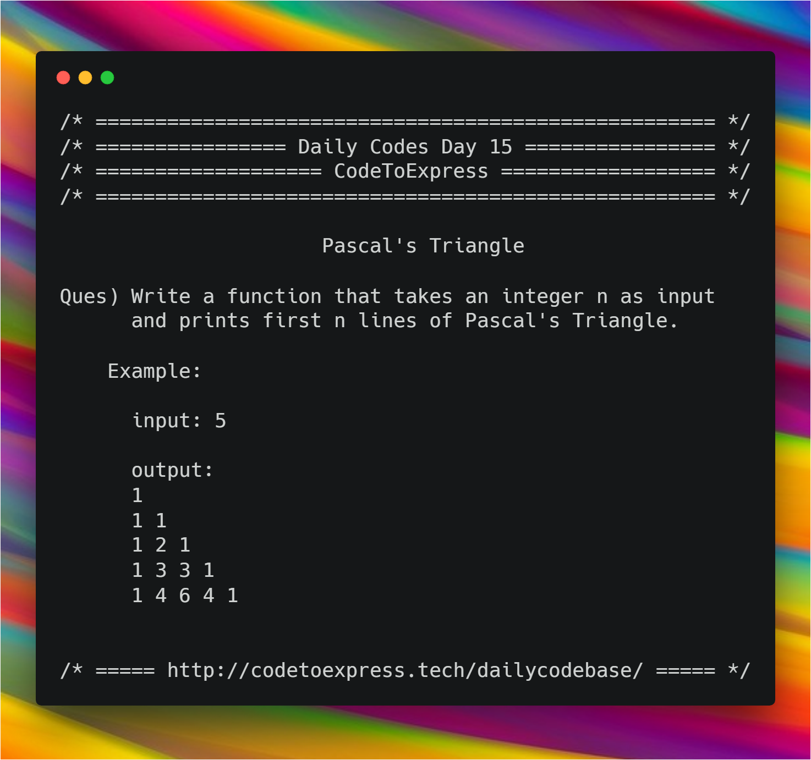

# Day 15 - Recursion Series Part C

Today's Problem - Pascal's Triangle

**Question** -- Write a function that takes an integer n as iniput and prints first n lines of Pascal's Triangle

**Example**

```
input: 5
output:
1  
1 1 
1 2 1 
1 3 3 1 
1 4 6 4 1 
```



## JavaScript Implementation

### [Solution](./JavaScript/pascal_MadhavBahlMD)

```js
/**
 * @author MadhavBahlMD
 * @date 09/01/2018
 */

function findPascal (row, col) {
    if (col === 1 || col === row) {
        return 1;
    } else {
        return findPascal (row-1, col-1) + findPascal (row-1, col);
    }
}

function printPascal (num) {
    let currentRow;
    for (let i=1; i<=num; i++) {
        currentRow = '';
        for (let j=1; j<=i; j++) {
            currentRow += findPascal (i, j) + ' ';
        }
        console.log(currentRow);
    }    
}

console.log ('/* ===== Pascal\'s Triangle for n = 5\n');
printPascal (5);
console.log ('\n/* ===== Pascal\'s Triangle for n = 7\n');
printPascal (7);
```