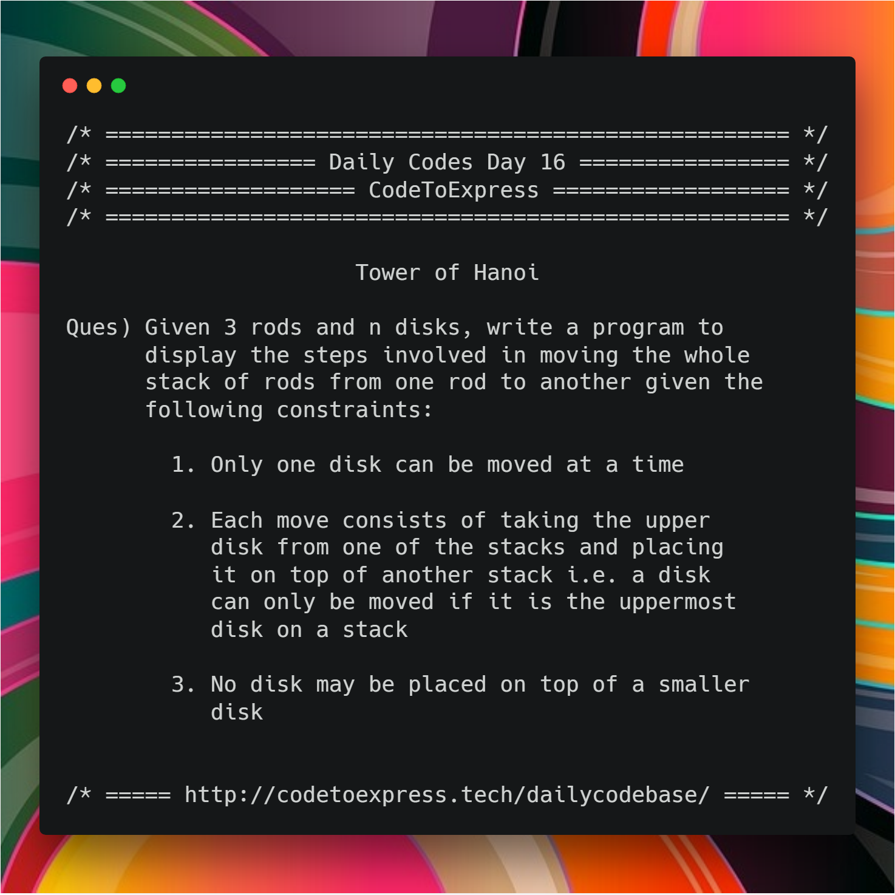

# Day 16 - Recursion Series Part D

Today's Problem - Tower of Hanoi

## Tower of Hanoi

The Tower of Hanoi puzzle was invented by the French mathematician Edouard Lucas in 1883.

**Question** -- Given 3 rods and n disks, write a program to display the steps involved in moving the whole stack of rods from one rod to another given the following constraints:

1. Only one disk can be moved at a time
2. Each move consists of taking the upper disk from one of the stacks and placing it on top of another stack i.e. a disk can only be moved if it is the uppermost disk on a stack
3. No disk may be placed on top of a smaller disk

[read more...](http://interactivepython.org/runestone/static/pythonds/Recursion/TowerofHanoi.html)



## JavaScript Implementation

### [Solution](./JavaScript/hanoi_MadhavBahl.js)

```js
/**
 * @source Geeks4Geeks: https://www.geeksforgeeks.org/c-program-for-tower-of-hanoi/
 * Implementaed in JavaScript by @MadhavBahl
 * @date 10/01/2019
 */

function towerOfHanoi (num, fromRod, toRod, auxRod) {
    if (num === 1) {
        console.log (`Move disk 1 from rod ${fromRod} to ${toRod}`);
        return 0;
    }

    towerOfHanoi (num-1, fromRod, auxRod, toRod);
    console.log (`Move disk ${num} from rod ${fromRod} to ${toRod}`);
    towerOfHanoi (num-1, auxRod, toRod, fromRod);
}

console.log ('/* ===== for 2 disks ===== */');
towerOfHanoi (2, 'A', 'C', 'B');
console.log ('\n/* ===== for 3 disks ===== */');
towerOfHanoi (3, 'A', 'C', 'B');
```

## Java Implementation

### [Solution](./Java/towersOfHanoi.java)

```java
/**
 * @date 10/01/19
 * @author SPREEHA DUTTA
 */
import java.util.*;
public class towersOfHanoi
{
    public static void move(int n,char s,char d,char c)
    {
        if(n==1)
        {
            System.out.println("Move disk "+n+" from "+s+" to "+d);  
            return;
        }
        else
        {
            move(n-1,s,c,d);
            System.out.println("Move disk "+n+" from "+s+" to "+d);
            move(n-1,c,d,s);
        }
    }
    public static void main(String []args)
    {
        Scanner sc=new Scanner(System.in);
        int n; char start='S';char center='C'; char destination='D';
        System.out.println("Enter number of disks");
        n=sc.nextInt();
        move(n,start,destination,center);
    }
    }
}
```

## Ruby Implementation

### [Solution](./Ruby/hanoi.rb)

```ruby
=begin
@author: aaditkamat
@date: 12/01/2019
=end

def hanoi(start_rod, aux_rod, end_rod, num)
  if num < 0
    puts "The number of disks must be a non-negative integer"
    return
  end
  if num == 0
    return
  end
  if num == 1
    puts "Move top most disk from rod #{start_rod} to rod #{end_rod}"
    return
  end
  hanoi(start_rod, end_rod, aux_rod, num - 1)
  hanoi(start_rod, aux_rod, end_rod, 1)
  hanoi(aux_rod, start_rod, end_rod, num - 1)
end

def main
  print "Enter number of disks: "
  num = gets.chomp!.to_i
  print "The sequence of instructions to move #{num} disks where disk 1 is the start rod"
  puts "disk 2 is the auxiliary rod and disk 3 is the end rod are as follows: "
  hanoi(1, 2, 3, num)
end

main
```

## Python Implementation

### [Solution](./Python/tower_hanoi.py)
```python

"""
  @author : vishalshirke7
  @date : 10/01/2019
"""


def towerhanoi(n, from_rod, to_rod, aux_rod):
    if n == 1:
        print("Move disk 1 from rod %d to rod %d"%(from_rod, to_rod))
        return
    towerhanoi(n - 1, from_rod, aux_rod, to_rod)
    print("Move disk 1 from rod %d to rod %d"%(from_rod, to_rod))
    towerhanoi(n - 1, aux_rod, to_rod, from_rod)


no_of_disks = int(input())
towerhanoi(no_of_disks, 'A', 'C', 'B')

```

### [Solution by @hiteshsubnani0128](./python3/hitesh_toh.py)

```python
#Implementaed in Python3 by @hiteshsubnani0128
#reffered geekforgeeks.com
#@date 10/01/2019

def toh(n,a,b,c):
    if n == 1:
        print("Move disk 1 from rod",a,"to rod",c)
        return
    toh(n-1, a, b, c)
    print("Move disk",n,"from rod",a,"to rod",b)
    toh(n-1, a, b, c)

num = int(input("enter a number"))
if num == 0:
    print("Not Possible")
else:
    toh(num,'a','b','c')
```


###C Implementation

### [Solution](./C/towersofhanoi.C)
```C
/**
     @author: rajashree23
     @date: 13/02/2019
   **/

#include<stdio.h>

void TowerOfHanoi(int n, char source,char aux, char dest)
{
    if(n==1)
    {
      printf("Move disk 1 from rod %c to rod %c\n", source,dest);
      return;
    }
    TowerOfHanoi(n-1,source,dest,aux);
    printf("Move disk %d from rod %c to rod %c\n",n,source,dest);
    TowerOfHanoi(n-1,aux,source,dest);

}
int main()
{
    int n;
    char source,auxilliary,destination;
    printf("Enter number of disks\n");
    scanf("%d",&n);
    TowerOfHanoi(n,'A','c','B');
    return 0;
}
