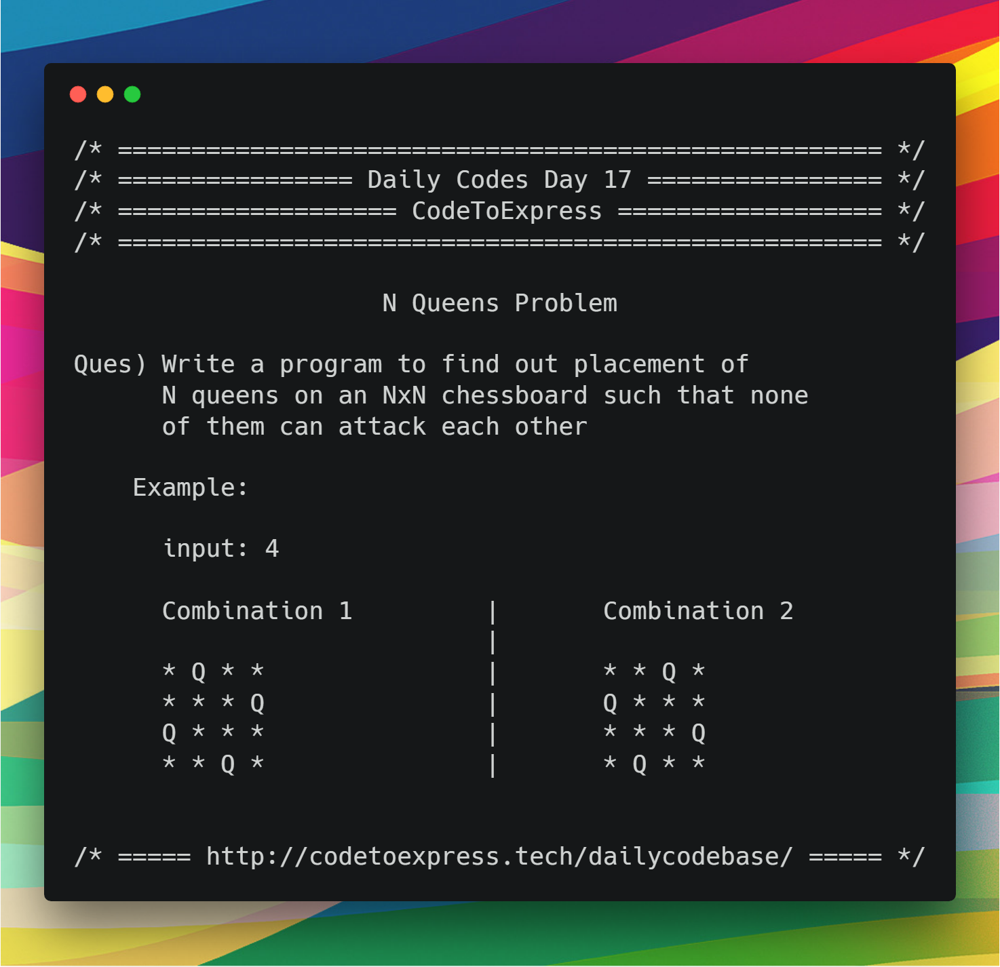

# Day 17

Today's Problem - N Queens Problem

**Question** -- Write a program to find out placement of N queens on an NxN chessboard such that none of them can attack each other

Example

```
input: 4
output:
* * Q *
Q * * *
* * * Q
* Q * *
```

Note that the output can be printed in the form of a binary NxN matrix with 1 representing the queen's position

Example

```
{ 0,  1,  0,  0}
{ 0,  0,  0,  1}
{ 1,  0,  0,  0}
{ 0,  0,  1,  0}
```



### Method - Backtracking 

Source: [Geeks4Geeks](https://www.geeksforgeeks.org/n-queen-problem-backtracking-3/)

Method

```
1) Start in the leftmost column
2) If all queens are placed
    return true
3) Try all rows in the current column.  Do following for every tried row.
    a) If the queen can be placed safely in this row then mark this [row, 
        column] as part of the solution and recursively check if placing queen here leads to a solution.
    b) If placing the queen in [row, column] leads to a solution then return 
        true.
    c) If placing queen doesn't lead to a solution then umark this [row, 
        column] (Backtrack) and go to step (a) to try other rows.
3) If all rows have been tried and nothing worked, return false to trigger 
    backtracking.
```

## JavaScript Implementation

### [Solution](./JavaScript/nqueens.js)

```js
/**
 * @date 11/01/2018
 * Method (Backtracking) taken from -- https://www.youtube.com/watch?v=0DeznFqrgAI
 * Implemented in JavaScript by @MadhavBahlMD
 */

function nqueens (num) {
    console.log (`Solving ${num} Queens Problem`);
    
    // Initialize chessBoard
    let chessBoard = [];
    for (let i=0; i<num; i++) {
        let thisRow = [];
        for (let j=0; j<num; j++)
            thisRow.push (0);
        chessBoard.push(thisRow);
    }

    // Check whether solution exists or not
    if (!solveNqueens(num, chessBoard, 0)) {
        console.log ('No combinations');
        return 0;
    }

    printBoard (chessBoard);
    return 1;
}

function solveNqueens (num, chessBoard, col) {
    // If all queens are placed, return true 
    // We find all queens are place when the value of current column (col) becomes greater than or equals to N (num)
    if (col >= num) 
        return true;
    
    // Place all queen in all rows one by one and check whether they can be placed or not
    for (let i=0; i<num; i++) {
        // Check if the queen can be placed in ith row
        if (canBePlaced (num, chessBoard, i, col)) {
            chessBoard [i][col] = 1;

            // Use recursion to place rest of the queens
            if (solveNqueens (num, chessBoard, col+1))
                return true;
            
            // If current queen placement doesnt lead to a solution, remove the queen
            chessBoard [i][col] = 0; 
        }
    }

    return false;
}

function canBePlaced (num, chessBoard, row, col) {
    // Check row on left side
    for (let i=0; i<col; i++)
        if (chessBoard[row][i] === 1)
            return false;
        
    // Check diagonals
    for (let i=row, j=col; i>=0 && j>=0; i--, j--) 
        if (chessBoard[i][j] === 1) 
            return false; 
    
    for (let i=row, j=col; j>=0 && i<num; i++, j--) 
        if (chessBoard[i][j] === 1) 
            return false; 
    
    // Return true
    return true;
}

function printBoard (chessBoard) {
    let outputString;

    for (let row of chessBoard) {
        outputString = '';
        for (let element of row)
            outputString += element + ' ';
        console.log (outputString);
    }
}

nqueens (8);
```

## C++ Implementation

### [Solution 1](./C++/Day17.cpp)

```cpp
/*
* @author : dhruv-gupta14
* @date : 12/01/2019
*/

#include<iostream>
using namespace std;
#define N 8

void printBoard(int board[N][N]) {
   for (int i = 0; i < N; i++) {
      for (int j = 0; j < N; j++)
         cout << board[i][j] << " ";
      cout << endl;
   }
}

bool isValid(int board[N][N], int row, int col) {
   for (int i = 0; i < col; i++)    //check whether there is queen in the left or not
      if (board[row][i])
         return false;
   for (int i=row, j=col; i>=0 && j>=0; i--, j--)
      if (board[i][j])       //check whether there is queen in the left upper diagonal or not
         return false;
   for (int i=row, j=col; j>=0 && i<N; i++, j--)
      if (board[i][j])      //check whether there is queen in the left lower diagonal or not
         return false;
   return true;
}

bool solveNQueen(int board[N][N], int col) {
   if (col >= N)           //when N queens are placed successfully
      return true;
   for (int i = 0; i < N; i++) {     //for each row,check placing of queen is possible or not
      if (isValid(board, i, col) ) {
         board[i][col] = 1;      //if validate, place the queen at place (i, col)
         if ( solveNQueen(board, col + 1))    //Go for the other columns recursively
            return true;
                   
         board[i][col] = 0;        //When no place is vacant remove that queen
      }
   }
   return false;
}

bool checkSolution() {
   int board[N][N];
   for(int i = 0; i<N; i++)
      for(int j = 0; j<N; j++)
         board[i][j] = 0;      
               
   if ( solveNQueen(board, 0) == false ) {
      cout << "Solution does not exist";
      return false;
   }
   printBoard(board);
   return true;
}

int main() {
   checkSolution();
}
```

## Python Implemetation

### [Solution](./Python/n_queens.py)

```python
"""
@author:aaditkamat
@date: 13/01/2019
"""
def print_chessboard(chessboard):
    for i in range(len(chessboard)):
        print(chessboard[i])

def fill_chessboard(i, j,chessboard):
    chessboard[i][j] = 1

    for x in range(len(chessboard)):
        if x != i:
            chessboard[x][j] = 0

    for y in range(len(chessboard)):
        if y != j:
            chessboard[i][y] = 0

    x, y = (i + 1, j + 1)
    while x < len(chessboard) and y < len(chessboard):
        chessboard[x][y] = 0
        x += 1
        y += 1

    x, y = (i - 1, j - 1)
    while x >= 0 and y >= 0:
        chessboard[x][y] = 0
        x -= 1
        y -= 1

    x, y = (i + 1, j - 1)
    while x < len(chessboard) and y >= 0:
        chessboard[x][y] = 0
        x += 1
        y -= 1

    x, y = (i - 1, j + 1)
    while x >= 0 and y < len(chessboard):
        chessboard[x][y] = 0
        x -= 1
        y += 1

def try_position(i, chessboard):
    fill_chessboard(0, i, chessboard)

    for i in range(1, len(chessboard)):
        for j in range(len(chessboard)):
            if chessboard[i][j] == -1:
                fill_chessboard(i, j, chessboard)

def reset_chessboard(chessboard):
    for i in range(len(chessboard)):
        for j in range(len(chessboard)):
            chessboard[i][j] = -1

def is_correct(chessboard):
    for i in range(len(chessboard)):
        if chessboard[i].count(1) == 0:
            return False
    return True

def n_queens(num):
    chessboard = []
    for i in range(num):
        chessboard.append([-1] * num)

    for i in range(num):
        try_position(i, chessboard)
        if (is_correct(chessboard)):
            print_chessboard(chessboard)
            return
        reset_chessboard(chessboard)

def main():
    print("Enter number of queens: ", end="")
    num = int(input())
    n_queens(num)

main()
```

## Java Implementation

### [Solution](./Java/nQueen.java)

```java
/**
 * @date 14/01/19
 * @author SPREEHA DUTTA
 */
import java.util.*;
public class nQueen {
    static int n;
    public static void print(int arr[][])
    {
        for(int i=0;i<n;i++)
        {
            for(int j=0;j<n;j++)
                System.out.print(arr[i][j]);
            System.out.println();
        }
    }
    
    public static boolean safe(int arr[][],int r,int c)
    {
        int i,j;
        for(i=0;i<c;i++)
            if(arr[r][i]==1)
                return false;
        for(i=r, j=c; i>=0 && j>=0; i--,j--)
            if(arr[i][j]==1)
                return false;
        for(i=r, j=c; i<n && j>=0; i++,j--)
            if(arr[i][j]==1)
                return false;
        return true;
    }
    
    public static boolean placeQueen(int arr[][],int c)
    {
        int i;
        if(c>=n)
            return true;
        for(i=0;i<n;i++)
        {
            if(safe(arr,i,c))
            {
                arr[i][c]=1;
                if(placeQueen(arr,c+1)==true)
                    return true;
                arr[i][c]=0;
            }
        }
        return false;
    }
    
    public static void main(String []args)
    {
        Scanner sc=new Scanner(System.in);
        n=sc.nextInt();
        int arr[][]=new int[n][n];
        if(placeQueen(arr,0)==false)
        {
            System.out.println("All the queens cannot be placed");
        }
        else
            print(arr);
    }
}
```