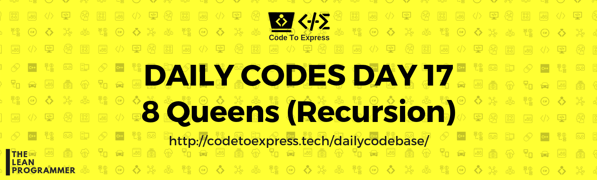

# Day 17

Today's Problem - N Queens Problem

**Question** -- Write a program to find out placement of N queens on an NxN chessboard such that none of them can attack each other

Example

```
input: 4
output:
* * Q *
Q * * *
* * * Q
* Q * *
```

Note that the output can be printed in the form of a binary NxN matrix with 1 representing the queen's position

Example

```
{ 0,  1,  0,  0}
{ 0,  0,  0,  1}
{ 1,  0,  0,  0}
{ 0,  0,  1,  0}
```


### Method - Backtracking 

Source: [Geeks4Geeks](https://www.geeksforgeeks.org/n-queen-problem-backtracking-3/)

Method

```
1) Start in the leftmost column
2) If all queens are placed
    return true
3) Try all rows in the current column.  Do following for every tried row.
    a) If the queen can be placed safely in this row then mark this [row, 
        column] as part of the solution and recursively check if placing queen here leads to a solution.
    b) If placing the queen in [row, column] leads to a solution then return 
        true.
    c) If placing queen doesn't lead to a solution then umark this [row, 
        column] (Backtrack) and go to step (a) to try other rows.
3) If all rows have been tried and nothing worked, return false to trigger 
    backtracking.
```

## JavaScript Implementation

### [Solution](./JavaScript/nqueens.js)

```js
/**
 * @date 11/01/2018
 * Method (Backtracking) taken from -- https://www.youtube.com/watch?v=0DeznFqrgAI
 * Implemented in JavaScript by @MadhavBahlMD
 */

function nqueens (num) {
    console.log (`Solving ${num} Queens Problem`);
    
    // Initialize chessBoard
    let chessBoard = [];
    for (let i=0; i<num; i++) {
        let thisRow = [];
        for (let j=0; j<num; j++)
            thisRow.push (0);
        chessBoard.push(thisRow);
    }

    // Check whether solution exists or not
    if (!solveNqueens(num, chessBoard, 0)) {
        console.log ('No combinations');
        return 0;
    }

    printBoard (chessBoard);
    return 1;
}

function solveNqueens (num, chessBoard, col) {
    // If all queens are placed, return true 
    // We find all queens are place when the value of current column (col) becomes greater than or equals to N (num)
    if (col >= num) 
        return true;
    
    // Place all queen in all rows one by one and check whether they can be placed or not
    for (let i=0; i<num; i++) {
        // Check if the queen can be placed in ith row
        if (canBePlaced (num, chessBoard, i, col)) {
            chessBoard [i][col] = 1;

            // Use recursion to place rest of the queens
            if (solveNqueens (num, chessBoard, col+1))
                return true;
            
            // If current queen placement doesnt lead to a solution, remove the queen
            chessBoard [i][col] = 0; 
        }
    }

    return false;
}

function canBePlaced (num, chessBoard, row, col) {
    // Check row on left side
    for (let i=0; i<col; i++)
        if (chessBoard[row][i] === 1)
            return false;
        
    // Check diagonals
    for (let i=row, j=col; i>=0 && j>=0; i--, j--) 
        if (chessBoard[i][j] === 1) 
            return false; 
    
    for (let i=row, j=col; j>=0 && i<num; i++, j--) 
        if (chessBoard[i][j] === 1) 
            return false; 
    
    // Return true
    return true;
}

function printBoard (chessBoard) {
    let outputString;

    for (let row of chessBoard) {
        outputString = '';
        for (let element of row)
            outputString += element + ' ';
        console.log (outputString);
    }
}

nqueens (8);
```