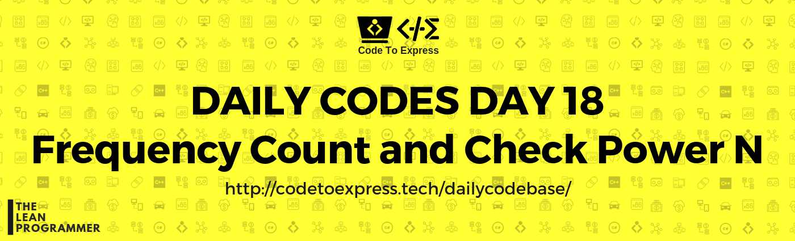
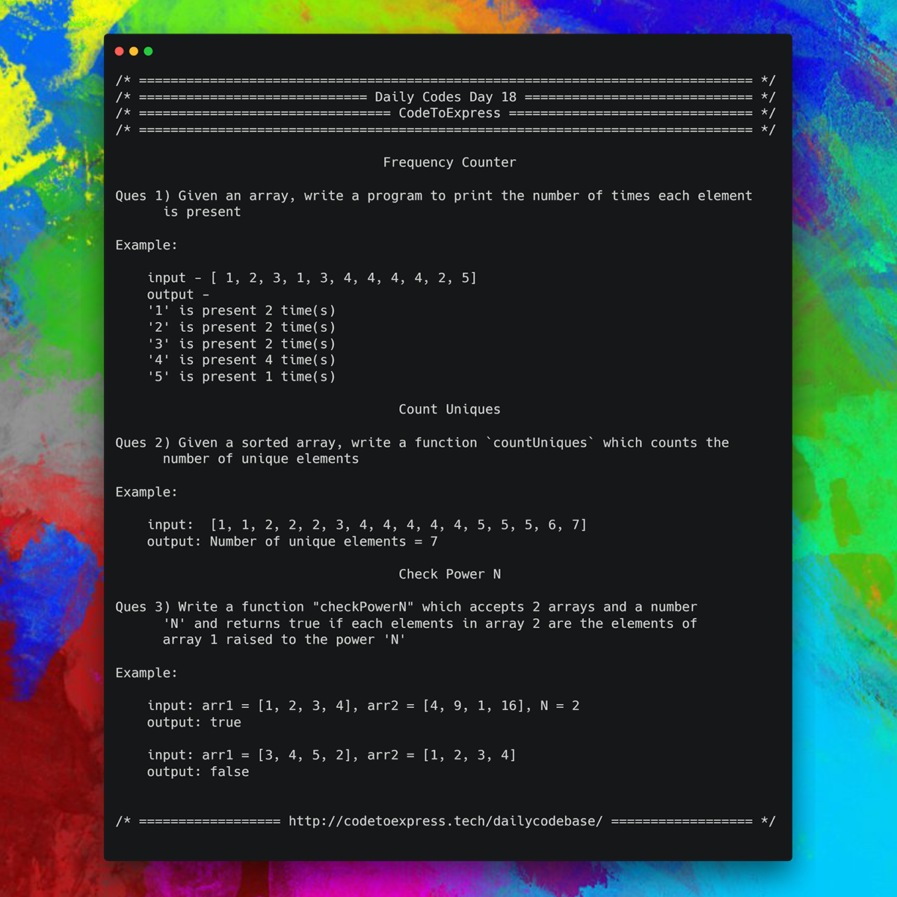

# Day 18 - Array Series Part 1

Till now we looked at some basic problems, then we went to string related problems, then we did some recursion based problems, now we will do some array based problems.

## Ques A - Frequency Counter

**Question** -- Given an array, write a program to print the number of times each element is present

**Example**

```
input - [ 1, 2, 3, 1, 3, 4, 4, 4, 4, 2, 5]
output -
'1' is present 2 time(s)
'2' is present 2 time(s)
'3' is present 2 time(s)
'4' is present 4 time(s)
'5' is present 1 time(s)
```

## Ques B - Count Uniques

**Question** -- Given a **sorted** array, write a function `countUniques` which counts the number of unique elements

**Example**

```
input: [1, 1, 2, 2, 2, 3, 4, 4, 4, 4, 4, 5, 5, 5, 6, 7]
output:
Number of unique elements = 7
```

## Ques C -- Check Power N

**Question** -- Write a function "checkPowerN" which accepts 2 arrays and a number 'N' and returns true if each elements in array 2 are the elements of array 1 raised to the power 'N'

**Example**

```
input: arr1 = [1, 2, 3, 4], arr2 = [4, 9, 1, 16], N = 2
output: true

input: arr1 = [3, 4, 5, 2], arr2 = [1, 2, 3], N=4
output: false
```



## Question 1 -- Frequency Counter

### JavaScript Implementation

#### [Solution by @MadhavBahl](./JavaScript/freqCounter_madhav.js)

```js
/**
 * @author MadhavBahl
 * @date 01/14/2018
 * Frequency Ccounter using object
 */

function freqCounter (arr) {
    let freq = {};

    // Iterate over the array and update frequency object
    for (let element of arr) {
        freq[element] = (freq[element] || 0) + 1;
    }
    
    // Print the output
    printFrequency (freq);
}

function printFrequency (freqObj) {
    for (let key in freqObj)
        console.log (`'${key}' is present ${freqObj[key]} time(s)`);
}

freqCounter ([ 1, 2, 3, 1, 3, 4, 4, 4, 4, 2, 5]);
```

### C++ Implementation

#### [Solution by @divyakhetan](./C++/FreqCounterDay18.cpp)

```cpp
/**
 * @author divyakhetan
 * @date 14/1/2019
 */

#include<bits/stdc++.h>
using namespace std;

int main(){
	int n;
	cin >> n;
	int a[n];
	map<int, int> m;
	for(int i = 0; i < n; i++){
		cin >> a[i];
		m[a[i]]++;
	}
	
	map<int, int>::iterator it;
	for (it = m.begin(); it != m.end(); it++)
	{
	    std::cout << it->first << " comes " << it->second << " times " << '\n';
	}
	return 0;
}
```

### [Solution by @dhruv-gupta14](./C++/day18a.cpp)

```cpp
/*
* @author : dhruv-gupta14
* @date : 14/01/2019
*/

#include <bits/stdc++.h>
using namespace std;

int main() {
	int n;
	cin >> n;
	int arr[n];
	int cnt[n] = {0};
	for(int i=0;i<n;i++)
	{
	    cin >> arr[i];
	    cnt[arr[i]]++;
	}
	
	for(int j=0;j<n;j++)
	{
	    if(cnt[arr[j]] != -1)
	    {
	        cout << arr[j] << " is present " << cnt[arr[j]] << " times" << endl;
	        cnt[arr[j]] = -1;
	    }
	}
	
	
	return 0;
}
```

## Java Implementation

### [Solution](./Java/Freq.java)

```java
/**
 * @date 14/01/19
 * @author SPREEHA DUTTA
 */
import java.util.*;
public class Freq {
   public static void main(String []args)
   {
       int n;int i;int t;int k=0;
       Scanner sc=new Scanner(System.in);
       System.out.println("Enter number of elements in the array ");
       n=sc.nextInt();
       int arr[]=new int[n];
       System.out.println("Enter elements of the array ");
       for(i=0;i<n;i++)
           arr[i]=sc.nextInt();
       Arrays.sort(arr);
       if(n!=1){
        if(arr[0]==arr[1])
           k=1;
       }
       else
           System.out.println("frequency of "+arr[0]+" is "+1);
       for(i=1;i<n;i++)
       {
           if(arr[i]==arr[i-1])
               k++;
           else
           {
               System.out.println("frequency of "+arr[i-1]+" is "+k);
               k=1;
           }
       }
       if(n!=1)
       System.out.println("frequency of "+arr[i-1]+" is "+k);
   }
}
```

### Python Implementation

#### [Solution](./Python/A_Frequency_Counter.py)

```python
"""
  @author : ashwek
  @date : 15/1/2019
"""

num = list(map(int, input("Enter numbers (space separated) = ").split()))

count = {}
for each in num:
	if count.get(each) == None :
		count[each] = 1
	else:
		count[each] += 1

for v,c in count.items():
	print("\'" + str(v) + "\' is present " + str(c) + " time(s)")
```

### [Solution 2](./Python/frequency_counter.py)

```python
"""
author: @aaditkamat
date: 15/01/2019
"""
def count_frequencies(lst):
  frequency_dictionary = {}
  
  for num in lst:
    if num not in frequency_dictionary:
      frequency_dictionary[num] = 1
    else:
      frequency_dictionary[num] += 1

  for key in frequency_dictionary:
    print(f'\'{key}\' is present {frequency_dictionary[key]} time(s)')

def get_input(word):
  print(f'Enter {word} input array: ', end='')
  input_array = input()
  return input_array

def handle_input(word):
  input_array = get_input(word)
  return convert_input_array_to_list(input_array)

def convert_input_array_to_list(input_array):
  return list(map(lambda x: int(x), input_array.strip('[').strip(']').split(',')))

def main():
  lst = handle_input('an')
  count_frequencies(lst)
```

***

## Question 2 -- Count Uniques

### JavaScript Implementation

#### [Solution 1](./JavaScript/countUniques1.js)

Using Multiple Pointer

```js
/**
 * @author MadhavBahl
 * @date 14/01/2019
 * Count uniques using multiple pointers (since the input array is sorted)
 */


function countUniques (arr) {
    if (arr.length === 0)   return 0;

    let i=0;

    for (let j=1; j<arr.length; j++) {
        if (arr[i] !== arr[j]) {
            i++;
            arr[i] = arr[j];
        }
    }

    return i+1;
}

console.log (`Number of unique elements = ${countUniques([1, 1, 2, 2, 2, 3, 4, 4, 4, 4, 4, 5, 5, 5, 6, 7])}`);
```

#### [Solution 2](./JavaScript/countUniques2.js)

Using Frequency Object

```js
/**
 * @author MadhavBahl
 * @date 14/01/2019
 * Count Uniques using frequency object
 */

function countUniques (arr) {
    let freq = {},
        count = 0;

    for (let element of arr) {
        if (!(element in freq)) {
            count++;
            freq[element] = 1;
        } else
            freq[element]++;
    }

    return count;
}

console.log (`Number of unique elements = ${countUniques([1, 1, 2, 2, 2, 3, 4, 4, 4, 4, 4, 5, 5, 5, 6, 7])}`);
```

#### [Solution 3](./JavaScript/countUniques3.js)

Using Brute Force Search

```js
/**
 * @author MadhavBahl
 * @date 14/01/2019
 * Count Uniques using brute force search
 */

function countUniques (arr) {
    if (arr.length === 0)   return 0;

    let count = 1; // first element is always unique, since there is nothing behind it
    for (let j=1; j<arr.length; j++) {
        let flag = true;
        for (let i=0; i<j; i++) {
            if (arr[i] === arr[j]) {
                flag = false;
                break;
            }
        }
        if (flag)
            count++;
    }

    return count;
}

console.log (`Number of unique elements = ${countUniques([1, 1, 2, 2, 2, 3, 4, 4, 4, 4, 4, 5, 5, 5, 6, 7])}`);
```

### C++ Implementation

#### [Solution by @divyakhetan](./C++/UniqueElementsDay18.cpp)

```cpp
/**
 * @author divyakhetan
 * @date 14/1/2019
 */

#include<bits/stdc++.h>
using namespace std;

int main(){
	int n;
	cin >> n;
	int a[n];
	
	for(int i = 0; i < n; i++){
		cin >> a[i];
		
	}
	
	//since sorted
	
	int count = 1;
	int pos = a[0];
	for(int i = 1; i < n; i++){
		if(a[i] != pos){
			count++;
			pos = a[i];
			
		}
	}
	
	cout << count << endl;
	return 0;
}
```

### [Solution by @dhruv-gupta14](./C++/day18b.cpp)

```cpp
/*
* @author : dhruv-gupta14
* @date : 14/01/2019
*/

#include <bits/stdc++.h>
using namespace std;

int main() {
	int n;
	cin >> n;
	int arr[n];
    
    for(int i=0;i<n;i++)
    {
        cin >> arr[i];
    }
    
    std::set<int> s(arr,arr+n);
    cout << "Number of unique elements = " << s.size() << endl;
	return 0;
}
```

## Java Implementation

### [Solution](./Java/Unique.java)

```java
/**
 * @date 14/01/19
 * @author SPREEHA DUTTA
 */
import java.util.*;
public class Unique {
    public static void countUniques(int arr[])
    {
        int k=1;
        for(int i=1;i<arr.length;i++)
        {
            if(arr[i]!=arr[i-1])
                k++;
        }
        System.out.println("Number of unique elements = "+k);
    }
    public static void main(String []args)
    {
        int n;int i;
        Scanner sc=new Scanner(System.in);
        System.out.println("Enter number of elements");
        n=sc.nextInt();
        int arr[]=new int[n];
        System.out.println("Enter elements of the array ");
        for(i=0;i<n;i++)
            arr[i]=sc.nextInt();
        countUniques(arr);
    }
}
```

### Python Implementation

#### [Solution](./Python/B_Count_Uniques.py)

```python
"""
  @author : ashwek
  @date : 15/1/2019
"""

def countUniques(data):
	return len(set(data))

data = [1, 1, 2, 2, 2, 3, 4, 4, 4, 4, 4, 5, 5, 5, 6, 7]
print("Number of unique elements =", countUniques(data))
```

#### [Solution 2](./Python/count_uniques.py)

```python
'''
@author: aaditkamat
@date: 15/01/2019
'''
from frequency_counter import handle_input, count_frequencies

def count_uniques(frequency_dictionary):
  print(f'Number of unique elements = {len(frequency_dictionary)}')

def main():
  lst = handle_input('an')
  frequency_dictionary = count_frequencies(lst)
  count_uniques(frequency_dictionary)
  
main()
```

***

## Question 3 -- Check Power N

### JavaScript Implementation

#### [Solution 1](./JavaScript/checkPowerN_madhav.js)

Using Frequency Count

```js
/**
 * @author MadhavBahl
 * @date 14/01/2019
 * Using frequency counter
 */

function checkPowerN (arr1, arr2, num) {
    if (arr1.length !== arr2.length)    return false;

    let freq1 = {};
        freq2 = {};
    
    // Make frequency counter for array 1
    let powElement;
    for (let element of arr1) {
        powElement = Math.pow (element, num);
        freq1[powElement] = (freq1[powElement] || 0) + 1;
    }

    // Make frequency counter for array 2
    for (let element of arr2) 
        freq2[element] = (freq2[element] || 0) + 1;
        
    // Compare the objects
    for (let key in freq1) {
        if (!(key in freq2))
            return false;
        if (freq1[key] !== freq2[key])
            return false;
    }
    return true;
}

console.log (checkPowerN ([1, 2, 3, 4], [4, 9, 1, 16], 2));
console.log (checkPowerN ([3, 4, 5, 2], [1, 2, 3], 4));
```

#### [Solution 2](./JavaScript/checkPowerN_madhav.js)

Using Brute Force search

```js
/**
 * @author MadhavBahl
 * @date 14/01/2019
 * Using Brute Force Search
 */

function checkPowerN (arr1, arr2, num) {
    if (arr1.length !== arr2.length)    return false;

    for (let i=0; i<arr1.length; i++)
        arr1[i] = Math.pow (arr1[i], num);

    for (let element of arr1) {
        let pos = arr2.indexOf (element);

        if (pos < 0)
            return false;
        
        arr2.splice (pos, 1);
    }
    return true;
}

console.log (checkPowerN ([1, 2, 3, 4], [4, 9, 1, 16], 2));
console.log (checkPowerN ([3, 4, 5, 2], [1, 2, 3], 4));
```

### C++ Implementation

#### [Solution by @dhruv-gupta14](./C++/day18c.cpp)

```cpp
/*
* @author : dhruv-gupta14
* @date : 14/01/2019
*/

#include <bits/stdc++.h>
using namespace std;

int main() {
	int n,m,cnt=0;
	cin >> n;
	cin >> m;
	int arr1[n];
	int arr2[n];
    
    for(int i=0;i<n;i++)
    {
        cin >> arr1[i];
    }
    
    for(int j=0;j<n;j++)
    {
        cin >> arr2[j];
    }
    
    sort(arr1,arr1 + n);
    sort(arr2,arr2 + n);
    
    for(int k =0 ;k<n; k++)
    {

        if(arr2[k] == pow(arr1[k],m))
        {
            cnt++;
        } else
        {
            cout << "false";
            break;
        }
    }
	
	if (cnt == n)
	{
	    cout << "true";
	}
	
	return 0;
}
```

#### [Solution by @divyakhetan](./C++/CheckSquareDay18.cpp)


```cpp
/**
 * @author divyakhetan
 * @date 14/1/2019
 */

#include<bits/stdc++.h>
using namespace std;

int main(){
	int n;
	cin >> n;
	int a[n];
	int b[n];
	for(int i = 0; i < n; i++){
		cin >> a[i];
	
	}
	
	for(int i = 0; i < n; i++){
		cin >> b[i];
	
	}
	int num;
	cin >> num;
	sort(a, a + n);
	sort(b, b + n);
	

	bool flag = true;
	for(int i = 0; i< n; i++){
		
		if((int) pow(a[i], num) != b[i]){
			flag = false;
			break;
		}
	}
	if(flag)
	cout << "true" << endl;
	else cout << "false" << endl;
	return 0;
}
```

## Java Implementation

### [Solution](./Java/Power.java)

```java
/**
 * @date 14/01/19
 * @author SPREEHA DUTTA
 */
import java.util.*;
public class Power {
    public static void main(String []args)
    {
        Scanner sc=new Scanner(System.in);
        int n,p;int i,j;int k=0;
        System.out.println("Enter size of the array ");
        n=sc.nextInt();
        ArrayList<Integer> arr1 = new ArrayList<Integer>(n);
        ArrayList<Integer> arr2 = new ArrayList<Integer>(n);
        System.out.println("Enter elements of the first array ");
        for(i=0;i<n;i++)
            arr1.add(sc.nextInt());
        System.out.println("Enter elements of the second array ");
        for(i=0;i<n;i++)
            arr2.add(sc.nextInt());
        System.out.println("Enter power");
        p=sc.nextInt();
        for(i=0;i<n;i++)
        {
            int t=(int)(Math.pow(arr1.get(i),p));
            if(arr2.contains(t))
                k++;
        }
        if(k==n)
            System.out.println("true");
        else
            System.out.println("false");
    }
}
```

### Python Implementation

#### [Solution](./Python/C_Check_Power_N.py)

```python
"""
  @author : ashwek
  @date : 15/1/2019
"""

def checkPowerN(arr1, arr2, pow):

	arr1 = sorted(set(arr1))
	arr2 = sorted(set(arr2))

	if len(arr1) != len(arr2) :
		return False

	for i in range(len(arr1)):
		if arr1[i]**pow != arr2[i] :
			return False

	return True


arr1 = [1, 2, 3, 4]
arr2 = [4, 9, 1, 16]
n = 2
print("arr1 =", arr1, "arr2 =", arr2, "n =", n)
print("output = ", checkPowerN(arr1, arr2, n))

arr1 = [3, 4, 5, 2]
arr2 = [1, 2, 3]
n = 4
print("arr1 =", arr1, "arr2 =", arr2, "n =", n)
print("output = ", checkPowerN(arr1, arr2, n))
```

### Python Implementation

#### [Solution 2](./Python/check_power_n.py)
```python
'''
@author:aaditkamat
@date: 15/01/2019
'''
from frequency_counter import handle_input

"""
I wrote a one liner for the check_power_n function thanks to python's generators which is quite messy ;-) 
print(len(list(filter(lambda x: x == 1, map(lambda x: len([num for num in first if x == num ** N]), second)))) == len(second))
"""
def check_power_n(first, second, N):
  count = 0
  for num in first:
    for x in second:
      if x == num ** N:
        count += 1
  print(count == len(second))

def main():
  first = handle_input('first')
  second = handle_input('second')
  print('Enter a number: ', end='')
  N = int(input())
  check_power_n(first, second, N)

main()
```
