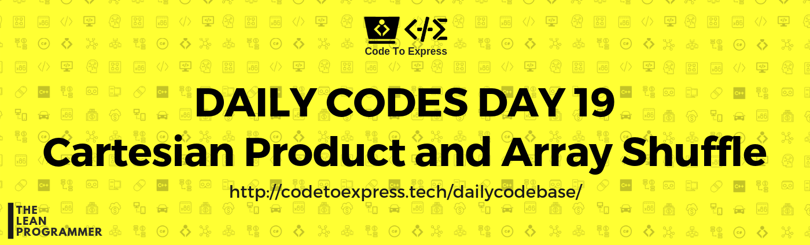

# Day 19 - Array Series Part 2

**Cartesian Product and Fisher-Yates Shuffle Algorithm**

## Ques A - Cartesian Product of Two Sets

**Question** -- Given 2 sets A and B, write a program to print the cartesian product of A and B.

#### Cartesian Product

In set theory a Cartesian product is a mathematical operation that returns a set (or product set or simply product) from multiple sets. That is, for sets A and B, the Cartesian product A × B is the set of all ordered pairs (a, b) where a ∈ A and b ∈ B

Source: [Wikipedia](https://en.wikipedia.org/wiki/Cartesian_product)

**Example**

```
input:
  A = [1, 2]
  B = [3, 4]
output:
[ 
    [1, 3],
    [1, 4],
    [2, 3],
    [2, 4]
]
```

## Ques B - Fisher-Yates Shuffle Algorithm

**Question** - Given an array, write a function that returns an array with shuffled elements form the original array

**Example**

```
input: [1, 2, 3, 4, 5, 6]
output: [3, 1, 4, 2, 5, 6]
```

### Fisher-Yates Shuffle Algorithm

The Fisher–Yates shuffle is an algorithm for generating a random permutation of a finite sequence—in plain terms, the algorithm shuffles the sequence. The algorithm effectively puts all the elements into a hat; it continually determines the next element by randomly drawing an element from the hat until no elements remain. The algorithm produces an unbiased permutation: every permutation is equally likely.

The Fisher–Yates shuffle is named after Ronald Fisher and Frank Yates, who first described it, and is also known as the Knuth shuffle after Donald Knuth.

#### Algorithm

1. Write down the numbers from 1 through N.
2. Pick a random number k between one and the number of unstruck numbers remaining (inclusive).
3. Counting from the low end, strike out the kth number not yet struck out, and write it down at the end of a separate list.
4. Repeat from step 2 until all the numbers have been struck out.
5. The sequence of numbers written down in step 3 is now a random permutation of the original numbers.

source: [wikipedia (https://en.wikipedia.org/wiki/Fisher%E2%80%93Yates_shuffle)](https://en.wikipedia.org/wiki/Fisher%E2%80%93Yates_shuffle)


# Solution

## Ques A

**Question** -- Given 2 sets A and B, write a program to print the cartesian product of A and B.

### JavaScript Implementation

#### [Solution by @MadhavBahlMD](./JavaScript/cartesian_madhav.js)

```js
/**
 * @author MadhavBahlMD
 * @date 15/01/2018
 * Method: Use nested loop to generate the 2D matrix
 */

function cartesian (arr1, arr2) {
    if (arr1.length === 0 || arr2.length === 0) return null;

    let cartesianProduct = [];

    for (let arr1Element of arr1) {
        for (let arr2Element of arr2) {
            cartesianProduct.push([arr1Element, arr2Element]);
        }
    }

    return cartesianProduct;
}

console.log (cartesian ([1, 2], [3, 4]));
console.log (cartesian ([1, 2], []));
console.log (cartesian ([1, 2, 3, 4], ['a', 'b', 'c']));
```

### C++ Implementation

#### [Solution 1](./C++/day19a.cpp)

```cpp
/*
* @author : dhruv-gupta14
* @date : 15/01/2019
*/

#include <bits/stdc++.h>
using namespace std;

int main() {
	int n,m;
	cin >> n >> m;
	int arr1[n];
	int arr2[m];
	
	for(int i=0;i<n;i++)
	    cin >> arr1[i];
	    
	for(int j=0;j<m;j++)
	    cin >> arr2[j];
	    
	for(int l=0;l<n;l++)
	{
	    for(int k=0;k<m;k++)
	    {
	        cout << arr1[l] << "," << arr2[k] << endl;
	    }
	}
	return 0;
}
```

***

## Ques B

**Question** -- Given an array, write a function that returns an array with shuffled elements form the original array

### JavaScript Implementation

#### [Solution (using recursion)](./JavaScript/fisherYates_madhav.js)

```js
/**
 * Fisher Yates Shuffle Algorithm
 * Implemented in JavaScript by @MadhavBahlMD
 * Algorithm
 *   Step 1: Write down the numbers from 1 through N.
 *   Step 2: Pick a random number k between one and the number of unstruck numbers remaining (inclusive).
 *   Step 3: Counting from the low end, strike out the kth number not yet struck out, and write it down at the end of a separate list.
 *   Step 4: Repeat from step 2 until all the numbers have been struck out.
 *   Step 5: The sequence of numbers written down in step 3 is now a random permutation of the original numbers.
 * Method used - Helper Method Recursion
 */

function fisherYates (arr) {
    let shuffledArr = [];
    console.log (`Original Array: ${arr}`);
    
    function shuffle (toBeShuffled) {
        // Base Case
        if (toBeShuffled.length === 0)  return;
        
        // Push inro shuffled array
        let index = Math.floor(Math.random()*toBeShuffled.length);
        shuffledArr.push (toBeShuffled[index]);

        // Shuffle the remaining array
        toBeShuffled.splice (index, 1);
        shuffle (toBeShuffled);
    }
    
    shuffle (arr);
    console.log (`Shuffled Array: ${shuffledArr}`);
}

fisherYates ([1, 2, 3, 4, 5, 6]);
```

### C++ Implementation

#### [Solution 1](./C++/day19b.cpp)

```cpp
/*
* @author : dhruv-gupta14
* @date : 15/01/2019
*/

#include <bits/stdc++.h>
using namespace std;

int main() {
	int n;
	cin >> n;
	int arr1[n];
	
	for(int i=0;i<n;i++)
	    cin >> arr1[i];
	    
    int temp=0;
    int random_index = 0;
    
    for(int j=0;j<n;j++)
    {
        random_index = rand() % n;
        temp = arr1[j];
        arr1[j] = arr1[random_index];
        arr1[random_index] = temp;
    }
    
    for(int k=0;k<n;k++)
        cout << arr1[k] << " ";
	    

	return 0;
}
```
