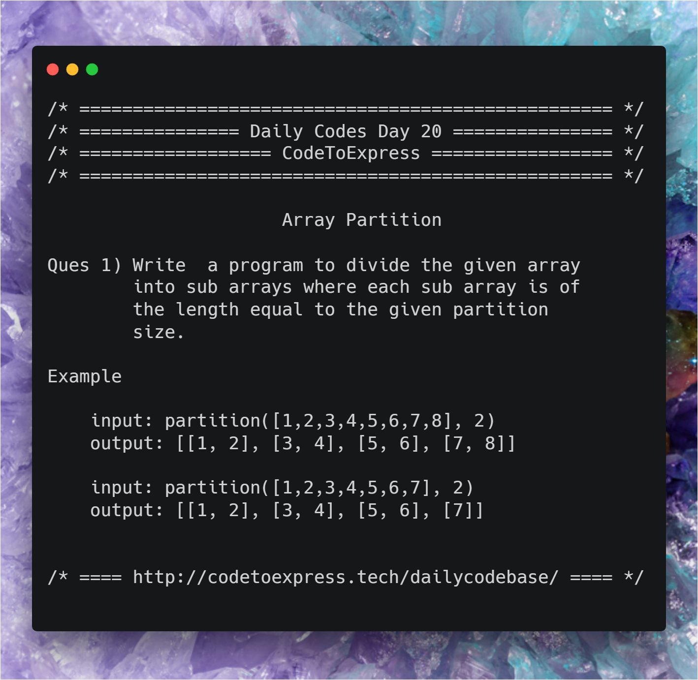

# Day 20 - Array Partition

Write a program to divide the given array into sub arrays where each sub array is of the length equal to the given partition size.

## Example

```
input: partition([1,2,3,4,5,6,7,8], 2)
output: [[1, 2], [3, 4], [5, 6], [7, 8]]

input: partition([1,2,3,4,5,6,7], 2)
output: [[1, 2], [3, 4], [5, 6], [7]]
```



## JavaScript Solution(s)

### [Solution 1](./JavaScript/sol1.js)

A very simple solution, all we have to is loop through i=0 to array length. In each iteration we check whether current iteration (i) is divisible by size or not, if it is not divisible, we add the current element in `toBeAdded` array otherwise we push the `toBeAdded` array into `partitionedArray`. Also, we check that `toBeAdded` is not wmpty otherwise it will push an empty array to `partitionedArray`


```js
function partition (array, size) {
let partitionedArray = [],
toBeAdded = [];

for (let i=0; i<array.length; i++) {
if ((i)%size === 0) {
if (toBeAdded.length > 0)  partitionedArray.push (toBeAdded);
toBeAdded = [];
}
toBeAdded.push (array[i]);
}
if (toBeAdded.length > 0)  partitionedArray.push (toBeAdded);
return partitionedArray;
}
```

### [Solution 2](./JavaScript/sol2.js)

The second solution is also similar to the first one. Here, we create an empty array to hold partitions (let's call the array `partitionedArray`). Now for each element in the "original" array, we retrieve the  last element in partitionedArray . If the last element does not exist (in case of empty array), or if it's size is equal to the partition size, we push a new partition array into the `partitionedArray` with the current element. Otherwise, we add the current element into the partition.

```js
function partition (array, size) {
let partitionedArray = [];

for (let element of array) {
let partition = partitionedArray[partitionedArray.length - 1];
if (!partition || partition.length === size) {
partitionedArray.push ([element]);
} else {
lastEle.push (element);
}
}

return partitionedArray;
}
```

### [Solution 3](./JavaScript/sol3.js)

This method will use JavaScript's `slice` method. This is probably the easiest method due to the inbuilt function `slice`. 

#### How slice works

array.sllice (startIndex, endIndex); will return a subarray of array including elements from startIndex to endIndex (**not including endIndex**).

#### Steps

- Create an empty `partitionedArray` array
- run a while loop from index i=0 to less than "original" array.length
- Push a `slice` of length `size` from `array` to `partitionedArray`.
- `index = index+size`

```js
function partition (array, size) {
let partitionedArray = [], i=0;
while (i<array.length) {
partitionedArray.push (array.slice(i, i+size));
i += size;
}
return partitionedArray;
}
```

## Java Implementation

### [Solution](./Java/Partitions.java)

```java
/**
* @date 16/01/19
* @author SPREEHA DUTTA
*/
import java.util.*;
public class Partitions {
public static void main(String []args)
{
Scanner sc=new Scanner(System.in);
int n,p,i,j;int k=0;
System.out.println("Enter size of original array");
n=sc.nextInt();
int arr[]=new int[n];
for(i=0;i<n;i++)
arr[i]=sc.nextInt();
System.out.println("Enter size of partition");
p=sc.nextInt();
for(i=0;i<arr.length;i=i+p)
{
int part[]=Arrays.copyOfRange(arr,i,i+p);
k++;
if(arr.length%2!=0 && k==(arr.length/p+1))
p=arr.length%p;
System.out.print("{ ");
for(j=0;j<p;j++)
System.out.print(part[j]+" ");
System.out.print("}\n");
}
}
}
```

## C++ Solution

### [Solution @divyakhetan](./C++/PartitionDay20.cpp)


```cpp
/**
* @author divyakhetan
* @date 16/1/2019
*/

#include<bits/stdc++.h>
using namespace std;

int main(){
cout << "Enter length of 1st and 2nd array";
int n1, n2;    
cin >> n1 >> n2;
int a[n1];
int b[n2];
for(int i = 0; i < n1; i++){
cin >> a[i];

}

for(int i = 0; i < n2; i++){
cin >> b[i];
}

for(int i = 0; i < n1; i++){
for(int j = 0; j < n2; j++){
cout << "[ " << a[i]  << " " << b[j] << " ] " << endl;
}
}
return 0;
}
```
