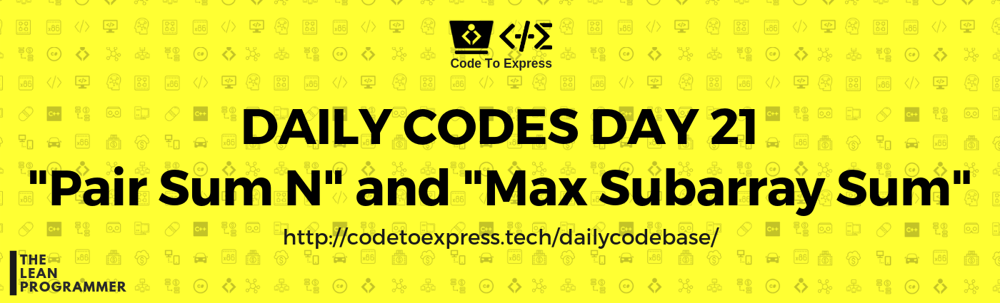

# Day 21 - Array Series Part 4

## Question 1 - Pair Sum N

**Question** -- Given a sorted array of integers and a number `num`, write a function `pairSumN` which returns the first pair of integers whose sum equals to the given number `num`, return an empty array if the pair does not exist

**Example**

```
input: arr = [-3, -2, -1, 0, 1, 2, 3], num = 0
output: [-3, 3]

input: arr = [-1, 4, 5, 5, 6, 7, 8], num = 10
output: [4, 6]

input; arr = [1, 2, 3, 4, 5, 6], num = 20
output: []
```

## Question 2 - Max Subarray Sum

**Question** -- Given an array of integers and a number `n`, write a function which returns the maximum sum of `n` consecutive numbers in that array.

**Example**

```
input: arr = [1, 3, 2, 4, 7, 5, 4], N = 3
output: 16 (7 + 5 + 4)
```


## Question 1 -- Pair Sum N

## JavaScript Implementation

### [Solution 1 by @MadhavBahlMD](./JavaScript/pairSumN1.js)

```js
/**
 * @author MadhavBahlMD
 * @date 17/01/2019
 * Method used -- bruteforce search (Iteration using nested loops)
 */

function pairSumN (arr, num) {
    let pairArray = [];

    for (let i=0; i<arr.length-1; i++)
        for (let j=i+1; j<arr.length; j++) {
            if (arr[i] + arr[j] === num) {
                pairArray.push (arr[i], arr[j]);
                return pairArray;
            }
        }
    
    return pairArray;
}

console.log (pairSumN ([-3, -2, -1, 0, 1, 2, 3], 0));
console.log (pairSumN ([-1, 4, 5, 5, 6, 7, 8], 10));
console.log (pairSumN ([1, 2, 3, 4, 5, 6], 20));
```

### [Solution 2 by @MadhavBahlMD](./JavaScript/pairSum2.js)

```js
/**
 * @author MadhavBahlMD
 * @date 16/01/2019
 * Method -- Multiple Pointers, solution in O(n)
 */

function pairSumN (arr, num) {
    let i=0, j=arr.length-1, pairArr = [];

    while (i<j) {
        if (arr[i] + arr[j] === num) {
            pairArr.push (arr[i], arr[j]);
            return pairArr;
        }
        else if (arr[i] + arr[j] < num)
            i++;
        else
            j--;
    }

    return pairArr;
}

console.log (pairSumN ([-3, -2, -1, 0, 1, 2, 3], 0));
console.log (pairSumN ([-1, 4, 5, 5, 6, 7, 8], 10));
console.log (pairSumN ([1, 2, 3, 4, 5, 6], 20));
```

***

## Question 2 - Max Subarray Sum

## JavaScript Implementation

### [Solution 1 by @MadhavBahlMD](./JavaScript/maxSubarray_madhav.js)

Method - Bruteforce Search -- Worst Case Complexity = O(m.n), where m = array length and n is input number

```js
/**
 * @author MadhavBahlMD
 * @date 17/01/2019
 * Method - Bruteforce Search
 */

function maxSubarraySum (arr, n) {
    let max = 0;

    for (let i=0; i<arr.length - n + 1; i++) {
        let currentSum = 0;

        for (let j=i; j<i+n; j++) 
            currentSum += arr[j];
        
        if (currentSum > max)
            max = currentSum;
    }

    return max;
}

console.log (maxSubarraySum ([1, 3, 2, 4, 7, 5, 4], 3)); // 16
```

### [Solution 2 by @MadhavBahlMD](./JavaScript/maxSubarray_madhav2.js)

Method - Sliding Wndow -- Solvable in O(m) time, m = array length

```js
/**
 * @author MadhavBahlMD
 * @date 17/01/2019
 * Method - Sliding Wndow -- Solvable in O(m) time, m = array length
 */

function maxSubarraySum (arr, n) {
    let currentSum = 0;

    for (let i=0; i<n; i++) 
        currentSum += arr[i];

    let  max = currentSum;

    for (let i=n; i<arr.length; i++) {
        currentSum -= arr[i-n];
        currentSum += arr[i];

        if (currentSum > max)
            max = currentSum;
    }

    return max;
}

console.log (maxSubarraySum ([1, 3, 2, 4, 7, 5, 4], 3)); // 16
```