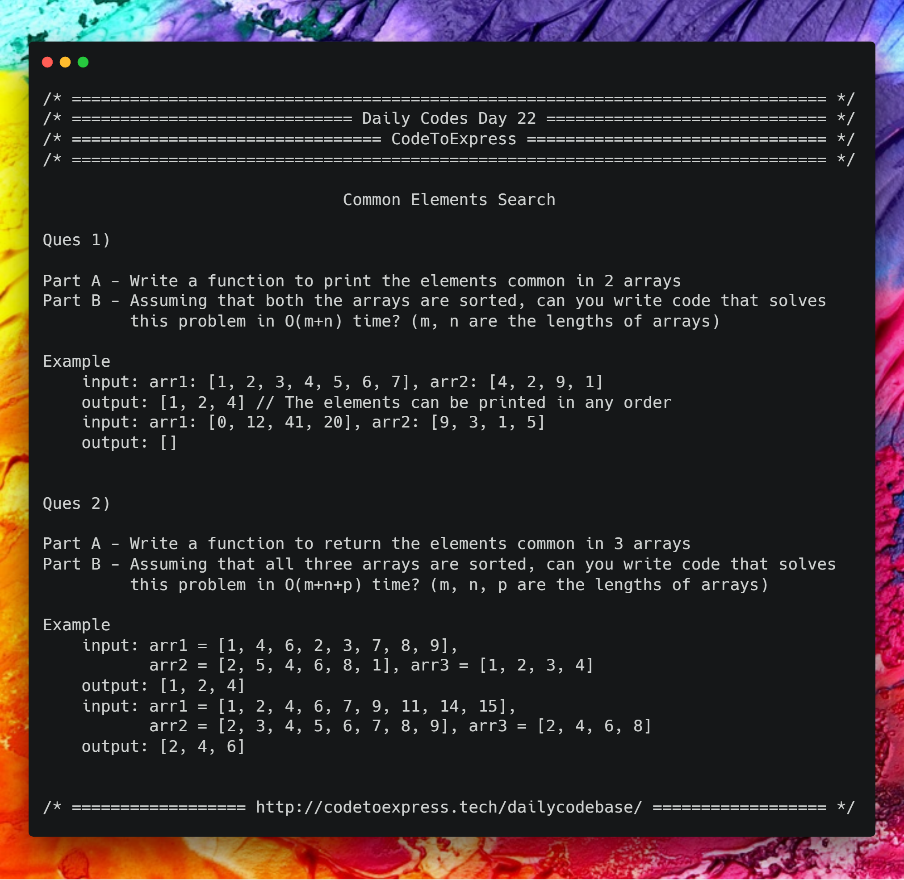

# Day 22 - Array Series Part 5 : Common Elements Search

## Question 1

Part A - Write a function to print the elements common in 2 arrays
Part B - Assuming that both the arrays are sorted, can you write code that solves this problem in O(m+n) time? (m, n are the lengths of arrays)

**Example**

```
input: arr1: [1, 2, 3, 4, 5, 6, 7], arr2: [4, 2, 9, 1]
output: [1, 2, 4] // The elements can be printed in any order

input: arr1: [0, 12, 41, 20], arr2: [9, 3, 1, 5]
output: [] 
```

## Question 2

Part A - Write a function to return the elements common in 3 arrays
Part B - Assuming that all three arrays are sorted, can you write code that solves this problem in O(m+n+p) time? (m, n, p are the lengths of arrays)

**Example**

```
input: arr1 = [1, 4, 6, 2, 3, 7, 8, 9], arr2 = [2, 5, 4, 6, 8, 1], arr3 = [1, 2, 3, 4]
output: [1, 2, 4]

input: arr1 = [1, 2, 4, 6, 7, 9, 11, 14, 15], arr2 = [2, 3, 4, 5, 6, 7, 8, 9], arr3 = [2, 4, 6, 8]
output: [2, 4, 6]
```



# Solution

## Question 1

## JavaScript Implementation

### [Solution 1 -- Brute Force Search](./JavaScript/sol1a_bruteforce.js)

Method Used -- Bruteforce Search

```js
/**
 * @author MadhavBahlMD
 * @date 18/01/2019
 * Method - Brute force Search
 */

function searchCommonElements (arr1, arr2) {
    let commonElements = [];

    for (let i=0; i<arr1.length; i++) 
        for (let j=0; j<arr2.length; j++) {
            if (arr1[i] === arr2[j])
                commonElements.push (arr1[i]);
        }

    return commonElements;
}

console.log (searchCommonElements ([1, 2, 3, 4, 5, 6, 7], [4, 2, 9, 1]));
console.log (searchCommonElements ([0, 12, 41, 20], [9, 3, 1, 5]));
```

### [Solution 2 -- Using JavaScript's `indexOf()` method](./JavaScript/sol1b_indexOf.js)

```js
/**
 * @author MadhavBahlMD
 * @dete 18/01/2019
 * Method - Using JavaScript's `indexOf()` method
 */

function searchCommonElements (arr1, arr2) {
    let commonElements = [];

    for (let element of arr1)
        if (arr2.indexOf (element) >= 0)
            commonElements.push (element);
    
    return commonElements;
}

console.log (searchCommonElements ([1, 2, 3, 4, 5, 6, 7], [4, 2, 9, 1]));
console.log (searchCommonElements ([0, 12, 41, 20], [9, 3, 1, 5]));
```

### [Solution 3 -- Multiple Pointers](./JavaScript/sol1c_multiplepointers.js)

```js
/** FOR SORTED ARRAY
 * @author MadhavBahlMD
 * @date 18/01/2019
 * Method - Multiple Pointers 
 * NOTE - For this method, We are assuming that the arrays are sorted. 
 * Time Complexity = O(m+n)
 */

function searchCommonElements (arr1, arr2) {
    let commonElements = [],
        i = 0,
        j = 0;
    
    while (i < arr1.length && j < arr2.length) {
        if (arr1[i] < arr2[j])
            i++;
        else if (arr1[i] > arr2[j])
            j++;
        else {
            commonElements.push (arr1[i]);
            i++; j++;
        }
    }

    return commonElements;
}

console.log (searchCommonElements ([1, 2, 3, 5, 7, 9, 12], [3, 4, 5, 6, 7]));
```

### [Solution 4 -- Frequency Count](./JavaScript/sol1d_frequencycount.js)

```js
/**
 * @author MadhavBahlMD
 * @date 18/01/2019
 * Method - Frequency Count
 */

function searchCommonElements (arr1, arr2) {
    let commonElements = [];

    // Create frequency count
    let freq1 = {},
        freq2 = {};

    for (let element of arr1)
        freq1[element] = (freq1[element] || 0) + 1;
    
    for (let element of arr2)
        freq2[element] = (freq2[element] || 0) + 1;
    
    // Check common elements
    for (let key in freq1)
        if (freq2.hasOwnProperty(key))
            commonElements.push (key); // For Integer array, use parseInt(key) instead of directly pushing the key
    
    return commonElements;
}

console.log (searchCommonElements ([1, 2, 3, 4, 5, 6, 7], [4, 2, 9, 1]));
console.log (searchCommonElements ([0, 12, 41, 20], [9, 3, 1, 5]));
```

***
## C++ Implementation

### [Solution 1](./C++/commonElements.cpp)
```cpp
/**
 * @author: Rajdeep Roy Chowdhury<rrajdeeproychowdhury@gmail.com>
 * @github: https://github.com/razdeep
 * @date: 18/01/2019
 */
#include <bits/stdc++.h>

int main()
{
    std::vector<int> a = {1, 2, 3, 4, 5, 6, 8, 8, 7};
    std::vector<int> b = {4, 2, 9, 1, 8};
    std::sort(a.begin(), a.end());
    auto last_ptr = std::unique(a.begin(), a.end());
    a.resize(std::distance(a.begin(), last_ptr));

    for (auto i : a)
    {
        if (std::find(b.begin(), b.end(), i) != b.end())
            std::cout << i << std::endl;
    }

    return 0;
}
```
## Question 2

## JavaScript Implementation

### [Solution 1 -- Brute Force Search](./JavaScript/sol2a_bruteforce.js)

```js
/**
 * @author MadhavBahlMD
 * @date 18/01/2019
 * Method - Bruteforce Search - Time complexity = O(m.n.p) // m, n, and p are the lengths of 3 input arrays
 */

function searchCommonElements (arr1, arr2, arr3) {
    let commonElements = [];

    for (let element of arr1)
        if (arr2.indexOf (element) >= 0)
            if (arr3.indexOf (element) >= 0)
                commonElements.push (element);
    
    return commonElements;
}

console.log (searchCommonElements ([1, 4, 6, 2, 3, 7, 8, 9], [2, 5, 4, 6, 8, 1], [1, 2, 3, 4]));
console.log (searchCommonElements ([1, 2, 4, 6, 7, 9, 11, 14, 15], [2, 3, 4, 5, 6, 7, 8, 9], [2, 4, 6, 8]));
```

### [Solution 2 -- Frequency Count](./JavaScript/sol2b_frequencycount.js)

```js
/**
 * @author MadhavBahlMD
 * @date 18/01/2019
 * Method - Frequency Count (object)
 */

function searchCommonElements (arr1, arr2, arr3) {
    let commonElements = [];

    // Create frequency count
    let freq1 = {},
        freq2 = {},
        freq3 = {};

    assignFrequency (freq1, arr1);
    assignFrequency (freq2, arr2);
    assignFrequency (freq3, arr3);
    
    for (let key in freq1)
        if (key in freq2 && key in freq3)
            commonElements.push (parseInt(key));
    
    return commonElements;
}

function assignFrequency (freq, arr) {
    for (let element of arr)
        freq[element] = (freq[element] || 0) + 1;
}

console.log (searchCommonElements ([1, 4, 6, 2, 3, 7, 8, 9], [2, 5, 4, 6, 8, 1], [1, 2, 3, 4])); // [1, 2, 4]
console.log (searchCommonElements ([1, 2, 4, 6, 7, 9, 11, 14, 15], [2, 3, 4, 5, 6, 7, 8, 9], [2, 4, 6, 8])); // [2, 4, 6]
```

### [Solution 3 -- Multiple Pointers](./JavaScript/sol2c_multiplepointers.js)

```js
/** FOR SORTED ARRAYS
 * @author MadhavBahlMD
 * @date 18/01/2019
 * Method - Multiple Pointers 
 * NOTE - For this method, We are assuming that the arrays are sorted. 
 * Time Complexity = O(m+n+p)
 */

function searchCommonElements (arr1, arr2, arr3) {
    let commonElements = [],
        i=0, j=0, k=0;
    
    while (i<arr1.length && j<arr2.length && k<arr3.length) {
        if (arr1[i] === arr2[j] && arr1[i] === arr3[k]) {
            commonElements.push (arr1[i]);
            i++; j++; k++;
        } else if (arr1[i] < arr2[j])
            i++;
        else if (arr2[j] < arr3[k])
            j++;
        else
            k++;
    }

    return commonElements;
}

console.log (searchCommonElements ([1, 2, 4, 6, 7, 9, 11, 14, 15], [2, 3, 4, 5, 6, 7, 8, 9], [2, 4, 6, 8])); // [2, 4, 6]
```