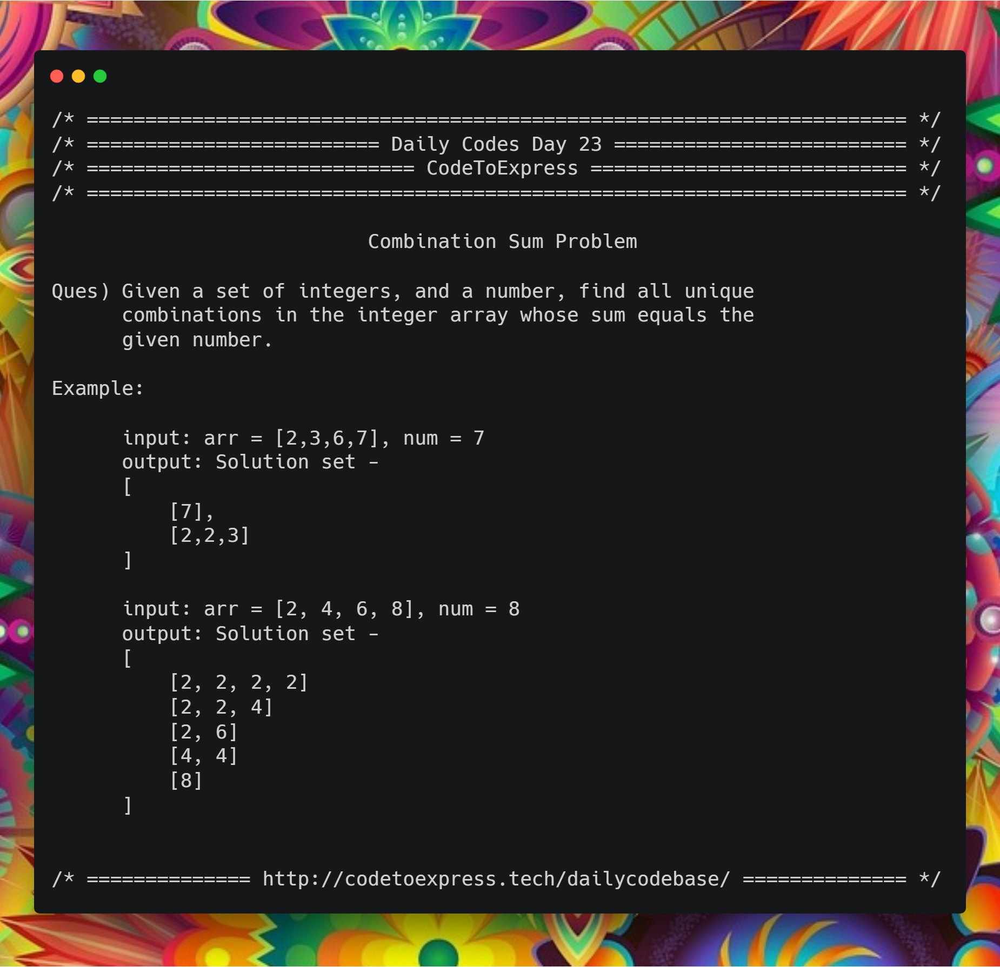

# Day 23 - Array Series Part 6: Combination Sum

**Question Source -- [Geeks4Geeks](https://www.geeksforgeeks.org/combinational-sum/)**

**Question** -- Given a set of integers, and a number, find all unique combinations in the integer array whose sum equals the given number.

**Example**

```
input: arr = [2,3,6,7], num = 7
output: Solution set -
[
    [7],
    [2,2,3]
]

input: arr = [2, 4, 6, 8], num = 8
output: Solution set -
[
    [2, 2, 2, 2]
    [2, 2, 4]
    [2, 6]
    [4, 4]
    [8]
]
```



## Solution

## JavaScript Implementation

### [Soluion](./JavaScript/combinationSum.js)

```
to be added
```

