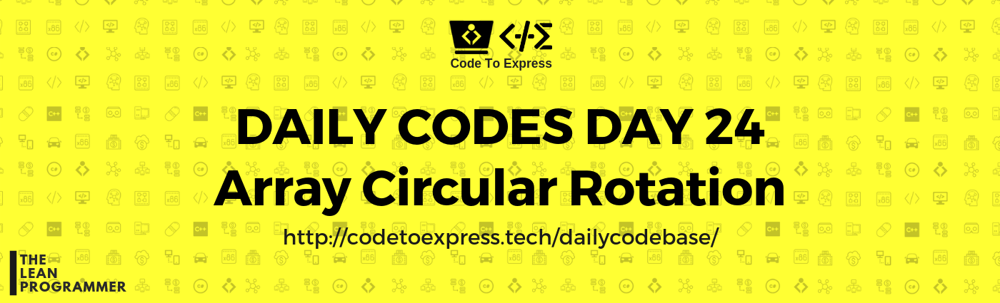
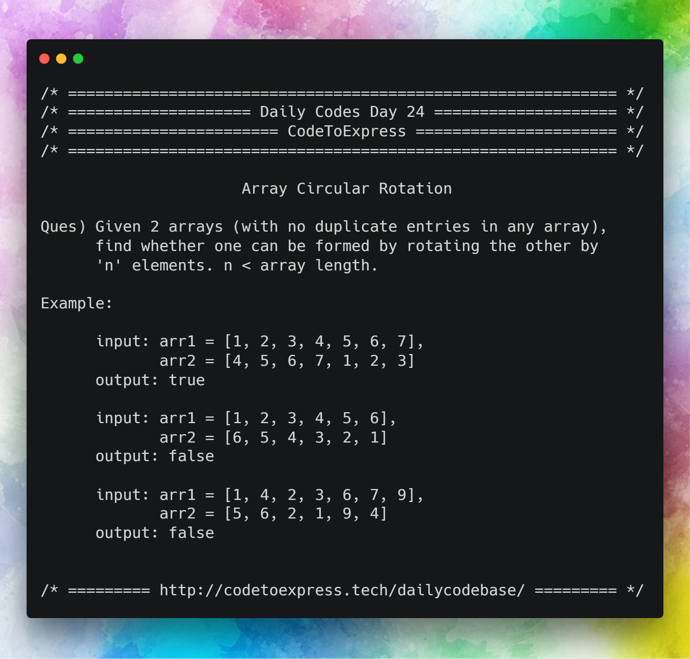

# Day 24 - Array Series Part 7: Array Circular rotation

**Question** -- Given 2 arrays (with no duplicate entries in any array), find whether one can be formed by rotating the other by 'n' elements. n < array length

**Example**

```
input: arr1 = [1, 2, 3, 4, 5, 6, 7], arr2 = [4, 5, 6, 7, 1, 2, 3]
output: true

input: arr1 = [1, 2, 3, 4, 5, 6], arr2 = [6, 5, 4, 3, 2, 1]
output: false

input: arr1 = [1, 4, 2, 3, 6, 7, 9], arr2 = [5, 6, 2, 1, 9, 4]
output: false
```



## JavaScript Implementation

### [Solution](./JavaScript/isRotation_madhav.js)

```js
/**
 * @author MadhavBahl
 * @date 22/01/2019
 * Method - Circular Search -- Time = O(n)
 */

function isRotation (arr1, arr2) {
    let len1 = arr1.length,
        len2 = arr2.length;

    // return false if lengths are different
    if (len1 !== len2)  return false;

    // find position of first element of array2 in array 2
    let isRotated = true,
        pos = arr1.indexOf (arr2[0]);

    // Return false if element not found
    if (pos < 0)  return false;
    
    // Check all the other numbers
    for (let i=0; i<len1; i++) {
        if (arr1[(pos+i)%len1] !== arr2[i]) {
            isRotated = false;
            break;
        }
    }

    return isRotated;
}

console.log (isRotation ([1, 2, 3, 4, 5, 6, 7], [4, 5, 6, 7, 1, 2, 3]));  // true
console.log (isRotation ([1, 2, 3, 4, 5, 6, 7], [7, 1, 2, 3]));  // false
console.log (isRotation ([1, 2, 3, 4, 5, 6], [6, 5, 4, 3, 2, 1]));  // false 
```

## Ruby Implementation

### [Solution](./Ruby/circular_rotation.rb)

```ruby
=begin
@author: aaditkamat
@date: 22/01/2019
=end

def check_rotation(first, second)
  if first.length != second.length
    return false
  end
  i = 0
  curr = second.index(first[0])
  if curr == nil
    return false
  end
  i += 1
  curr = (curr + 1) % (first.length)
  until i >= second.length
      if first[i] != second[curr]
        return false
      end
      i += 1
      curr = (curr + 1) % (first.length)
  end
  true
end

def parse_input_array()
  gets.chomp!.gsub(/\]|\[/, '').split(',').map{|s| s.to_i}
end

def main
  print "Enter the first array: "
  first = parse_input_array()
  print "Enter the second array: "
  second = parse_input_array()
  puts check_rotation(first, second)
end

main
```

## Java Implementation

### [Solution](./Java/circularRotation.java)

```java
/**
 * @date 03/01/19
 * @author SPREEHA DUTTA
 */
import java.util.*;
public class circularRotation {
    public static boolean circular(List a1,List a2)
    {
        int p;int c=0;int i,j=0;
        if(a1.size()!=a2.size())
            return false;
        else
        {
           p=a2.indexOf(a1.get(0)); 
           if(p!=-1)
           {
               for(i=p;i<a2.size();i++)
               {
                   if(a2.get(i)==a1.get(j))
                   {
                       c++;
                       j++;
                   }
                   else
                       break;
               }
               for(i=0;i<p;i++)
               {
                   if(a2.get(i)==a1.get(j))
                   {
                       c++; j++;
                   }
                   else
                       break;
               }
           }
               if(c==a1.size())
                   return true;
               else
                   return false;
        }
            
    }
   public static void main(String []args)
   {
       Scanner sc=new Scanner(System.in);
       int m,n,i;
       ArrayList<Integer> a = new ArrayList<Integer>();
       ArrayList<Integer> a2 = new ArrayList<Integer>();
       System.out.println("Enter size and insert elements into first array ");
       m=sc.nextInt();
       for(i=0;i<m;i++)
          a.add(sc.nextInt()); 
       System.out.println("Enter size and insert elements into second array ");
       n=sc.nextInt();
       for(i=0;i<n;i++)
          a2.add(sc.nextInt());
       boolean res = circular(a,a2);
       System.out.println(res);
   }
}
```