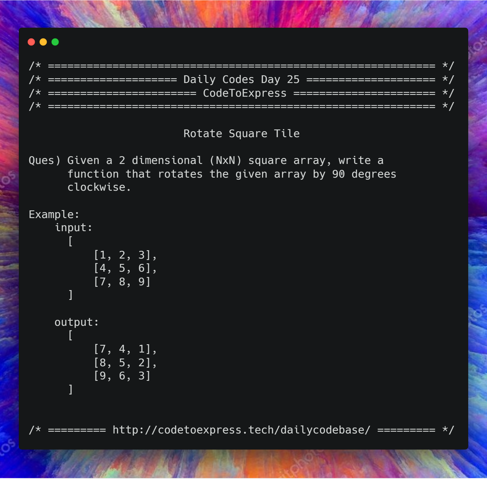

# Day 25 - Array Series Part 8: Rotate Square Tile

**Question** -- Given a 2 dimensional (NxN) square array, write a function that rotates the given array by 90 degrees clockwise

**Example**

```
input:
[
    [1, 2, 3],
    [4, 5, 6],
    [7, 8, 9]
]

output: 
[
    [7, 4, 1],
    [8, 5, 2],
    [9, 6, 3]
]
```



## Solution

## JavaScript Implementation

### [Solution 1 -- Creating a new matrix for rotated tile](./JavaScript/rotateTile.js)

#### Main Logic:

```js
for (let i=0; i<n; i++) {
    for (let j=0; j<n; j++)
        rotatedTile [i][j] = arr[(n-j)-1][i];
}
```

#### Complete Code:

```js
/**
 * @author MadhavBahlMD
 * @date 23/01/2019
 * Method -- Creating a new matrix to represent the rotated tile
 */

function rotateTile (arr) {
    let n = arr.length;

    // print the original tile
    console.log ('Original Tile: ');
    let toPrint = '';
    for (let array of arr) {
        toPrint = '';
        for (let element of array) {
            toPrint += element + ' ';
        }
        console.log (toPrint);
    }

    // Make another tile to store the rotated tile
    let rotatedTile = [];
    // Initialize with zeros
    for (let i=0; i<n; i++) {
        let row = [];
        for (let j=0; j<n; j++) {
            row.push(0);
        }
        rotatedTile.push (row);
    }

    for (let i=0; i<n; i++) {
        for (let j=0; j<n; j++)
            rotatedTile [i][j] = arr[(n-j)-1][i];
    }

    // print the rotated tile
    console.log ('Rotated Tile: ');
    for (let array of rotatedTile) {
        toPrint = '';
        for (let element of array) {
            toPrint += element + ' ';
        }
        console.log (toPrint);
    }

    return rotatedTile;
}

rotateTile ([[1, 2, 3], [4, 5, 6], [7, 8, 9]]);
```

### [Solution 2 -- Changing the original tile](./JavaScript/rotateTile2.js)

```js
To be added
```

## Java Implementation

### [Solution](./Java/rotateTile.java)

```java
/**
 * @date 3/02/19
 * @author SPREEHA DUTTA
 */
import java.util.*;
public class rotateTile {
    public static int[][] rotate(int arr[][])
    {
        int i,j,ri=0;
        int rj=arr.length-1;
        int rot[][]=new int[arr.length][arr.length];
        for(i=0;i<arr.length;i++)
        {
            for(j=0;j<arr.length;j++)
            {
                rot[ri][rj]=arr[i][j];
                ri++;
            }
            rj--; ri=0;
        }
        return rot;
    }
    public static void main(String []args)
    {
        int n,i,j;
        Scanner sc=new Scanner(System.in);
        n=sc.nextInt();
        int ri=0,rj=n-1;
        int arr[][]=new int[n][n];
        for(i=0;i<n;i++)
            for(j=0;j<n;j++)
                arr[i][j]=sc.nextInt();
        System.out.println("Original matrix is ");
        for(i=0;i<n;i++)
        {
            for(j=0;j<n;j++)
            {
                System.out.print(arr[i][j]+" ");
            }
            System.out.println();
        }
        int rot[][]=rotate(arr);
        System.out.println("Rotated matrix is ");
        for(i=0;i<n;i++)
        {
            for(j=0;j<n;j++)
            {
                System.out.print(rot[i][j]+" ");
            }
            System.out.println();
        }
    }
}
```
## C++ Implementation

### [Solution](./C++/rotateTile.cpp)
```cpp
/**
 * @author : Rajdeep Roy Chowdhury<rrajdeeproychowdhury@gmail.com>
 * @handle : razdeep
 * @date   : Feb 17, 2019
 */
#include <bits/stdc++.h>
std::vector<std::vector<int>> rotate(std::vector<std::vector<int>> &two_D_array)
{
    std::vector<std::vector<int>> result(two_D_array.size());
    for(int i=0; i<two_D_array.size();i++)
    {
        std::vector<int> this_array(two_D_array.size(), 0);
        result[i] = this_array;
    }
    int rj = two_D_array.size() - 1, ri = 0;
    for (int i = 0; i < two_D_array.size(); i++)
    {
        for (int j = 0; j < two_D_array[i].size(); j++)
        {
            result[ri++][rj] = two_D_array[i][j];
        }
        rj--;
        ri = 0;
    }
    return result;
}
int main(int argc, char **argv)
{
    int n;
    std::cout << "Enter the value of n ";
    std::cin >> n;
    std::vector<std::vector<int>> two_D_array(n);
    for (int i = 0; i < n; i++)
    {
        std::vector<int> this_array(n, 0);
        // std::vector<int> this_array = new std::vector<int>(n);
        for (int j = 0; j < n; j++)
        {
            std::cin >> this_array[j];
        }
        two_D_array[i] = this_array;
    }
    std::cout << "Original Matrix is..." << std::endl;
    for (int i = 0; i < two_D_array.size(); i++)
    {
        for (int j = 0; j < two_D_array[i].size(); j++)
        {
            std::cout << two_D_array[i][j] << " ";
        }
        std::cout << std::endl;
    }
    std::vector<std::vector<int>> rotated_2d_array = rotate(two_D_array);
    std::cout << "Rotated matrix is" << std::endl;
    for (int i = 0; i < two_D_array.size(); i++)
    {
        for (int j = 0; j < two_D_array[i].size(); j++)
        {
            std::cout << rotated_2d_array[i][j] << " ";
        }
        std::cout << std::endl;
    }
    return 0;
}
```