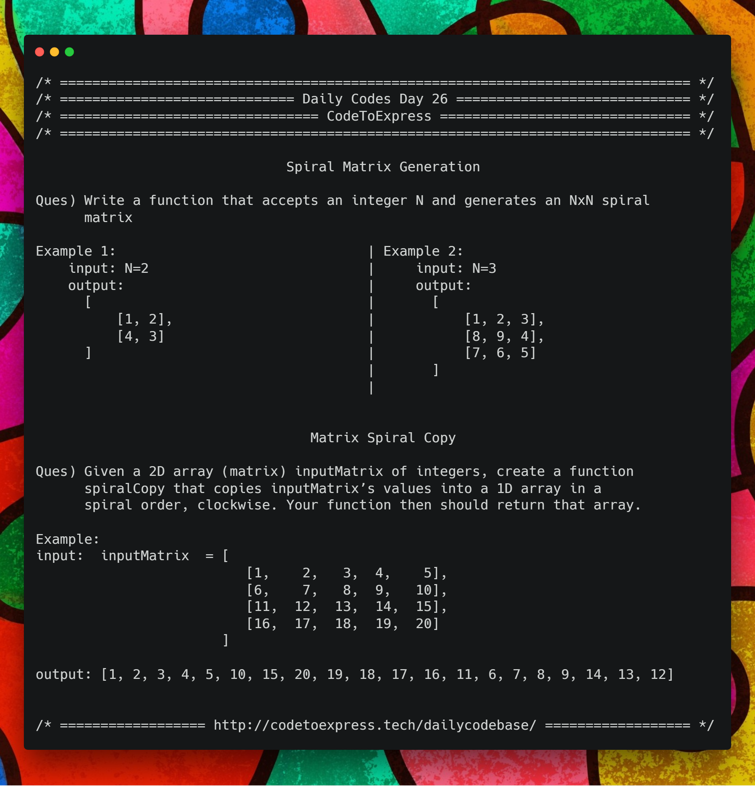

# Day 26 - Array Series Part 9: Spiral Matrix Generation and Matrix Spiral Copy

## Question 1 - Spiral Matrix Generation (1D to 2D)

**Question 1** -- Write a function that accepts an integer N and generates an NxN spiral matrix

**Example** 

```
input: N=2
output:
[
    [1, 2],
    [4, 3]
]

input: N=3
output:
[
    [1, 2, 3],
    [8, 9, 4],
    [7, 6, 5]
]
```

## Question 2 - Matrix Spiral Copy (2D to 1D)

Given a 2D array (matrix) inputMatrix of integers, create a function spiralCopy that copies inputMatrix’s values into a 1D array in a spiral order, clockwise. Your function then should return that array.

**Example**

```js
input:  inputMatrix  = [ [1,    2,   3,  4,    5],
                         [6,    7,   8,  9,   10],
                         [11,  12,  13,  14,  15],
                         [16,  17,  18,  19,  20] ]

output: [1, 2, 3, 4, 5, 10, 15, 20, 19, 18, 17, 16, 11, 6, 7, 8, 9, 14, 13, 12]
```



## Solution to problem 1 - Spiral Matrix Generation

## JavaScript Implementation

### [Solution](./JavaScript/spiralGeneration.js)

```js
/**
 * Spiral Matrix Generation
 * @author MadhavBahlMD
 * @date 24/01/2019
 */

function spiralGeneration (num) {
    let spiral = [],
        topRow = 0,
        btmRow = num-1,
        leftCol = 0,
        rightCol = num-1,
        count = 1;
    
    // Initialize the spiral matrix with zeros
    for (let i=0; i<num; i++) {
        let thisRow = [];
        for (let j=0; j<num; j++) 
            thisRow.push (0);
        spiral.push (thisRow);
    }

    // Populate the matrix
    while ((topRow<=btmRow) && (leftCol<=rightCol)) {
        // Populate the top row
        for (let i=leftCol; i<=rightCol; i++) 
            spiral[topRow][i] = count++;
        topRow++;

        // Populate the right column
        for (let i=topRow; i<=btmRow; i++)
            spiral[i][rightCol] = count++;
        rightCol--;

        // Populate the bottom row IF toprow has not become greater than bottom row
        if (topRow <= btmRow) {
            for (let i=rightCol; i>=leftCol; i--)
                spiral[btmRow][i] = count++;
            btmRow--;
        }

        // Populate the left column IF rightCol has not become less than left Col
        if (rightCol >= leftCol) {
            for (let i=btmRow; i>=topRow; i--)
                spiral[i][leftCol] = count++;
            leftCol++;
        }
    }

    // Print the result
    console.log (spiral);
    return spiral;
}

spiralGeneration (2);
spiralGeneration (3);
spiralGeneration (4);
spiralGeneration (5);
```

***

## Solution to problem 2 - Matrix Spiral Copy

## JavaScript Implementation

### [Solution](./JavaScript/spiralCopy.js)

```js
function spiralCopy(inputMatrix) {
    // your code goes here
    let outputArray = [],
        numRow = inputMatrix.length,
        numCol = inputMatrix[0].length;
    
    let topRow   = 0,
        btmRow   = numRow - 1,
        leftCol  = 0,
        rightCol = numCol - 1;
  
    while ((topRow <= btmRow) && (leftCol <= rightCol)) {
        for (let i=leftCol; i<=rightCol; i++) {
            outputArray.push(inputMatrix[topRow][i]);
        }
        topRow++;

        for (let i=topRow; i<=btmRow; i++) {
            outputArray.push(inputMatrix[i][rightCol]);
        }
        rightCol--;

        if (topRow <= btmRow) {
            for (let i=rightCol; i>=leftCol; i--) {
                outputArray.push(inputMatrix[btmRow][i]);
            }
            btmRow--;
        }

        if (leftCol <= rightCol) {
            for (let i=btmRow; i>=topRow; i--) {
                outputArray.push(inputMatrix[i][leftCol]);
            }
            leftCol++;
        }
    }
    
    return outputArray;
}

console.log(spiralCopy([ [1,    2,   3,  4],
             [6,    7,   8,  9],
             [11,  12,  13,  14],
             [16,  17,  18,  19] ]));  
             // Should print [ 1, 2, 3, 4, 9, 14, 19, 18, 17, 16, 11, 6, 7, 8, 13, 12 ]

console.log(spiralCopy([ [1,    2,   3,  4,    5],
                         [6,    7,   8,  9,   10],
                         [11,  12,  13,  14,  15],
                         [16,  17,  18,  19,  20] ]));
// Should print [ 1, 2, 3, 4, 5, 10, 15, 20, 19, 18, 17, 16, 11, 6, 7, 8, 9, 14, 13, 12 ]
```