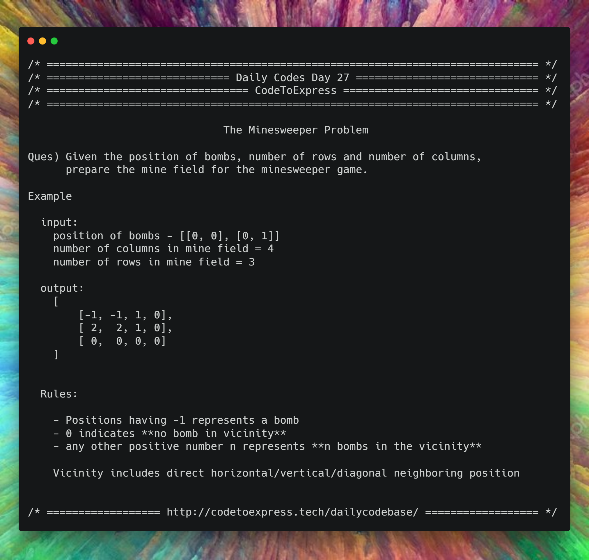

# Day 27 - Array Series Part 10: The Minesweeper Problem

**Question** -- Given the position of bombs, number of rows and number of columns, prepare the mine field for the minesweeper game.

**Example**

```
input:
    position of bombs - [[0, 0], [0, 1]]
    number of columns in mine field = 4
    number of rows in mine field = 4
output:
[
    [-1, -1, 1, 0],
    [ 2,  2, 1, 0],
    [ 0,  0, 0, 0],
    [ 0,  0, 0, 0]
]
```

**Please Note that** 

- Positions having -1 represents a bomb
- 0 indicates **no bomb in vicinity**
- any other positive number n represents **n bombs in the vicinity**

Vicinity includes direct horizontal/vertical/diagonal neighboring position



# Solution

## JavaScript Implementation

### [Solution 1 (First Assign then place values)](./JavaScript/minesweeper.js)

```js
/**
 * @author MadhavBahl
 * @date 25/01/2019
 * Method - First Assign then place values
 * Complexity - O(row*col)   // row and col are the number of rows and number of columns
 */

function makeMineField (posArr, row, col) {
    let mineField = [];

    // initialize the mineField with zeros
    for (let i=0; i<row; i++) {
        let thisRow = [];
        for (let j=0; j<col; j++) 
            thisRow.push (0);
        mineField.push (thisRow);
    }

    // Iterate over position array and put -1 at those positions in the minefield
    for (let pos of posArr) {
        mineField [pos[0]][pos[1]] = -1;
    }

    // Iterate over each element and complete the mine field
    for (let i=0; i<row; i++) {
        for (let j=0; j<col; j++) {
            if (mineField [i][j] !== -1)
                mineField[i][j] = assignValue (mineField, i, j, row, col);
        }
    }

    console.log (mineField);
}

function assignValue (mineField, thisRow, thisCol, row, col) {
    let count = 0;

    // Check for bombs in all 3 rows 
    for (let i=-1; i<=1; i++) 
        for (let j=-1; j<=1; j++) 
            if ((thisRow+i >= 0 && thisRow+i < row) && (thisCol+j >= 0 && thisCol+j < col))
                if (mineField [thisRow+i][thisCol+j] === -1)  count++;
    
    return count;
}

makeMineField ([[0, 0], [0, 1]], 4, 4);
```

### [Solution 2 (Assign and place values simultaneously)](./JavaScript/minesweeper2.js)

```js
/**
 * @author MadhavBahl
 * @date 25/01/2019
 * Method - First Assign then place values
 * Complexity - O(num_bombs)   // num_bombs = number of bombs
 */

function makeMineField (posArr, row, col) {
    let mineField = [];

    // initialize the mineField with zeros
    for (let i=0; i<row; i++) {
        let thisRow = [];
        for (let j=0; j<col; j++) 
            thisRow.push (0);
        mineField.push (thisRow);
    }

    // Iterate over position array and assign values
    for (let pos of posArr) {
        mineField [pos[0]][pos[1]] = -1;

        for (let i=-1; i<=1; i++) 
            for (let j=-1; j<=1; j++) 
                if ((pos[0]+i >= 0 && pos[0]+i < row) && (pos[1]+j >= 0 && pos[1]+j < col))
                    if (mineField [pos[0]+i][pos[1]+j] !== -1)  mineField [pos[0]+i][pos[1]+j]++;
    }

    console.log (mineField);
}

makeMineField ([[0, 0], [0, 1]], 4, 4);
```