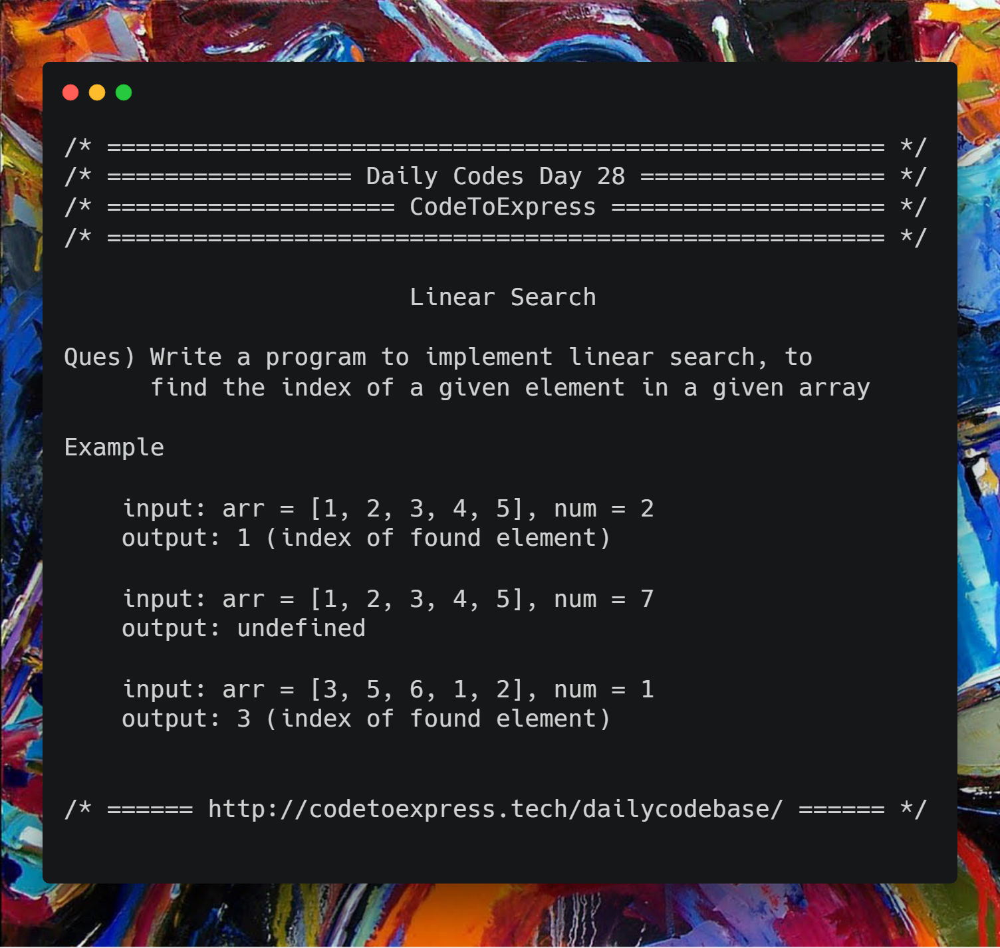

# Day 28 - Search and Sort Algorithms Part A: the Linear Search

It's almost a month sincec we starated this initiative and we did questions on Strings, Arrays, Recursion and Misc. Also, in some questions, we tried to solve the question in best possible runtime, which improved our concepts of time complexity. Now, to make our code more efficient, it's highly essential that we know some frequently used searching and sorting algorithms and apply them in the code accordingly whenever required.

So this week we will be be focusing on various searching and sortinig algorithms. Today's Algorithm -- Linear Search

## Question

Write a program to implement linear search, to find the index of a given element in a given array

**Example**

```
input: arr = [1, 2, 3, 4, 5], num = 2
output: 1 (index of found element)

input: arr = [1, 2, 3, 4, 5], num = 7
output: undefined
```



## Solution

### [JavaScript Implementation](./JavaScript/linear.js)

```js
function linearSearch (arr, n) {
    for (let i=0; i<arr.length; i++)
        if (arr[i] === n)
            return i;

    return undefined;
}

console.log (linearSearch ([1, 2, 3, 4, 5], 2));
console.log (linearSearch ([1, 2, 3, 4, 5], 7));
```

## Java Implementation

### [Solution](./Java/linearSearch1.java)

```java
/**
 * @date 28/01/19
 * @author SPREEHA DUTTA
 */
import java.util.*;
public class linearSearch1 {
    public static void main(String []args)
    {
        Scanner sc=new Scanner(System.in);
        int n;int i;int p,c=-1;
        System.out.println("Enter size and array elements");
        n=sc.nextInt();
        int arr[]=new int[n];
        for(i=0;i<n;i++)
            arr[i]=sc.nextInt();
        System.out.println("Enter element to be found");
        p=sc.nextInt();
        for(i=0;i<n;i++)
           if(arr[i]==p)
           {
               c=i;
               break;
           }
        if(c!=-1)
            System.out.println(c);
        else
            System.out.println("undefined");
    }
}
```

## C++ Implementation

### [Solution](./C++/linearSearch.cpp)

```cpp

/*
* @author : imkaka
* @date   : 29/1/2019
*/

#include<iostream>
#include<vector>

using namespace std;

int linearSearch(vector<int> arr, int val){

    int size = arr.size();
    for(int i = 0; i < size; ++i){
        if(arr[i] == val)
          return i;
     return -1;
     }
        
 int main(){

    vector<int> arr = {1, 2, 5, 10, 6, 100};
    vector<int> arr2 = {500, 22, 101, 10, 6, 0};
    int val = 10;
    int val2 = 1;

    cout << linearSearch(arr, val) << endl;
    cout << linearSearch(arr2, val2) << endl;
    return 0;
}
```
## C Implementation
### [Solution](./C/Linear_Search.c)

```c
/*
 * @author : ashwek
 * @date : 29/01/2019
 */

#include <stdio.h>
#include <stdlib.h>

int linear_search(int *arr, int n, int search){

    int i;

    for(i=0; i<n; i++){
        if( arr[i] == search )
            return i;
    }

    return -1;
}

void main(){

    int *arr, n, search, i;

    printf("Enter size of array = ");
    scanf("%d", &n);

    arr = (int *)malloc(sizeof(int)*n);

    printf("Enter %d elements : ", n);
    for(i=0; i<n; i++){
        scanf("%d", &arr[i]);
    }

    printf("Enter a value to search = ");
    scanf("%d", &search);

    i = linear_search(arr, n, search);

    if( i == -1 ){
        printf("%d not found in array", search);
    }
    else{
        printf("%d found at %d index", search, i);
    }
}
```
## Python Implementation

### [Solution](./Python/linearSearch.py)
```python

"""
@author:NormalVad
@date:25/10/2020 
"""


def LinearSearch(a,n):
    l = len(a)
    found = False
    i = 0
    while(i<l):
        if(a[i]==n):
            found = True
            break
        else:
            i += 1
    if(found):
        return i
    else:
        return "Undefined"

print("Please input Elements of array in single line seperated by spaces")
arr = list(map(int, input().split()))
print("Input element to be found")
n = int(input())
print(LinearSearch(arr,n))
```

