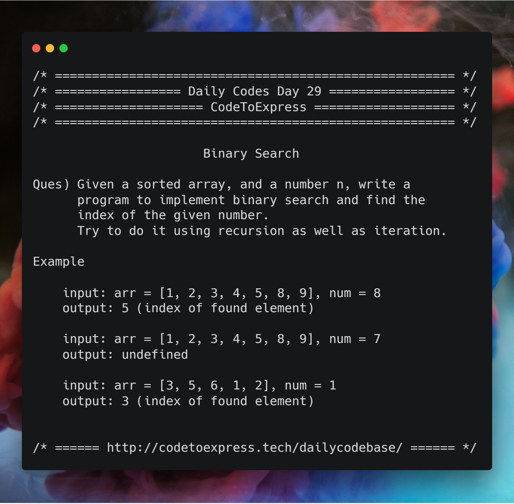

# Day 29 - Search and Sort Algorithms Part B: The Binary Search

Binary Search is searching technique which works on Divide and Conquer approach. Indeed an efficient searching algorithm with a runtime of `O(log(n))`, but it works only on sorted arrays.

## Question

Given a sorted array, and a number n, write a program to implement binary search and finid the index of the given number.

Try to do it using recursion as well as iteration.

**Example**

```
input: arr = [1, 2, 3, 4, 5, 8, 9], num = 8
output: 5 (index of found element)

input: arr = [1, 2, 3, 4, 5, 8, 9], num = 7
output: undefined
```



## Solution

### [JavaScript Implementation](./JavaScript/binary.js)

```js
function binarySearch(arr, elem) {
    var start = 0;
    var end = arr.length - 1;
    var middle = Math.floor((start + end) / 2);
    while(arr[middle] !== elem && start <= end) {
        if(elem < arr[middle]){
            end = middle - 1;
        } else {
            start = middle + 1;
        }
        middle = Math.floor((start + end) / 2);
    }
    if(arr[middle] === elem){
        return middle;
    }
    return undefined;
}

console.log (binarySearch ([1, 2, 3, 4, 5, 8, 9], 8));
console.log (binarySearch ([1, 2, 3, 4, 5, 8, 9], 7));
```