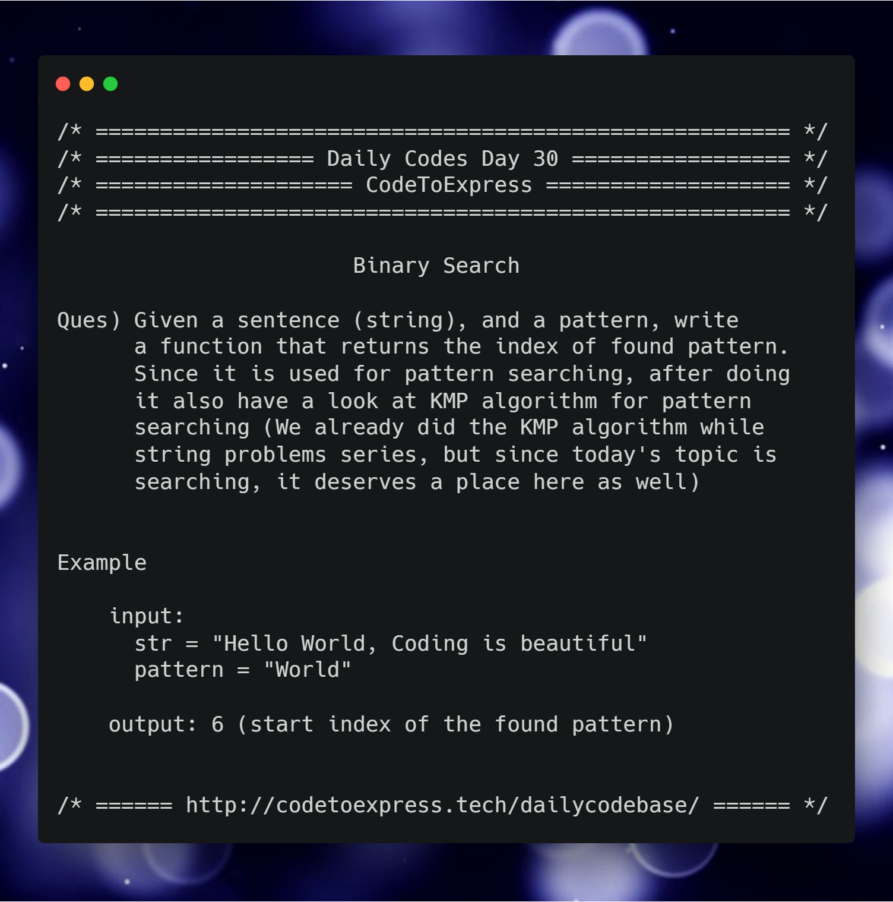

# Day 30 - Search and Sort Algorithms Part C: Naive Pattern Search

So this week is for searching and sorting algorithms, and we did linear search and binary search yesterday, and today's algorithm would be the Naive Search.

## Question

Given a sentence (string), and a pattern, write a function that returns the index of found pattern. Since it is used for pattern searching, after doing it also have a look at KMP algorithm for pattern searching (We already did the KMP algorithm while string problems series, but since today's topic is searching, it deserves a place here as well 😁)

**Example**

```
input:
  str = "Hello World, Coding is beautiful"
  pattern = "World"

output: 6 (start index of the found pattern)
```



## Solution

### [JavaScript Implementation](./JavaScript/naive.js)

```js
to be added
```

### [C++ Implementation](./C++/naiveSearch.cpp)

```cpp
/*
* @author : imkaka
* @date   : 1/2/2019
*/

#include<iostream>
#include<string>

using namespace std;

void computeLPS(string, int, int []);

// KMP Algorithm
void KMPsearch(string text, string pat){
    // Length
    int N = text.size();
    int M = pat.size();

    // Define LPS (Longest Proper Prefix)
    int lps[M];

    //Preprocess
    computeLPS(pat, M, lps);

    int i = 0, j = 0;
    while(i < N){
        //While Match
        if(pat[j] == text[i]){
            i++;
            j++;
        }

        if(j == M){
            cout << "Pattern Found At " << (i-j) << endl;
            j = lps[j-1];
        }

        else if(i < N && pat[j] != text[i]){
            if(lps[j] != 0)
                j = lps[j-1];
            else
                i++;
        }
    }
}

void computeLPS(string pat, int M, int lps[]){
    int len = 0; //Track len of longest common prefix which is suffix also.

    lps[0] = 0;
    int i = 1;

    while(i < M){
        if(pat[i] == pat[len]){
            len++;
            lps[i] = len;
            i++;
        }
        else{
            if(len != 0){
                len = lps[len-1]; //Don't increment i
            }
            else{
                lps[i] = 0;
                i++;
            }
        }
    }
}

int main(){

    string txt = "ABABDABACDABABCABAB";
    string pat = "ABABCABAB";

    KMPsearch(txt, pat);
    return 0;
}
```
