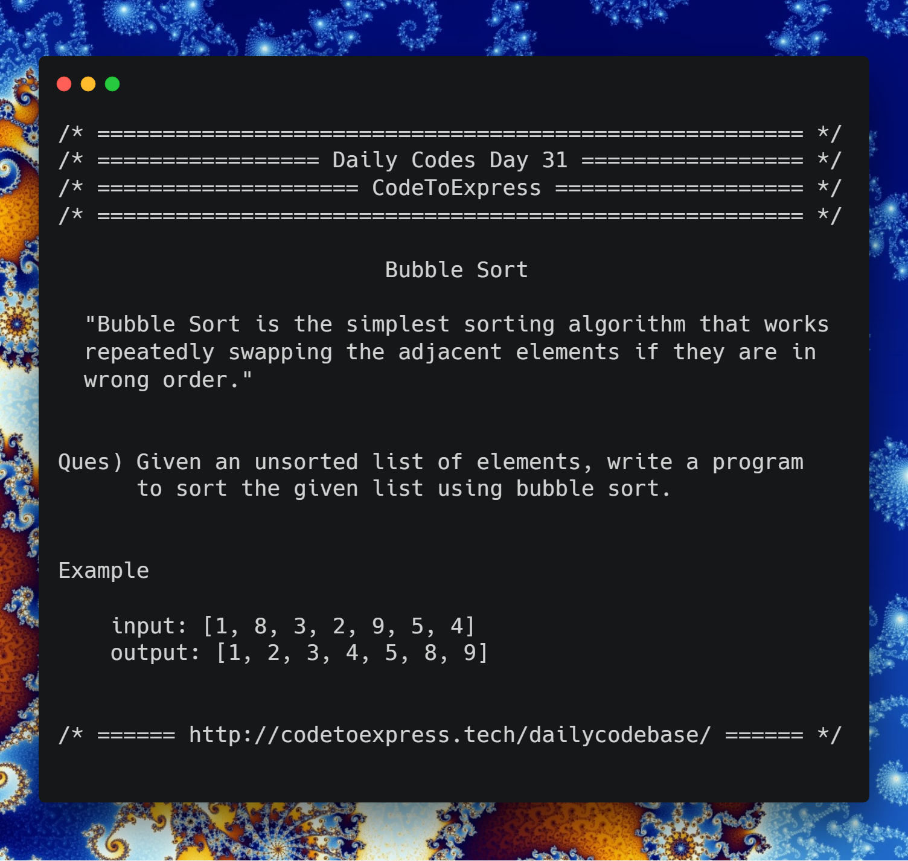

# Day 31 - Search and Sort Algorithms Part D: Bubble Sort

Now that we've seen some searching algorithms, it's time we proceed with the sorting algorithms. Whenever we look at sorting algorithm, the first algorithm that comes to mind is the easiest one, the bubble sort algorithm, and hence today, we'll be doing the bubble sort.

"Bubble Sort is the simplest sorting algorithm that works by repeatedly swapping the adjacent elements if they are in wrong order." -- (source: GeeksForGeeks)

## Question

Given an unsorted list of elements, write a program to sort the given list using bubble sort.

**Example**

```
input: [1, 8, 3, 2, 9, 5, 4]
output: [1, 2, 3, 4, 5, 8, 9]
```



## Solution

### [JavaScript Implementation](./JavaScript/bubble.js)

```js
to be added
```