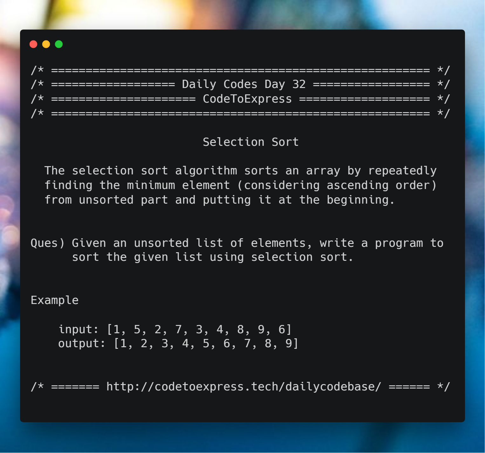

# Day 32 - Search and Sort Algorithms Part E: Selection Sort

**Source: [GeeksForGeeks](https://www.geeksforgeeks.org/selection-sort/)**

The selection sort algorithm sorts an array by repeatedly finding the minimum element (considering ascending order) from unsorted part and putting it at the beginning. The algorithm maintains two subarrays in a given array.

1. The subarray which is already sorted
2. Remaining subarray which is unsorted

In every iteration of selection sort, the minimum element (considering ascending order) from the unsorted subarray is picked and moved to the sorted subarray

## Question

Given an unsorted list of elements, write a program to sort the given list using selection sort.

**Example**

```
input: [1, 5, 2, 7, 3, 4, 8, 9, 6]
output: [1, 2, 3, 4, 5, 6, 7, 8, 9]
```



## Solution

### [JavaScript Implementation](./JavaScript/selectionsort.js)

```js
function selectionSort(arr){
    for(var i = 0; i < arr.length; i++){
        var lowest = i;
        for(var j = i+1; j < arr.length; j++){
            if(arr[j] < arr[lowest]){
                lowest = j;
            }
        }
        if(i !== lowest){
            var temp = arr[i];
            arr[i] = arr[lowest];
            arr[lowest] = temp;
        }
    }
    return arr;
}

console.log ( selectionSort ([1, 5, 2, 7, 3, 4, 8, 9, 6]));
```
### [C++ Implementation](./C++/selectionSort.cpp)

```cpp
/*
* @author : imkaka
* @date   : 2/1/2019
*
*/

#include<iostream>

using namespace std;

void selectionSort(int arr[], int size){

    for(int i = 0; i < size; ++i){
        for(int j = i+1; j < size; ++j){
            if(arr[i] > arr[j]){
                int temp = arr[i];
                arr[i] = arr[j];
                arr[j] = temp;
            }
        }
    }
}

void print(int arr[], int size){
    for(int x = 0; x < size; ++x){
        cout << arr[x] << " ";
    }
    cout << endl;
}
int main(){

    int arr[] = {20, 46, 2, 43, 10, -29, 10, 0, 12};
    int size = sizeof(arr)/sizeof(arr[0]);
    cout << "Before Sorting " << endl;
    print(arr, size);

    selectionSort(arr, size);

    cout << endl;
    cout << "After Sorting " << endl;
    print(arr, size);

    return 0;
}
```
