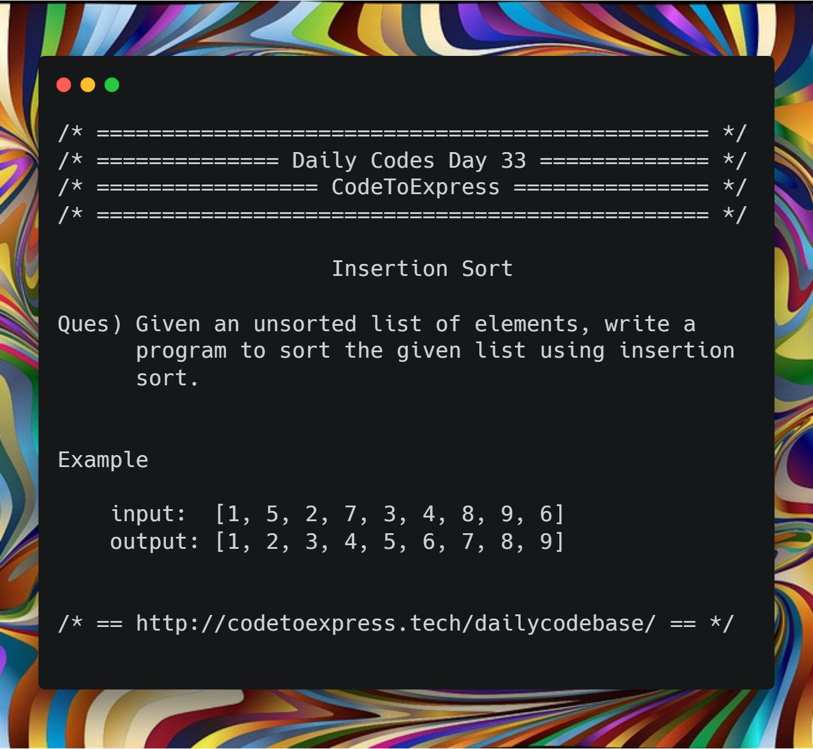

# Day 33 - Search and Sort Algorithms Part F: Insertion Sort

## Question

Given an unsorted list of elements, write a program to sort the given list using insertion sort.

**Example**

```
input: [1, 5, 2, 7, 3, 4, 8, 9, 6]
output: [1, 2, 3, 4, 5, 6, 7, 8, 9]
```



## Solution

### [JavaScript Implementation](./JavaScript/insertionsort.js)

```js
function insertionSort(arr){
	var val;
    for(var i = 1; i < arr.length; i++){
        val = arr[i];
        for(var j = i - 1; j >= 0 && arr[j] > val; j--) {
            arr[j+1] = arr[j]
        }
        arr[j+1] = val;
    }
    return arr;
}

console.log ( insertionSort ([1, 5, 2, 7, 3, 4, 8, 9, 6]));
```

## Java Implementation

### [Solution](./Java/insertionSort.java)

```java
/**
 * @date 04/02/19
 * @author SPREEHA DUTTA
 */
import java.util.*;
public class insertionSort {
    public static void sort(int arr[])
    {
        int i,j,t;
        for(i=0;i<arr.length;i++)
        {
            t=arr[i];
            j=i-1;
            while(j>=0 && arr[j]>t) 
            { 
                arr[j+1]=arr[j]; 
                j=j-1; 
            } 
            arr[j+1]=t; 
        }
        System.out.println("Sorted array is ");
        for(i=0;i<arr.length;i++)
            System.out.print(arr[i]+" ");
    }
    public static void main(String []args)
    {
        int a[]={4,2,7,5,1,6,8};
        sort(a);
    }
}
```