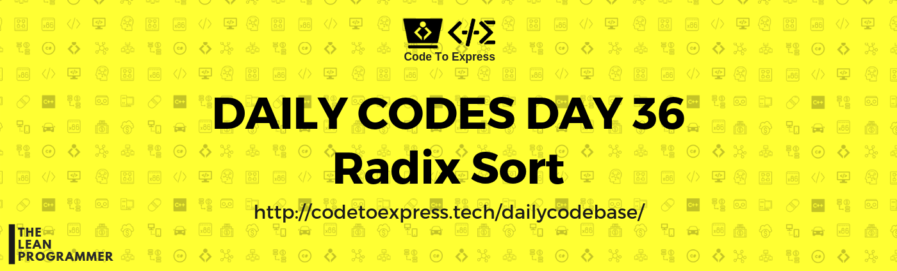

# Day 36 - Search and Sort Algorithms Part I: Radix Sort

From quite a lot of days we are looking at searching and sorting algorithms, try out the radix sort today.

## Question

Given an unsorted list of elements, write a program to sort the given list using radix sort.

**Example**

```
input: [1, 5, 2, 7, 3, 4, 8, 9, 6]
output: [1, 2, 3, 4, 5, 6, 7, 8, 9]
```

## Solution

### [JavaScript Implementation](./JavaScript/radixsort.js)

```js
to be added
```