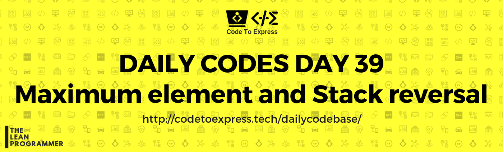

# Day 39 - Maximum Element and Stack Reversal

## Question 1 

Find the maximum element in the stack

## Question 2

Reverse the given stack

**HINT**

- You can use another stack, pop the elements of first stack and push them onto the second stack
- You can reverse without another data structure using recursion

## Solution to Question 1

### [JavaScript Implementation](./JavaScript/maxElement.js)

```js
/**
 * Find maximum element in the stack
 * @author MadhavBahlMD
 * @date 12/02/2019
 */

class Stack {
    constructor (limit) {
        this.myStack = [];
        this.tempStack = [];
        this.capacity = limit;
    }

    // Implement isFull() method
    isFull () {
        if (this.myStack.length === this.capacity)  return true;
        return false;
    }

    // Implement isEmpty() method
    isEmpty () {
        if (this.myStack.length === 0)  return true;
        return false;
    }

    // Implement push(x) method
    push (element) {
        if (this.isFull()) return false;
        this.myStack.push(element);
        return true;
    }

    // Implement pop() method
    pop () {
        if (this.isEmpty())  return -1;
        return this.myStack.pop();
    }

    // Implement the peek() function 
    peek () {
        return this.myStack[this.myStack.length - 1];
    }

    // Implement findMax() method
    findMax () {
        this.tempStack = this.myStack;
        let max = this.peek();

        while (!this.isEmpty()) {
            let currentTop = this.pop();
            if (currentTop > max) max = currentTop;
        }

        this.myStack = this.tempStack;
        return max;
    }
}

const stk = new Stack (10);
stk.push (1);
stk.push (2);
stk.push (19);
stk.push (12);
stk.push (16);
stk.push (4);
stk.push (25);
stk.push (5);

console.log (stk.findMax());
```

## Solution to Question 2

### [JavaScript Implementation](./JavaScript/stackReverse.js)

```js
/**
 * Reverse the stack
 * @author MadhavBahlMD
 * @date 12/02/2019
 */

class Stack {
    constructor (limit) {
        this.myStack = [];
        this.tempStack = [];
        this.capacity = limit;
    }

    // Implement isFull() method
    isFull () {
        if (this.myStack.length === this.capacity)  return true;
        return false;
    }

    // Implement isEmpty() method
    isEmpty () {
        if (this.myStack.length === 0)  return true;
        return false;
    }

    // Implement push(x) method
    push (element) {
        if (this.isFull()) return false;
        this.myStack.push(element);
        return true;
    }

    // Implement pop() method
    pop () {
        if (this.isEmpty())  return -1;
        return this.myStack.pop();
    }

    // Implement the peek() function 
    peek () {
        return this.myStack[this.myStack.length - 1];
    }

    // Implement reverse() method
    reverse () {
        this.tempStack = [];
        while (!this.isEmpty()) {
            let top = this.pop ();
            console.log ('temp = ', top);
            this.tempStack.push (top);
        }
        this.myStack = this.tempStack;
    }

    // Implement displayAll() method
    displayAll () {
        console.log ('/* ==== My Stack ==== */');
        console.log ('Top');

        this.tempStack = this.myStack;
        while (!this.isEmpty())
            console.log (this.pop());
        this.myStack = this.tempStack;

        console.log ('Bottom');
    }
}

const stk = new Stack (10);
stk.push (1);
stk.push (2);
stk.push (19);
stk.push (12);
stk.push (16);
stk.push (4);
stk.push (25);
stk.push (5);

stk.displayAll ();
stk.reverse ();
stk.displayAll ();
```