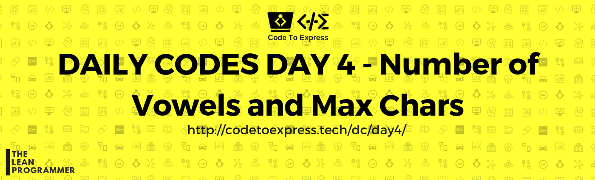

# Day 4 -- Number of Vowels and Max Chars



## Part A -- Number of Vowels

**Question** - Given a string, Write a program that prints the number of vowels in it.

## JavaScript Implementation

### [Solution 1](./JavaScript/partA_sol1.js)

```js
function numVowels (str) {
    let count = 0;

    // Iterate over each character in the string
    for (let i=0; i<str.length; i++) {
        // check whether this character (in lower case) is a, e, i, o, or u (converting in lower case would reduce the amount of conditons by half since there would be no need to check A, E, I, O or U)
        if (
            str[i].toLowerCase() === 'a' ||
            str[i].toLowerCase() === 'e' ||
            str[i].toLowerCase() === 'i' ||
            str[i].toLowerCase() === 'o' ||
            str[i].toLowerCase() === 'u'
        ) {
            count++;
        }
    }

    // Print and return the number of vowels
    console.log(`The number of vowels in ${str} is = ${count}`);
    return count;
}

numVowels ('hello');
numVowels ('Greetings');
```

## [Solution 2](./JavaScript/partA_sol2.js)

```js
function numVowels (str) {
    let count = 0;

    // Define a vowels array
    let vowels = ['a', 'e', 'i', 'o', 'u'];

    // Iterate over each character in the string
    for (let i=0; i<str.length; i++) {
        // check whether this character (in lower case) is a, e, i, o, or u (converting in lower case would reduce the amount of conditons by half since there would be no need to check A, E, I, O or U)
        if (vowels.indexOf(str[i].toLowerCase()) >= 0) {
            count++;
        }
    }

    // Print and return the number of vowels
    console.log(`The number of vowels in ${str} is = ${count}`);
    return count;
}

numVowels ('hEllo');
numVowels ('Greetings');
```

## [Solution 3](./JavaScript/partA_sol3.js)

```js
// Store vowels in an array
// check each character of the string with each element in vowels array

function numVowels (str) {
    // Initialize count to be zero
    let count = 0;

    // Define an array of vowels
    let vowels = ['a', 'e', 'i', 'o', 'u'];

    // Check each character of string 
    for (let char of str) {
        for (let vowel of vowels) {
            if (char.toLowerCase() === vowel)  count++;
        }
    }

    // Print the result
    console.log(`The number of vowels in "${str}" is = ${count}`);
    return count;
}

numVowels ('hello');
numVowels ('Greetings');
```

## [Solution 4](./JavaScript/partA_sol4.js)

```js
// Similar to previous method
// Instead of storing vowels in an array, store them in an object as keys and values as the number of occurances

function numVowels (str) {
    console.log('\nString: ', str);

    // Initialize count to be zero
    let count = 0;

    // Store the vowels in an object
    let vowels = {
        'a': 0,
        'b': 0,
        'c': 0,
        'd': 0,
        'e': 0
    };

    // Iterate through each character of string to check vowels
    for (let char of str) {
        for (vowel in vowels) {
            if (char.toLowerCase() === vowel) {
                count++;
                vowels[vowel]++;
            }
        }
    }
    
    // Print the result
    console.log('Vowel Count: ');
    for (let vowel in vowels) {
        console.log(`Vowel: ${vowel} appears ${vowels[vowel]} number of times in the string "${str}"`);
    }    

    console.log("Total number of vowels: " + count);
    return count;
}

numVowels ('hello');
numVowels ('Greetings');
```

## Java Implementation

### [Solution 1](./Java/NumVowels.java)

```java
import java.util.Scanner;

public class NumVowels {
    public static void main (String[] args) {
        // set count = 0
        int count = 0;

        // Input the string
        Scanner input = new Scanner(System.in);
        System.out.println("/* ===== Number of Vowels ===== */");
        System.out.print("\nEnter the string: ");
        String str = input.next();

        // Convert input string to lower case
        str = str.toLowerCase();

        // Run a loop from 0 to string length
        for (int i=0; i<str.length(); i++) {
            if (
                str.charAt(i) == 'a' ||
                str.charAt(i) == 'e' ||
                str.charAt(i) == 'i' ||
                str.charAt(i) == 'o' ||
                str.charAt(i) == 'u'
            ) {
                count++;
            }
        }

        // Print the result
        System.out.println("Number of vowels in \"" + str + "\" = " + count);
    }
}
```

### [Solution 2](./Java/NumVowels2.java)

```java
import java.util.Scanner;

public class NumVowels2 {
    public static void main (String[] args) {
        // set count = 0
        int count = 0;

        // Input the string
        Scanner input = new Scanner(System.in);
        System.out.println("/* ===== Number of Vowels ===== */");
        System.out.print("\nEnter the string: ");
        String str = input.next();

        // Convert input string to lower case
        str = str.toLowerCase();

        // Create an array of vowels
        char[] vowels = new char[]{ 'a', 'e', 'i', 'o', 'u' };

        // Run a loop from 0 to string length
        for (int i=0; i<str.length(); i++) {
            // Check whether the current character exists in the vowels array
            for (int j=0; j<5; j++) {
                if (str.charAt(i) == vowels[j]) {
                    count++;
                    break;
                }
            }
        }

        // Print the result
        System.out.println("Number of vowels in \"" + str + "\" = " + count);
    }
}
```

## C++ Implementation

### [NumVowelsPartA.cpp](./C++/NumVowelsPartA.cpp)

```cpp
/**
 * @author: Rajdeep Roy Chowdhury<rrajdeeproychowdhury@gmail.com>
 * @github: https://github.com/razdeep
 * @date: 25/12/2018
**/

#include <iostream>
#include <algorithm>
using namespace std;
int main()
{
    // set count = 0
    int count = 0;
    string str;
    cout << "/* ===== Number of Vowels ===== */" << endl;
    cout << "\nEnter the string: ";
    cin >> str;

    // Convert input string to lower case
    // using transform() function and ::tolower in STL
    transform(str.begin(), str.end(), str.begin(), ::tolower);

    // Run a loop from 0 to string length
    for (int i = 0; i < str.length(); i++)
    {
        if (
            str[i] == 'a' ||
            str[i] == 'e' ||
            str[i] == 'i' ||
            str[i] == 'o' ||
            str[i] == 'u')
        {
            count++;
        }
    }
    // Print the result
    cout<<"Number of vowels in \""<<str<<"\" = "<<count<<endl;
    return 0;
}
```

## Python Implementation

### [Solution](./Python/partA_sol.py)

```py
# Input the String.
string=input("Enter the String : ")

# Create a list of vowels in lowercase.
vowels=['a','e','i','o','u']

# Initialize the count variable to zero.
count=0

# Now iterate every character in the string.
for char in string:
    # And if the current character we are iterating is
    # present in the vowels list then increment count.
    if char.lower() in vowels:
        count+=1

# Print the result
print("Number of vowels in the string are : ",count)

```

## [Solution](./Python/Shashankvowels.py)
```Python
""" 
 * @author: Shashank Jain
 * @date: 25/12/2018
"""
a=input("Enter the string to count no. of vowels?")
b=list(a.replace(" ","").lower())
c=['a','e','i','o','u']
count=0
for i in b:
    for j in c:
        if (j==i):
            count=count+1
print(count)
```

## C Implementation

### [Solution](./C/vowels.c)

```c
/**
  * @author : ashwek
  * @date : 25/12/2018
  */

#include<stdio.h>
#include<ctype.h>

void main(){

    char Str[50];
    int i, count=0;

    printf("Enter a string = ");
    scanf("%s", Str);

    for(i=0; Str[i]!='\0'; i++){
        switch(tolower(Str[i])){
            case 'a':
            case 'e':
            case 'i':
            case 'o':
            case 'u':
                count++;
        }
    }

    printf("number of vowels = %d", count);

}
```

</hr>

## Part B -- Max Chars Problem

**Question** - Given a string, write a program to return the character that appears most frequently in that string

## JavaScript Implementation

### [Solution 1](./JavaScript/partB_sol1.js)

```js
function maxChars (str) {
    let letterCount = {};

    // Complete the letter count object
    for(let currentChar of str) {
        let flag = 0;
        for (letter in letterCount) {
            if (currentChar.toLowerCase() === letter) {
                flag = 1;
                letterCount[letter]++;
            }
        }

        if (flag === 0) {
            letterCount[currentChar] = 1;
        }
    }

    // Find the maximum value key from the letterCount
    let max = 0, maxChar = '';
    for (letter in letterCount) {
        if (letterCount[letter] >= max) {
            max = letterCount[letter];
            maxChar = letter;
        }
    }

    // Print the result
    console.log(`The maximum frequency letter is: "${maxChar}" and it appears ${letterCount[maxChar]} number of times!`);
    return letterCount[maxChar];
}

maxChars('helllllo worlld');
```

### [Solution 2](./JavaScript/partB_sol2.js)

```js
function maxChars (sentence) {
    let characters = {};

    // Update characters object with count of each character in sentence
    for (let letter of sentence) {
        // increment the count of existing letter OR add the new character with value = 1
        characters[letter] = characters[letter] + 1 || 1;
    }

    let max = 0,
      maxChar = '';

    for (let character in characters) {
        if (max < characters[character]) {
            max = characters[character];
            maxChar = character;
        }
    }

    // Print the result
    console.log(`The maximum frequency letter is: "${maxChar}" and it appears ${characters[maxChar]} number of times!`);
    return characters[maxChar];
}

maxChars('helllllo worlld');
```

## C++ Implementation

### [NumVowelsPartB.cpp](./C++/NumVowelsPartB.cpp)

```cpp
/**
 * @author: Rajdeep Roy Chowdhury<rrajdeeproychowdhury@gmail.com>
 * @github: https://github.com/razdeep
 * @date: 25/12/2018
 * 
 * Max Char Problem Solution
 * 
**/

#include <iostream>
#include <algorithm>
#include <vector>
#include <climits>
using namespace std;
int main()
{
    int count = 0;

    // Input the string
    string str;
    cout << "/* ===== Number of Vowels ===== */" << endl;
    cout << "\nEnter the string: ";
    cin >> str;

    // Convert input string to lower case
    // using transform() function and ::tolower in STL
    transform(str.begin(), str.end(), str.begin(), ::tolower);

    int max_count = INT_MIN;
    char max_label;
    for (int i = 0; i < str.size(); i++)
    {
        int this_count = std::count(str.begin(), str.end(), str[i]);
        if (this_count > max_count)
        {
            max_count = this_count;
            max_label = str[i];
        }
    }
    cout << "'" << (char)max_label << "' has " << max_count << " occurences." << endl;
    return 0;
}
```

## Python Implementation

### [Solution](./Python/partB_sol.py)

```python
# Input the string
string=input("Enter the string : ")

# Create an empty dictionary to store the frequency of characters
characters={}

#  Iterate every character in the string
for char in string:
    # And if the character already exists in the dictionary then
    # increment its frequency by 1.
    if char.lower() in characters:
        characters[char.lower()]+=1
    # Else initialize its frequency by 1
    else:
        characters[char.lower()]=1
        
# Print the character which has the maximum frequency
print("The most occouring character in the string is : ", max(characters,key=characters.get))

```

### [Solution] (./Python/Shashankchar.py)

```python
"""
* @author: Shashank Jain
* @date: 25/12/2018
"""

a=input("Enter the string to count frequent occuring characters?")
b=list(a.replace(" ","").lower())
c=[]
for i in b:
    d=(i,b.count(i))
    c.append(d)

e=dict(list(set(c)))
f=max(e)
g=max(e.values())
print("maximum occurence is of {0}:{1}".format(f,g))
```

## C Implementation

### [Solution](./C/max_chars.c)

```c
/**
  * @author : ashwek
  * @date : 25/12/2018
  */

#include<stdio.h>

void main(){

    char Str[50];
    int i, Max = 0;
    int possibleChar[94] = {0};  //ASCII 32-126

    printf("Enter a string = ");
    scanf("%[a-zA-Z-0-9 ]s", Str);  //Modify control string to accept blank spaces in input

    for(i=0; Str[i]!='\0'; i++){
        possibleChar[ (int)Str[i] - 32]++;
        if( possibleChar[Max] < possibleChar[ (int)Str[i] - 32] )
            Max = (int)Str[i] - 32;
    }

    printf("Most frequent character = \'%c\'\n", (Max+32));
}
```