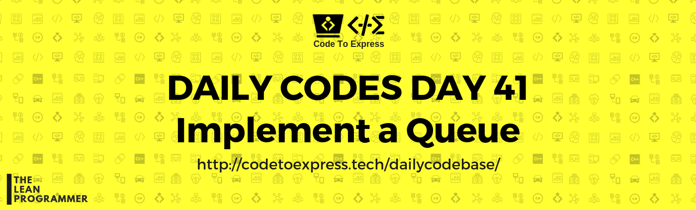

# Day 41 - Implement a Queue

Just like a stack, queue is also a linear data structure which follows a particular order in which the operations are performed. The order is called FIFO (First In First Out) which means the first element to enter the queue will be the first one to exit

There are many real-life examples of a queue, and the most common one of them is the real queue. It can be a queue of people waiting at billing counter, or a queue of people waiting at a ticket counter etc.

A Queue has various methods -

1. `Enqueue()` - **Adds an item to the queue**
2. `Dequeue()` - **Removes an item from the queue**
3. `Front()` - **Get the front item from queue**
4. `Rear()` - **Get the last item from queue**

Try to implement a queue 😁

Read more about queues here: https://www.geeksforgeeks.org/queue-set-1introduction-and-array-implementation/

## Solution

## JavaScript Implementation

### [Solution](./JavaScript/queue.js)

```js
/**
 * Implementation of queue usinig JS
 * @author MadhavBahl
 * @date 14/02/2019
 */

class Queue {
    constructor (size) {
        this.capacty = size;
        this.data = [];
        this.frontIndex = 0;
        this.rearIndex = 0;
    }

    front () {
        return data[this.frontIndex];
    }

    rear () {
        return data[this.rearIndex];
    }

    enqueue (element) {
        if (this.rearIndex >= this.capacty)  {
            console.log ("Overflow!");
            return -1;
        }
        this.data.unshift (element);
        console.log (element + ' added to the queue');
        this.rearIndex++;
    }

    dequeue (element) {
        if (this.rearIndex === 0) {
            console.log ("Underflow!");
            return -1;
        }
        console.log (this.data[this.rearIndex -1] + ' has been removed from the queue');
        this.rearIndex--;
        return this.data.pop ();
    }
}

const myQ = new Queue (4);

myQ.dequeue ( );
myQ.enqueue (1);
myQ.enqueue (2);
myQ.enqueue (3);
myQ.enqueue (4);
myQ.enqueue (5);
myQ.dequeue ( );
```
