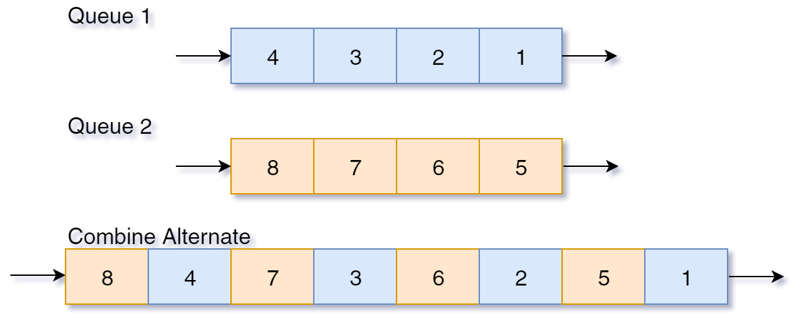
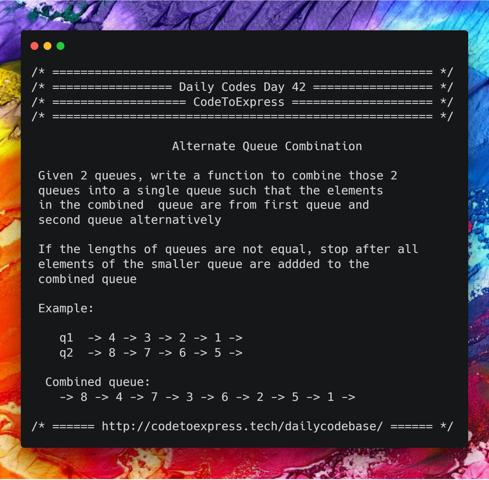
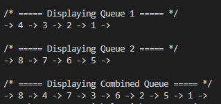

# Day 42 - Alternate Queue Combination

Given 2 queues, write a function to combine those 2 queues into a single queue such that the elements in the combined queue are from first queue and second queue alternatively

If the lengths of queues are not equal, stop after all elements of the smaller queue are addded to the combined queue



## Example:

```
q1  -> 4 -> 3 -> 2 -> 1 ->
q2  -> 8 -> 7 -> 6 -> 5 ->

combined queue:
-> 8 -> 4 -> 7 -> 3 -> 6 -> 2 -> 5 -> 1 ->
```



## Solution

## JavaScript Implementation

### [Solution](./JavaScript/queue.js)

```js
class Queue {
    constructor (size) {
        this.capacty = size;
        this.data = [];
        this.frontIndex = 0;
        this.rearIndex = 0;
    }

    front () {
        return data[this.frontIndex];
    }

    rear () {
        return data[this.rearIndex];
    }

    enqueue (element) {
        if (this.rearIndex >= this.capacty)  {
            console.log ("Overflow!");
            return -1;
        }
        this.data.unshift (element);
        // console.log (element + ' added to the queue');
        this.rearIndex++;
    }

    dequeue (element) {
        if (this.rearIndex === 0) {
            console.log ("Underflow!");
            return -1;
        }
        // console.log (this.data[this.rearIndex -1] + ' has been removed from the queue');
        this.rearIndex--;
        return this.data.pop ();
    }

    displayQueue () {
        let toBeDisplayed = '-> ';
        for (let element of this.data) {
            toBeDisplayed += element + ' -> ';
        }
        console.log (toBeDisplayed);
    }
}

const combine = (q1, q2) => {
    let toBeAdded;
    const combinedQueue = new Queue (q1.rearIndex + q2.rearIndex);
    while (!(q1.rearIndex === 0 || q2.rearIndex === 0)) {
        toBeAdded = q1.dequeue();
        combinedQueue.enqueue (toBeAdded);
        toBeAdded = q2.dequeue();
        combinedQueue.enqueue (toBeAdded);
    }
    console.log ("\n/* ===== Displaying Combined Queue ===== */");
    combinedQueue.displayQueue();
}

const firstQ = new Queue (4);

firstQ.enqueue (1);
firstQ.enqueue (2);
firstQ.enqueue (3);
firstQ.enqueue (4);

const secondQ = new Queue (4);

secondQ.enqueue (5);
secondQ.enqueue (6);
secondQ.enqueue (7);
secondQ.enqueue (8);

console.log ("\n/* ===== Displaying Queue 1 ===== */");
firstQ.displayQueue();
console.log ("\n/* ===== Displaying Queue 2 ===== */");
secondQ.displayQueue();

combine (firstQ, secondQ);
```

## C++ Implementation

### [Solution](./C++/alternate_queue.cpp)

```c++
/**
 * @author: aaditkamat
 * @date: 17/02/2019
 */
#include<iostream>
#include<queue>
#define SIZE 4
int main() {
  std::queue<int> first, second, result;
  int firstElements[SIZE] = {4, 3, 2, 1};
  int secondElements[SIZE] = {8, 7, 6, 5};
  for (int i = 0; i < SIZE; i++) {
    first.push(firstElements[i]);
    second.push(secondElements[i]);
  }
  while(!first.empty() && !second.empty()) {
    result.push(second.front());
    second.pop();
    result.push(first.front());
    first.pop();
  }
  while (!result.empty()) {
    std::cout << result.front() << " ";
    result.pop();
  }
  std::cout << "\n";
  return 0;
}
```

#### Output


