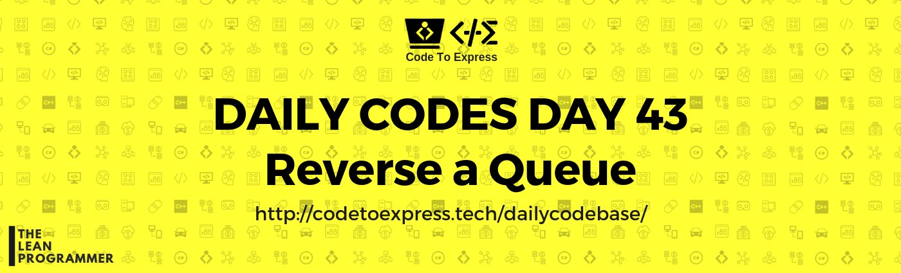
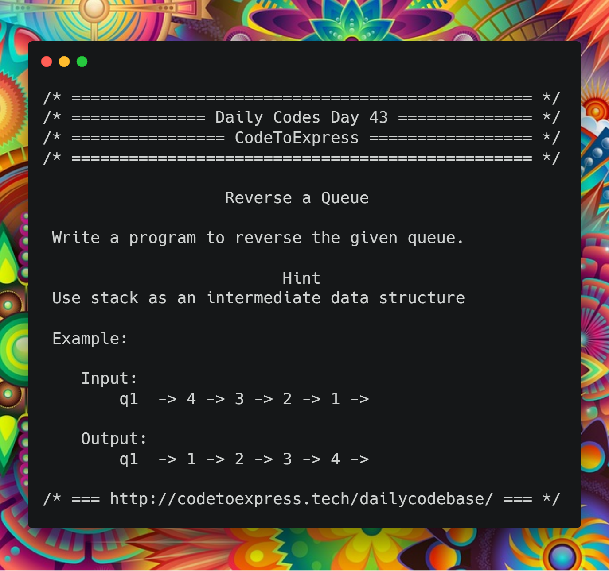

# Day 43 - Queue Reversal

Write a program to reverse the given queue.

#### Hint

Use stack as an intermediate data structure

## Example:

```
Input:
    q1  -> 4 -> 3 -> 2 -> 1 ->

Output:
    q1  -> 1 -> 2 -> 3 -> 4 ->
```



## Solution

## JavaScript Implementation

### [Solution](./JavaScript/queueReversal.js)

```js
const reverse = (myQueue) => {
    const stack = new Stack (10);
    let len = myQueue.rearIndex;

    for (let i=len; i>0; i--) {
        let currentElement = myQueue.dequeue();
        stack.push (currentElement);
    }

    for (let i=0; i<len; i++) {
        let currentElement = stack.pop();
        myQueue.enqueue(currentElement);
    }
};
```

[Click Here](./JavaScript/queueReversal.js) for complete solution