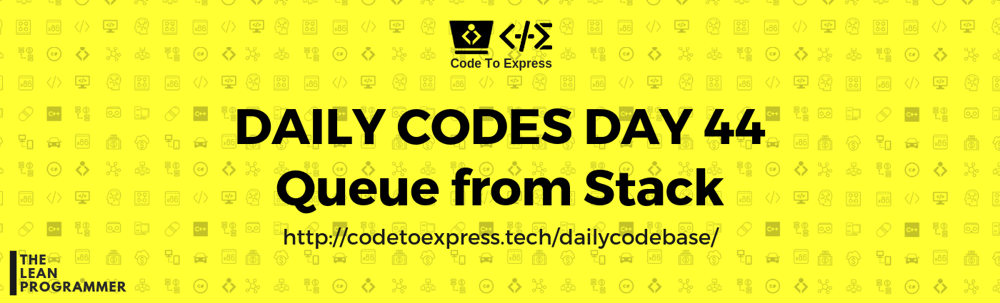

# Day 44 - Queue from Stacks

Implement the Queue data structure using Stacks

### Hint

Use 2 stacks

- enqueue operation same as push in a single stack
- For dequeue, pop all the elements of first stack into second and apply pop once in second queue
- for peek, again, pop all the elements of first stack into second and apply peek once in second queue

Don't forget to restore the state of first stack after the dequeue and peek operations

## Solution

## JavaScript Implementation

### [Solution](./JavaScript/queueFromStack.js)

```js
class Queue {
    constructor(size) {
        this.first = new Stack();
        this.second = new Stack();
    }

    enqueue(element) {
        this.first.push(element);
    }

    dequeue() {
        // Empty first stack to second
        while (this.first.peek()) {
            this.second.push(this.first.pop());
        }

        const element = this.second.pop();

        // Restore first stack
        while (this.second.peek()) {
            this.first.push(this.second.pop());
        }

        return element;
    }

    peek() {
        while (this.first.peek()) {
            this.second.push(this.first.pop());
        }

        const element = this.second.peek();

        while (this.second.peek()) {
            this.first.push(this.second.pop());
        }

        return element;
    }
}
```

[Click Here](./JavaScript/queueFromStack.js) for complete solution