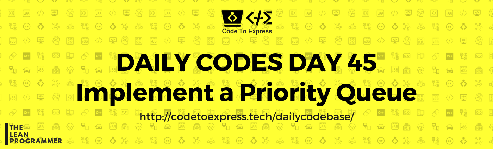

# Day 45 - Implement a priority queue

Implement the Priority Queue data structure 

### Priority Queue

Priority Queue is an extension of queue with following properties

1. Every item has a priority associated with it.
2. An element with high priority is dequeued before an element with low priority.
3. If two elements have the same priority, they are served according to their order in the queue.

A typical priority queue supports following operations.

1. **insert(item, priority):** Inserts an item with given priority.
2. **getHighestPriority():** Returns the highest priority item.
3. **deleteHighestPriority():** Removes the highest priority item

[Read More (Geeks4Geeks)](https://www.geeksforgeeks.org/priority-queue-set-1-introduction/)

## Solution

## JavaScript Implementation

### [Solution](./JavaScript/priorityQueue.js)

```js
// To Be Added
```