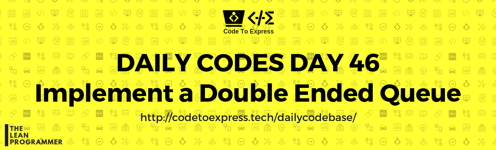

# Day 46 - Implement a double ended queue (deque)

Write a program to implement deque (Double Ended Queue)

### Double Ended Queue

Deque or Double Ended Queue is a generalized version of Queue data structure that allows insert and delete at both ends.

### Operations on Deque

Mainly the following four basic operations are performed on queue:

- insertFront(): Adds an item at the front of Deque.
- insertLast(): Adds an item at the rear of Deque.
- deleteFront(): Deletes an item from front of Deque.
- deleteLast(): Deletes an item from rear of Deque.

In addition to above operations, following operations are also supported

- getFront(): Gets the front item from queue.
- getRear(): Gets the last item from queue.
- isEmpty(): Checks whether Deque is empty or not.
- isFull(): Checks whether Deque is full or not.

[Read More (Geeks4Geeks)](https://www.geeksforgeeks.org/deque-set-1-introduction-applications/)

[ques](./ques.png)

## Solution

## JavaScript Implementation

### [Solution](./JavaScript/deque.js)

```js
// To Be Added
```