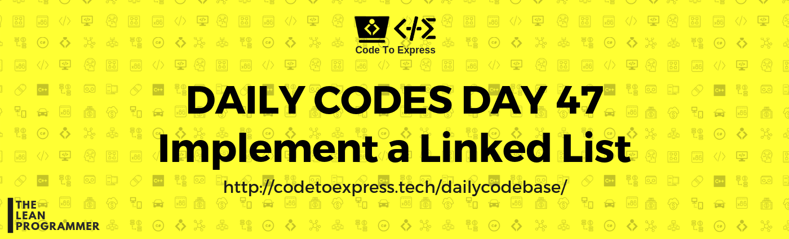

# Day 47 - Implement a singly linked list

Write a program to implement a singly linked list

### Linked Lists

#### Source: [GeeksForGeeks](https://www.geeksforgeeks.org/data-structures/linked-list/)

A linked list is a linear data structure, in which the elements are not stored at contiguous memory locations. The elements in a linked list are linked using pointers

### Advantages of Linked Lists

1. Dynamic size
2. Ease of insertion/deletion

### Disadvantages of Linked Lists

1. A middle element can't be accessed directly, only traversal is possible
2. Extra memory space for a pointer is required with each element of the list

[Read More (Geeks4Geeks)](https://www.geeksforgeeks.org/linked-list-set-1-introduction/)

Try to implement a singly linked list 

## Solution

## JavaScript Implementation

### [Solution](./JavaScript/linkedList.js)

```js
// To Be Added
```