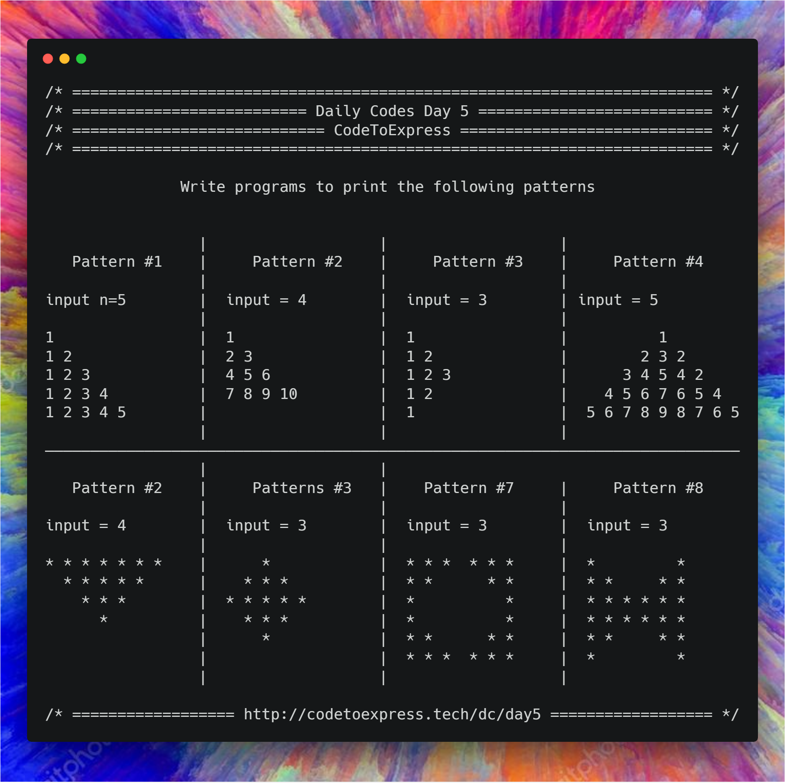

# Day 5 -- Patterns

Pattern programs like printing a pyramid, inverted pyramid etc. are some very famous problems and a good way to test your logic and knowledge of nested loops. Hence, on the day 5 of Daily Codes, let’s do some pattern based programs 😀

Here's the questions for today

### Pattern 1

```
input n=5

1
1 2
1 2 3
1 2 3 4
1 2 3 4 5
```

### Pattern 2

```
input = 4

1
2 3
4 5 6
7 8 9 10
```

### Pattern 3

```
input = 5

1
1 2
1 2 3
1 2 3 4
1 2 3 4 5
1 2 3 4
1 2 3
1 2
1
```

### Pattern 4

```
input = 5

          1
        2 3 2
      3 4 5 4 2
    4 5 6 7 6 5 4
  5 6 7 8 9 8 7 6 5
```

### Pattern 5

```
input = 5

* * * * * * * * *
  * * * * * * *
    * * * * *
      * * *
        *
```

### Pattern 6

```
input = 5

         *
       * * *
     * * * * *
   * * * * * * *
 * * * * * * * * *
   * * * * * * *
     * * * * *
       * * *
         *
```

### Pattern 7

```
input = 4

* * * *  * * * *
* * *      * * *
* *          * *
*              *
*              *
* *          * *
* * *      * * *
* * * *  * * * *
```

### Pattern 8

```
input = 5

 *                 *
 * *             * *
 * * *         * * *
 * * * *     * * * *
 * * * * * * * * * *
 * * * * * * * * * *
 * * * *     * * * *
 * * *         * * *
 * *             * *
 *                 *
```



## Pattern 1

```
input n=5
1
1 2
1 2 3
1 2 3 4
1 2 3 4 5
```

## JavaScript Implementation

### [Solution](./JavaScript/pattern1.js)

```js
/**
 * @author MadhavBahlMD
 * @date 26/12/2018
 */

function pattern1 (num) {
    console.log ("/* ===== Pattern #1 ===== */");

    for (let i=1; i<=num; i++) {
        // we will store the output for each line in a string
        // since console.log would print and take the pointer to next line
        let currentLine = '';
        for(let j=1; j<=i; j++) {
            currentLine += j + ' ';
        }
        console.log (currentLine);
    }
}

pattern1(5);
```

## Java Implementation

### [Solution](./Java/Pattern1.java)

```java
/**
 * @author MadhavBahlMD
 * @date 26/12/2018
 */

import java.util.Scanner;

public class Pattern1 {
    public static void main (String[] args) {
        System.out.println("/* ===== Pattern #1 ===== */");
        Scanner input = new Scanner (System.in);
        int n = input.nextInt(), i, j;

        // Print the pattern
        for (i=1; i<=n; i++) {
            for (j=1; j<=i; j++) {
                System.out.print(j + " ");
            }
            System.out.println("");
        }
    }
}
```

## Python Implementation

### [Pattern1.py](./Python/pattern1.py)

```python
'''
 * @author: Rajdeep Roy Chowdhury<rrajdeeproychowdhury@gmail.com>
 * @github: https://github.com/razdeep
 * @date: 26/12/2018
'''

def pattern1(num):
    for i in range(1,num+1):
        currentLine = ''
        for j in range(1,i+1):
            currentLine = currentLine + str(j) + ' '
        print(currentLine)

pattern1(5)
```
## C Implementation

### [Solution](./C/Pattern_1.c)

```c
/**
  * @author : ashwek
  * @date : 26/12/2018
  */

#include<stdio.h>

void main(){

    int n, i, j;

    printf("Enter n = ");
    scanf("%d", &n);

    for(i=1; i <= n; i++){
        for(j=1; j<=i; j++){
            printf("%d ", j);
        }
        printf("\n");
    }
}
```


## C++ Implementation

### [All Patterns](./C++/patterns.cpp)

```cpp

/*
* @author : imkaka
* @date   : 27/12/2018
*/
// All patterns day 5 dailycodebase.

#include<iostream>

using namespace std;

void pattern1(int);
void pattern2(int);
void pattern3(int);
void pattern4(int);
void pattern5(int);
void pattern6(int);
void pattern7(int);
void pattern8(int);

int main(){

    int n;
    cout << "Enter a Number: ";
    cin >> n;

    pattern1(n);
    pattern2(n);
    pattern3(n);
    pattern4(n);
    pattern5(n);
    pattern6(n);
    pattern7(n);
    pattern8(n);

    return 0;
}

void pattern1(int n){
    for(int i = 1; i <= n; ++i){
        for(int j = 1; j <= i; ++j){
            cout << j << " ";
        }
        cout << endl;
    }

    cout << "=================" << endl;
}


void pattern2(int n){
    int count = 1;
    for(int i = 1; i <= n; ++i){
        for(int j = 1; j <= i; ++j){
            cout << count << " ";
            count++;
        }
        cout << endl;
    }
    cout << "=================" << endl;
}


void pattern3(int n){
    for(int i = 1; i <= n; ++i){
        for(int j = 1; j <= i; ++j){
            cout << j << " ";
        }
        cout << endl;
    }

    // lower loop

    for(int i = n-1; i >= 1; --i){
        for(int j = 1; j <= i; ++j){
            cout << j << " ";
        }
        cout << endl;
    }

    cout << "=================" << endl;
}


void pattern4(int n){
    for(int i = 1; i <= n; ++i){
        // print spaces
        for(int j = i; j < n; ++j){
            cout << "  ";
        }

        // print the numbers
       for(int j = 0; j < i; ++j)
            cout << (j+i) << " ";

        for(int j = i-2; j >= 0; --j)
            cout << (j+i) << " ";

        cout << endl;
    }

    cout << "====================" << endl;
}


void pattern5(int n){
      int temp = 1;
      for(int i = 1; i <= n; ++i){

        // Print spaces
         for(int j = 1; j < i; ++j){
            cout << "  ";
        }

        // Print Stars
        for(int j = 1; j <= 2*n-temp; ++j){
            cout << "*" << " ";
        }
        temp+=2;
        cout << endl;
    }

    cout << "====================" << endl;
}


void pattern6(int n) {
    int count = 1;
    for(int i = 1; i <= n; ++i){
        // print spaces
        for(int j = i; j < n; ++j){
            cout << "  ";
        }

        // print the numbers
       for(int j = 1; j <= count; ++j)
            cout << "*" << " ";

        count +=2;
        cout << endl;
    }
    count-=4;
    for(int i = n-1; i >= 1; --i){

        // Spaces
        for(int j = i; j < n; ++j){
            cout << "  ";
        }

        for(int j = 1; j <=  count; ++j ){
            cout << "*" << " ";
        }
        count-=2;
        cout << endl;
    }

    cout << "====================" << endl;
}


void pattern7(int n){
    int count = 1;
    for(int i = 1; i <= n; ++i){
        //star
        for(int j = i; j <= n; ++j){
            cout << "*" << " ";
        }

        //space
        for(int j = 0; j < count; ++j)
            cout << "  ";
        //star

        for(int j = i; j <= n; ++j){
            cout << "*" << " ";
        }
        count+=2;
        cout << endl;
    }

    //Lower loop
    count-=2;

    for(int i = 1; i <= n; ++i){
        //star
        for(int j = 1; j <= i; ++j){
            cout << "*" << " ";
        }

        //space
        for(int j = 0; j < count; ++j)
            cout << "  ";
        //star

        for(int j = 1; j <= i; ++j){
            cout << "*" << " ";
        }
        count-=2;
        cout << endl;
    }
    cout << "===================================" << endl;
}


void pattern8(int n){
    int count = (n-1)*4;
    for(int i = 1; i <= n; ++i){
        //star
        for(int j = 1; j <= i; ++j){
            cout << "*" << " ";
        }

        //space
        for(int j = 0; j < count; ++j)
            cout << " ";
        //star

        for(int j = 1; j <= i; ++j){
            cout << "*" << " ";
        }
        count-=4;
        cout << endl;
    }

    //Lower loop
    count+=4;

    for(int i = 1; i <= n; ++i){
        //star
        for(int j = i; j <= n; ++j){
            cout << "*" << " ";
        }

        //space
        for(int j = 0; j < count; ++j)
            cout << " ";
        //star

        for(int j = i; j <= n; ++j){
            cout << "*" << " ";
        }
        count+=4;
        cout << endl;
    }
}

```

### [Solution](./C++/Pattern_1.cpp)

```cpp
/**
  * @author : ashwek
  * @date : 26/12/2018
  */

#include<iostream>

using namespace std;

int main(){

    int n;

    cout<<"Enter n = ";
    cin>>n;

    for(int i=1; i <= n; i++){
        for(int j=1; j<=i; j++)
            cout<<j <<" ";
        cout<<endl;
    }
    return 0;
}
```

### [first_pattern.cpp](./C++/first_pattern.cpp)

```cpp
/*
 * @author: aaditkamat
 * @date: 26/12/2018
 */

#include <iostream>

using namespace std;

void first_pattern(int num) {
   for (int i = 1; i <= num; i++) {
       for (int j = 1; j <= i; j++) {
          cout << j << " ";
       }
       cout << endl;
   }
}

int main() {
 int num;
 cout << "Enter a number: ";
 cin >> num;
 first_pattern(num);
 return 0;
```

## Pattern 2 (Floyd's Triangle)

```
input = 4
1
2 3
4 5 6
7 8 9 10
```

## JavaScript Implementation

### [Solution](./JavaScript/pattern2.js)

```js
/**
 * @author MadhavBahlMD
 * @date 26/12/2018
 */

function pattern2 (num) {
    // Set count = 0
    let  count = 0;

    // Print the pattern
    for (let i=1; i<=num; i++) {
        let currentLine = '';
        for (let j=1; j<=i; j++) {
            count++;
            currentLine += count + ' ';
        }
        console.log(currentLine);
    }
}

pattern2 (4);
```

## Java Implementation

### [Solution](./Java/Pattern2.java)

```java
import java.util.Scanner;

public class Pattern3 {
    public static void main (String[] args) {
        System.out.println("/* ===== Pattern #3 ===== */");
        Scanner input = new Scanner(System.in);
        int n = input.nextInt(), i, j;

        // Print the upper half
        for (i=1; i<=n; i++) {
            for (j=1; j<=i; j++) {
                System.out.print(j + " ");
            }
            System.out.println("");
        }

        // Print the lower half
        for (i=n-1; i>=1; i--) {
            for  (j=1; j<=i; j++) {
                System.out.print(j + " ");
            }
            System.out.println("");
        }
    }
}
```

## Python Implementation

### [Pattern2.py](./Python/pattern2.py)

```python
'''
 * @author: Rajdeep Roy Chowdhury<rrajdeeproychowdhury@gmail.com>
 * @github: https://github.com/razdeep
 * @date: 26/12/2018
'''

def pattern2(num):
    count = 0
    for i in range(1,num+1):
        currentLine = ''
        for j in range(1,i+1):
            count=count+1
            currentLine = currentLine + str(count) + ' '
        print(currentLine)

pattern2(4)
```

## C Implementation

### [Solution](./C/Pattern_2.c)

```c
/**
  * @author : ashwek
  * @date : 26/12/2018
  */

#include<stdio.h>

void main(){

    int n, i, j, k=1;

    printf("Enter n = ");
    scanf("%d", &n);

    for(i=1; i <= n; i++){
        for(j=1; j<=i; j++){
            printf("%d ", k++);
        }
        printf("\n");
    }
}
```

## C++ Implementation

### [Solution](./C++/Pattern_2.cpp)

```cpp
/**
  * @author : ashwek
  * @date : 26/12/2018
  */

#include<iostream>

using namespace std;

int main(){

    int n, k=1;

    cout<<"Enter n = ";
    cin>>n;

    for(int i=1; i <= n; i++){
        for(int j=1; j<=i; j++)
            cout<<k++ <<" ";
        cout<<endl;
    }
    return 0;
}
```

### [second_pattern.cpp](./C++/second_pattern.cpp)

```cpp
/*
 * @author: aaditkamat
 * @date: 26/12/2018
 */

#include <iostream>

using namespace std;

void second_pattern(int num) {
   int ctr = 1;
   for (int i = 1; i <= num; i++) {
      for (int j = 1; j <= i; j++) {
         cout << ctr++ << " ";
      }
      cout << endl;
   }
}

int main() {
 int num;
 cout << "Enter a number: ";
 cin >> num;
 second_pattern(num);
 return 0;
}
```

## Pattern 3

```
input = 5
1
1 2
1 2 3
1 2 3 4
1 2 3 4 5
1 2 3 4
1 2 3
1 2
1
```

## JavaScript Implementation

### [Solution](./JavaScript/pattern3.js)

```js
function pattern3 (num) {
    let currentLine = '';

    // Print the upper triangle
    for (let i=1; i<=num; i++) {
        currentLine = '';
        for (let j=1; j<=i; j++) {
            currentLine += j + " ";
        }
        console.log(currentLine);
    }

    // Print the lower half
    for (let i=num-1; i>=1; i--) {
        currentLine = '';
        for (let j=1; j<=i; j++) {
            currentLine += j + " ";
        }
        console.log(currentLine);
    }
}
```

## Java Implementation

### [Solution](./Java/Pattern3.java)

```java
import java.util.Scanner;

public class Pattern3 {
    public static void main (String[] args) {
        System.out.println("/* ===== Pattern #3 ===== */");
        Scanner input = new Scanner(System.in);
        int n = input.nextInt(), i, j;

        // Print the upper half
        for (i=1; i<=n; i++) {
            for (j=1; j<=i; j++) {
                System.out.print(j + " ");
            }
            System.out.println("");
        }

        // Print the lower half
        for (i=n-1; i>=1; i--) {
            for  (j=1; j<=i; j++) {
                System.out.print(j + " ");
            }
            System.out.println("");
        }
    }
}
```

## Python Implementation

### [Pattern3.py](./Python/pattern3.py)

```python
'''
 * @author: Rajdeep Roy Chowdhury<rrajdeeproychowdhury@gmail.com>
 * @github: https://github.com/razdeep
 * @date: 26/12/2018
'''

def pattern3(num):
    for i in range(1,num+1):
        currentLine = ''
        for j in range(1,i+1):
            currentLine = currentLine + str(j) + ' '
        print(currentLine)

    for i in range(num-1,0,-1):
        currentLine = ''
        for j in range(1,i+1):
            currentLine= currentLine + str(j) + ' '
        print(currentLine)


pattern3(4)
```

## C Implementation

### [Solution](./C/Pattern_3.c)

```c
/**
  * @author : ashwek
  * @date : 26/12/2018
  */

#include<stdio.h>

void main(){

    int n, i, j;

    printf("Enter n = ");
    scanf("%d", &n);

    //Upper-Half
    for(i=1; i <=n; i++){
        for(j=1; j<=i; j++)
            printf("%d ", j);
        printf("\n");
    }
    //Lower-Half
    for(i=n-1; i>=1; i--){
        for(j=1;  j<=i; j++)
            printf("%d ", j);
        printf("\n");
    }
}
```

## C++ Implementation

### [Solution](./C++/Pattern_3.cpp)

```cpp
/**
  * @author : ashwek
  * @date : 26/12/2018
  */

#include<iostream>

using namespace std;

int main(){

    int n;

    cout<<"Enter n = ";
    cin>>n;

    //Upper-Half
    for(int i=1; i<=n; i++){
        for(int j=1; j<=i; j++)
            cout<<j <<" ";
        cout<<endl;
    }
    //Lower-Half
    for(int i=n-1; i>=1; i--){
        for(int j=1;  j<=i; j++)
            cout<<j <<" ";
        cout<<endl;
    }
    return 0;
}
```

### [third_pattern.cpp](./C++/third_pattern.cpp)

```cpp
/*
 * @author: aaditkamat
 * @date: 26/12/2018
 */

#include <iostream>

using namespace std;

void third_pattern(int num) {
   int ctr = 1, bound = 2 * num - 1;
   for (int i = 1; i <= bound; i++) {
     for (int j = 1; j <= ctr; j++) {
       cout << j << " ";
     }
     if (i < num) {
        ctr++;
     } else {
        ctr--;
     }
     cout << endl;
   }
}

int main() {
 int num;
 cout << "Enter a number: ";
 cin >> num;
 third_pattern(num);
 return 0;
```

## Pattern 4

```
input = 5
          1
        2 3 2
      3 4 5 4 2
    4 5 6 7 6 5 4
  5 6 7 8 9 8 7 6 5
```

## JavaScript Implementation

### [Solution](./JavaScript/pattern4.js)

```js
/**
 * @author MadhavBahlMD
 * @date 26/12/2018
 */

function pattern4 (num) {
    let currentLine = '';

    for (let i=1; i<=num; i++) {
        currentLine = '';

        // Print left white spaces
        for (let j=num; j>i; j--) {
            currentLine += "  ";
        }

        // Print numbers
        for (let j=i; j<=(2*i-1); j++) {
            currentLine += j + " ";
        }
        for (let j=(2*i-1)-1; j>=i; j--) {
            currentLine += j + " ";
        }

        // Print the line
        console.log(currentLine);
    }
}

pattern4 (5);
```

## Java Implementation

### [Solution](./Java/Pattern4.java)

```java
/**
 * @author MadhavBahlMD
 * @date 26/12/2018
 */

import java.util.Scanner;

public class Pattern4 {
    public static void main (String[] args) {
        System.out.println("/* ===== Pattern #4 ===== */");
        Scanner input = new Scanner(System.in);
        int n = input.nextInt(), i, j;

        for (i=1; i<=n; i++) {
            // Print left white spaces
            for (j=n; j>i; j--) {
                System.out.print("  ");
            }

            // Print the numbers
            for (j=i; j<=(2*i-1); j++) {
                System.out.print(j + " ");
            }

            for (j=(2*i-1) - 1; j>=i; j--) {
                System.out.print(j + " ");
            }

            System.out.println("");
        }

    }
}
```

## Python Implementation

### [Pattern4.py](./Python/pattern4.py)

```python
'''
 * @author: ashwek
 * @date: 26/12/2018
'''

def pattern4(num):
    for i in range(1, num+1):
        print("  "*(num-i) + #Space
                " ".join(map(str, list(range(i, i+i)))) +  #Number-Sequence
                " " + " ".join(map(str, list(range(i+i-2, i-1, -1))))  #Reverse-Number-Sequence
            )

pattern4(5)
```

## C Implementation

### [Solution](./C/Pattern_4.c)

```c
/**
  * @author : ashwek
  * @date : 26/12/2018
  */

#include<stdio.h>

void main(){

    int n, i, j, s;

    printf("Enter n = ");
    scanf("%d", &n);

    for(i=1; i <=n; i++){
        for(s=i; s<n; s++)  //Space
            printf("  ");

        for(j=0; j<i; j++)  //Number-Sequence
            printf("%d ", (j+i));
        for(j=i-2; j>=0; j--)  //Reverse-Number-Sequence
            printf("%d ", (j+i));
        printf("\n");
    }
}
```

## C++ Implementation

### [Solution](./C++/Pattern_4.cpp)

```cpp
/**
  * @author : ashwek
  * @date : 26/12/2018
  */

#include<iostream>

using namespace std;

int main(){

    int n;

    cout<<"Enter n = ";
    cin>>n;

    for(int i=1; i <=n; i++){
        for(int s=i; s<n; s++)  //Space
            cout<<"  ";

        for(int j=0; j<i; j++)  //Number-Sequence
            cout<<(j+i) <<" ";
        for(int j=i-2; j>=0; j--)  //Reverse-Number-Sequence
            cout<<(j+i) <<" ";
        cout<<endl;
    }
    return 0;
}
```

### [fourth_pattern.cpp](./C++/fourth_pattern.cpp)

```cpp
/*
 * @author: aaditkamat
 * @date: 26/12/2018
 */

#include <iostream>

using namespace std;

void fourth_pattern(int num) {
    int bound = 2 * num - 1, ctr;
    for (int i = 1; i <= num; i++) {
        ctr = i;
        for (int j = 1; j <= bound; j++) {
            if (j <= num - i || j >= num + i) {
                cout << "  ";
            } else {
                cout << ctr << " ";
                if (j < num) {
                    ctr++;
                } else {
                    ctr--;
                }
            }
        }
        cout << endl;
    }
}

int main() {
 int num;
 cout << "Enter a number: ";
 cin >> num;
 fourth_pattern(num);
 return 0;
```

## Pattern 5

```
input = 5
* * * * * * * * *
  * * * * * * *
    * * * * *
      * * *
        *
```

## JavaScript Implementation

### [Solution](./JavaScript/pattern5.js)

```js
/**
 * @author MadhavBahlMD
 * @date 26/12/2018
 */

function pattern5 (num) {
    let currentLine = '';

    // Print the pattern
    for (let i=1; i<=num; i++) {
        currentLine = '';

        // Print the white spaces
        for (let j=1; j<i; j++) {
            currentLine += '  ';
        }

        // Print asterisk
        for (let j=1; j<=(2*num - (2*i - 1)); j++) {
            currentLine += '* ';
        }

        console.log(currentLine);
    }
}

pattern5 (5);
```

## Java Implementation

### [Solution](./Java/Pattern5.java)

```java
/**
 * @author MadhavBahlMD
 * @date 26/12/2018
 */

import java.util.Scanner;

public class Pattern5 {
    public static void main (String[] args) {
        System.out.println("/* ===== Pattern #5 ===== */");
        Scanner input = new Scanner(System.in);
        int n = input.nextInt(), i, j;

        // Print the pattern
        for (i=1; i<=n; i++) {
            // Print whitet spaces
            for (j = 1; j < i; j++) {
                System.out.print("  ");
            }

            // Print asterisk
            for (j = 1; j <= (2 * n - (2 * i - 1)); j++) {
                System.out.print("* ");
            }
            System.out.println("");
        }
    }
}
```

## Python Implementation

### [Pattern5.py](./Python/pattern5.py)

```python
'''
 * @author: ashwek
 * @date: 26/12/2018
'''

def pattern5(num):
    for i in range(num):
        print("  "*i + "* "*((num-i)*2-1))

pattern5(5)
```

## C Implementation

### [Solution](./C/Pattern_5.c)

```c
/**
  * @author : ashwek
  * @date : 26/12/2018
  */

#include<stdio.h>

void main(){

    int n, i, j, s;

    printf("Enter n = ");
    scanf("%d", &n);

    for(i=1; i <=n; i++){
        for(s=1; s<i; s++)  //Space
            printf("  ");
        for(j=1; j<(n-i+1)*2; j++)  //Triangle
            printf("* ");
        printf("\n");
    }
}
```

## C++ Implementation

### [Solution](./C++/Pattern_5.cpp)

```cpp
/**
  * @author : ashwek
  * @date : 26/12/2018
  */

#include<iostream>

using namespace std;

int main(){

    int n;

    cout<<"Enter n = ";
    cin>>n;

    for(int i=1; i <=n; i++){
        for(int s=1; s<i; s++)  //Space
            cout<<"  ";
        for(int j=1; j<(n-i+1)*2; j++)  //Triangle
            cout<<"* ";
        cout<<endl;
    }
    return 0;
}
```

### [fifth_pattern.cpp](./C++/fifth_pattern.cpp)

```cpp
/*
 * @author: aaditkamat
 * @date: 26/12/2018
 */

#include <iostream>

using namespace std;

void fifth_pattern(int num) {
    string result = "";
    int bound = 2  * num - 1;
    for (int i = num; i >= 1; i--) {
        for (int j = 1; j <= bound; j++) {
            if (j <= num - i || j >= num + i) {
                cout << "  ";
            } else {
                cout << "* ";
            }
        }
        cout << "\n";
    }
}

int main() {
 int num;
 cout << "Enter a number: ";
 cin >> num;
 fifth_pattern(num);
 return 0;
```

## Pattern 6

```
input = 5
         *
       * * *
     * * * * *
   * * * * * * *
 * * * * * * * * *
   * * * * * * *
     * * * * *
       * * *
         *
```

## JavaScript Implementation

### [Solution](./JavaScript/pattern6.js)

```js
/**
 * @author MadhavBahlMD
 * @date 26/12/2018
 */

function pattern6 (n) {
    let currentLine = '';

    // Print upper triangle
    for(let i=1; i<=n; i++) {
        currentLine = '';

        // Print white spaces
        for (let j=1; j<=n-i; j++) {
            currentLine += '  ';
        }

        // Print asterisks
        for (let j=1; j<=(2*i-1); j++) {
            currentLine += '* ';
        }

        console.log(currentLine);
    }

    // Print lower triangle
    for (let i=(n-1); i>=1; i--) {
        currentLine = '';

        // Print white spaces
        for (let j=1; j<=n-i; j++) {
            currentLine += '  ';
        }

        // Print asterisks
        for (let j=1; j<=(2*i-1); j++) {
            currentLine += '* ';
        }

        console.log(currentLine);
    }
}

pattern6 (5);
```

## Java Implementation

### [Solution](./Java/Pattern6.java)

```java
/**
 * @author MadhavBahlMD
 * @date 26/12/2018
 */

function pattern6 (n) {
    let currentLine = '';

    // Print upper triangle
    for(let i=1; i<=n; i++) {
        currentLine = '';

        // Print white spaces
        for (let j=1; j<=n-i; j++) {
            currentLine += '  ';
        }

        // Print asterisks
        for (let j=1; j<=(2*i-1); j++) {
            currentLine += '* ';
        }

        console.log(currentLine);
    }

    // Print lower triangle
    for (let i=(n-1); i>=1; i--) {
        currentLine = '';

        // Print white spaces
        for (let j=1; j<=n-i; j++) {
            currentLine += '  ';
        }

        // Print asterisks
        for (let j=1; j<=(2*i-1); j++) {
            currentLine += '* ';
        }

        console.log(currentLine);
    }
}

pattern6 (5);
```

## Python Implementation

### [Pattern6.py](./Python/pattern6.py)

```python
'''
 * @author: ashwek
 * @date: 26/12/2018
'''

def pattern6(num):
    for i in range(1, num+1):
        print("  "*(num-i) + #Space
                "* " * (2*i-1)  #Triangle
            )
    for i in range(2, num+1):
        print("  "*(i-1) + #Space
                "* " * (2*(num-i)+1)  #Triangle
            )

pattern6(5)
```

## C Implementation

### [Solution](./C/Pattern_6.c)

```c
/**
  * @author : ashwek
  * @date : 26/12/2018
  */

#include<stdio.h>

void main(){

    int n, i, j, s;

    printf("Enter n = ");
    scanf("%d", &n);

    //Upper-Half
    for(i=1; i <=n; i++){
        for(s=i; s<n; s++)  //Space
            printf("  ");
        for(j=1; j<i*2; j++)  //Triangle
            printf("* ");
        printf("\n");
    }
    //Lower-Half
    for(i=2; i <=n; i++){
        for(s=1; s<i; s++)  //Sapce
            printf("  ");
        for(j=1; j<(n-i+1)*2; j++)  //Triangle
            printf("* ");
        printf("\n");
    }
}
```

## C++ Implementation

### [Solution](./C++/Pattern_6.cpp)

```cpp
/**
  * @author : ashwek
  * @date : 26/12/2018
  */

#include<iostream>

using namespace std;

int main(){

    int n;

    cout<<"Enter n = ";
    cin>>n;

    //Upper-Half
    for(int i=1; i <=n; i++){
        for(int s=i; s<n; s++)  //Space
            cout<<"  ";
        for(int j=1; j<i*2; j++)  //Triangle
            cout<<"* ";
        cout<<endl;
    }
    //Lower-Half
    for(int i=2; i <=n; i++){
        for(int s=1; s<i; s++)  //Sapce
            cout<<"  ";
        for(int j=1; j<(n-i+1)*2; j++)  //Triangle
            cout<<"* ";
        cout<<endl;
    }
    return 0;
}
```

## C++ Implementation

### [sixth_pattern.cpp](./C++/sixth_pattern.cpp)

```cpp
/*
 * @author: aaditkamat
 * @date: 26/12/2018
 */
#include <iostream>

using namespace std;

string sixth_pattern(int num) {
    string result = "";
    int bound = 2 * num - 1, ctr = 0;
    for (int i = 1; i <= bound; i++) {
        for (int j = 1; j <= bound; j++) {
            if (j < num - ctr || j > num + ctr) {
                cout << "  ";
            } else {
                cout << "* ";
            }
        }
        if (i < num) {
            ctr++;
        } else {
            ctr--;
        }
        cout << endl;
    }
    return result;
}

int main() {
 int num;
 cout << "Enter a number: ";
 cin >> num;
 sixth_pattern(num);
 return 0;
```

## Pattern 7

```
input = 4
* * * *  * * * *
* * *      * * *
* *          * *
*              *
*              *
* *          * *
* * *      * * *
* * * *  * * * *
```

## JavaScript Implementation

### [Solution](./JavaScript/pattern7.js)

```js
/**
 * @author MadhavBahlMD
 * @date 26/12/2018
 */

function pattern7 (num) {
    let currentLine;

    // Print the upper half
    for(i=1; i<=num; i++) {
        currentLine = '';
        for (j=1; j<=2*num; j++) {

            if (j<=num) {
                if ((i+j) > num+1)
                    currentLine += '  ';
                else
                    currentLine += '* ';
            } else {
                if (i>j-num)
                    currentLine += '  ';
                else
                    currentLine += '* ';
            }

        }
        console.log(currentLine);
    }

    // Print the lower half
    for (i=2; i<=num; i++) {
        currentLine = '';
        for(j=1; j<=2*num; j++) {

            if (j<=num) {
                if (j>i)
                    currentLine += '  ';
                else
                    currentLine += '* ';
            } else {
                if (i+(j-num) < num+1)
                    currentLine += '  ';
                else
                    currentLine += '* ';
            }

        }
        console.log(currentLine);
    }

}

pattern7 (5);
```

## Java Implementation

### [Solution](./Java/Pattern7.java)

```java
/**
 * @author MadhavBahlMD
 * @date 26/12/2018
 */

import java.util.Scanner;

public class Pattern7 {
    public static void main (String[] args) {
        System.out.println("/* ===== Pattern #7 ===== */");
        Scanner input = new Scanner(System.in);
        int n = input.nextInt(), i, j;

        // Print upper half
        for (i=1; i<=n; i++) {
            for (j=1; j<=2*n; j++) {

                // Print upperleft pattern
                if (i+j <= n+1)
                    System.out.print("*");
                else
                    System.out.print(" ");

                // Print upperright pattern
                if (i>j-n)
                    System.out.print(" ");
                else
                    System.out.print("*");
            }
            System.out.println("");
        }

        // Print lower half
        for (i=1; i<=n; i++) {
            for (j=1; j<=2*n; j++) {

                // Print lower left pattern
                if (j>i)
                    System.out.print(" ");
                else
                    System.out.print("*");

                // Print lower right pattern
                if (i+j < 2*n+1)
                    System.out.print(" ");
                else
                    System.out.print("*");
            }
            System.out.println("");
        }
    }
}
```

## Python Implementation

### [Pattern7.py](./Python/pattern7.py)

```python
'''
 * @author: ashwek
 * @date: 26/12/2018
'''

def pattern7(num):
    Upper = []
    for i in range(1, num+1):
        Upper.append("* " * (num-i+1) +  #Left Triangle
                    "    "*(i-1) + #Space
                    "* " * (num-i+1)  #Right Triangle
                    )

    for i in Upper:  # Upper Half
        print(i)
    for i in Upper[::-1]:  # Lower Half (Reverse of Upper Half)
        print(i)

pattern7(4)
```

## C Implementation

### [Solution](./C/Pattern_7.c)

```c
/**
  * @author : ashwek
  * @date : 26/12/2018
  */

#include<stdio.h>

void main(){

    int n, i, j, s;

    printf("Enter n = ");
    scanf("%d", &n);

    //Upper-Half
    for(i=1; i <=n; i++){
        for(j=i; j<=n; j++)  //Left Triangle
            printf("* ");
        for(s=1; s<i; s++)  //Space
            printf("    ");
        for(j=i; j<=n; j++)  //Right Triangle
            printf("* ");
        printf("\n");
    }
    //Lower-Half
    for(i=1; i <=n; i++){
        for(j=1; j<=i; j++)  //Left Triangle
            printf("* ");
        for(s=1; s<=(n-i); s++)  //Space
            printf("    ");
        for(j=1; j<=i; j++)  //Right Triangle
            printf("* ");
        printf("\n");
    }
}
```

## C++ Implementation

### [Solution](./C++/Pattern_7.cpp)

```cpp
/**
  * @author : ashwek
  * @date : 26/12/2018
  */

#include<iostream>

using namespace std;

int main(){

    int n;

    cout<<"Enter n = ";
    cin>>n;

    //Upper-Half
    for(int i=1; i <=n; i++){
        for(int j=i; j<=n; j++)  //Left Triangle
            cout<<"* ";
        for(int s=1; s<i; s++)  //Space
            cout<<"    ";
        for(int j=i; j<=n; j++)  //Right Triangle
            cout<<"* ";
        cout<<endl;
    }
    //Lower-Half
    for(int i=1; i <=n; i++){
        for(int j=1; j<=i; j++)  //Left Triangle
            cout<<"* ";
        for(int s=1; s<=(n-i); s++)  //Space
            cout<<"    ";
        for(int j=1; j<=i; j++)  //Right Triangle
            cout<<"* ";
        cout<<endl;
    }
    return 0;
}
```

### [seventh_pattern.cpp](./C++/seventh_pattern.cpp)

```cpp
/*
 * @author: aaditkamat
 * @date: 26/12/2018
 */
#include <iostream>

using namespace std;

void seventh_pattern(int num) {
    string result = "";
    int ctr = num, bound = 2 * num + 1;
    for (int i = 1; i <= bound - 1; i++) {
        for (int j = 1; j <= bound; j++) {
            if (j <= ctr || j > bound - ctr) {
                cout << "* ";
            } else {
                cout << "  ";
            }
        }
        if (i < num) {
            ctr--;
        }
        if (i > num) {
            ctr++;
        }
        cout << "\n";
    }
}

int main() {
 int num;
 cout << "Enter a number: ";
 cin >> num;
 seventh_pattern(num);
 return 0;
 }
```

## Pattern 8

```
input = 5
 *                 *
 * *             * *
 * * *         * * *
 * * * *     * * * *
 * * * * * * * * * *
 * * * * * * * * * *
 * * * *     * * * *
 * * *         * * *
 * *             * *
 *                 *
```

## JavaScript Implementation

### [Solution](./JavaScript/pattern8.js)

```js
/**
 * @author MadhavBahlMD
 * @date 26/12/2018
 */

 function pattern8 (n) {
    let currentLine;

    // Print upper pattern
    for (let i=1; i<=n; i++) {
        currentLine = '';
        for (let j=1; j<=2*n; j++) {
            if (j<=n) {
                if (i<j)  currentLine += '  ';
                else  currentLine += '* ';
            } else {
                if (i+j < 2*n + 1)  currentLine += '  ';
                else  currentLine += '* ';
            }
        }
        console.log(currentLine);
    }

    // Print lower pattern
    for (let i=1; i<=n; i++) {
        currentLine = '';
        for (let j=1; j<=2*n; j++) {
            if (j<=n) {
                if (i+j>n+1)  currentLine += '  ';
                else  currentLine += '* ';
            } else {
                if (i > j-n)  currentLine += '  ';
                else  currentLine += '* ';
            }
        }
        console.log(currentLine);
    }
}

pattern8 (5);
```

## Java Implementation

### [Solution](./Java/Pattern8.java)

```java
/**
 * @author MadhavBahlMD
 * @date 26/12/2018
 */

import java.util.Scanner;

public class Pattern8 {
    public static void main(String[] args) {
        System.out.println("/* ===== Pattern #8 ===== */");
        Scanner input = new Scanner(System.in);
        int n = input.nextInt(), i, j;

        // Print upper pattern
        for (i=1; i<=n; i++) {
            for (j=1; j<=2*n; j++) {
                if (j<=n) {
                    if (i<j)  System.out.print("  ");
                    else  System.out.print("* ");
                } else {
                    if (i+j < 2*n + 1)  System.out.print("  ");
                    else  System.out.print("* ");
                }
            }
            System.out.println("");
        }

        // Print lower pattern
        for (i=1; i<=n; i++) {
            for (j=1; j<=2*n; j++) {
                if (j<=n) {
                    if (i+j>n+1)  System.out.print("  ");
                    else  System.out.print("* ");
                } else {
                    if (i > j-n)  System.out.print("  ");
                    else  System.out.print("* ");
                }
            }
            System.out.println("");
        }
    }
}
```

## Python Implementation

### [Pattern8.py](./Python/pattern8.py)

```python
'''
 * @author: ashwek
 * @date: 26/12/2018
'''

def pattern8(num):
    Upper = []
    for i in range(1, num+1):
        Upper.append("* "*i +  #Left Triangle
                    "    "*(num-i) + #Space
                    "* "*i  #Right Triangle
                    )

    for i in Upper:  # Upper Half
        print(i)
    for i in Upper[::-1]:  # Lower Half (Reverse of Upper Half)
        print(i)

pattern8(5)
```

## C Implementation

### [Solution](./C/Pattern_8.c)

```c
/**
  * @author : ashwek
  * @date : 26/12/2018
  */

#include<stdio.h>

void main(){

    int n, i, j, s;

    printf("Enter n = ");
    scanf("%d", &n);

    //Upper-Half
    for(i=1; i <=n; i++){
        for(j=1; j<=i; j++)  //Left Triangle
            printf("* ");
        for(s=1; s<=(n-i); s++)  //Space
            printf("    ");
        for(j=1; j<=i; j++)  //Right Triangle
            printf("* ");
        printf("\n");
    }
    //Lower-Half
    for(i=1; i <=n; i++){
        for(j=i; j<=n; j++)  //Left Triangle
            printf("* ");
        for(s=1; s<i; s++)  //Space
            printf("    ");
        for(j=i; j<=n; j++)  //Right Triangle
            printf("* ");
        printf("\n");
    }
}
```

## C++ Implementation

### [Solution](./C++/Pattern_8.cpp)

```cpp
/**
  * @author : ashwek
  * @date : 26/12/2018
  */

#include<iostream>

using namespace std;

int main(){

    int n;

    cout<<"Enter n = ";
    cin>>n;

    //Upper-Half
    for(int i=1; i<=n; i++){
        for(int j=1; j<=i; j++)  //Left Triangle
            cout<<"* ";
        for(int s=1; s<=(n-i); s++)  //Space
            cout<<"    ";
        for(int j=1; j<=i; j++)  //Right Triangle
            cout<<"* ";
        cout<<endl;
    }
    //Lower-Half
    for(int i=1; i<=n; i++){
        for(int j=i; j<=n; j++)  //Left Triangle
            cout<<"* ";
        for(int s=1; s<i; s++)  //Space
            cout<<"    ";
        for(int j=i; j<=n; j++)  //Right Triangle
            cout<<"* ";
        cout<<endl;
    }
    return 0;
}
```

## [eighth_solution.cpp](./C++/eighth_solution.cpp)

```cpp
/*
 * @author: aaditkamat
 * @date: 26/12/2018
 */

#include <iostream>

using namespace std;

void eighth_pattern(int num) {
    string result = "";
    int bound = 2 * num, ctr = 1;
    for (int i = 1; i <= bound; i++) {
        for (int j = 1; j <= bound; j++) {
            if (j <= ctr || j > bound - ctr) {
                cout << "* ";
            } else {
                cout << "  ";
            }
        }
        if (i < num) {
            ctr++;
        }
        if (i > num) {
            ctr--;
        }
        cout << "\n";
    }
}

int main() {
 int num;
 cout << "Enter a number: ";
 cin >> num;
 eighth_pattern(num);
 return 0;
}
```
/* @date 25/09/2020
 * @author Shashwat Gupta (shashwatxdevelop)
 */
import java.util.Scanner;

public class Pattern__1 {

	public static void main(String[] args) {
		int i,j,n;
		Scanner sc = new Scanner (System.in);
				n= sc.nextInt();
		for(i=1; i<=n; i++)
		{
			for (j=1; j<=i;j++)
			{
				System.out.print(j+" ");
			}
			System.out.println();
		}

	}

}
```
/* @date 25/09/2020
 * @author Shashwat Gupta (shashwatxdevelop)
 */
import java.util.Scanner;
public class Pattern__2 {

	public static void main(String[] args) {
		int i,j,n, s=0;
		Scanner sc = new Scanner (System.in);
		n= sc.nextInt();
		for (i=1; i<=n; i++)
		{
			for (j=1; j<=i; j++)
			{
				s=s+1;
				System.out.print(s+" ");
			}
			System.out.println();
		}

	}

}
```
/* @date 25/09/2020
 * @author Shashwat Gupta (shashwatxdevelop)
 */
import java.util.Scanner;
public class Pattern__3 {

	public static void main(String[] args) {
		int i,j,n,a,b;
		Scanner sc = new Scanner (System.in);
		n= sc.nextInt();
		for(i=1; i<=n; i++)
		{
			for(j=1; j<=i; j++)
			{
				System.out.print(j+" ");
			}
			System.out.println();
		}
		
		
		for (i=n-1; i>=1; i--)
		{
			for (j=1; j<=i; j++ )
			{
				System.out.print(j+" ");
			}
			System.out.println();
		}

	}

}

```
/* @date 25/09/2020
 * @author Shashwat Gupta (shashwatxdevelop)
 */
import java.util.Scanner;
public class Pattern__4 {

	public static void main(String[] args) {
		int i,j,n;
		Scanner sc =new Scanner (System.in);
		n= sc.nextInt();
		
       
        	for (i=1; i<=n; i++)
        	{
        		for (j=n; j>i; j--)
        		{
        			System.out.print(" ");
        		}
        	
        	for (j=i; j<=(2*i-1); j++)
        	{
        		System.out.print(j+" ");
        	}
        	for (j=(2*i-1) - 1; j>=i; j--)
        	{
        		System.out.print(j+" ");
        	}
        	System.out.println(" ");
        }
	}
}


```
/* @date 25/09/2020
 * @author Shashwat Gupta (shashwatxdevelop)
 */
import java.util.Scanner;
public class Pattern__5 {

	public static void main(String[] args) {
		int i,j,k,n, p=1;
		Scanner sc = new Scanner (System.in);
		n= sc.nextInt();
		for(i=1; i<=n;i++)
		{
			for (j=1; j<i; j++)
			{
				System.out.print(" ");
			}
			for (j=1; j<= (2*n-(2*i-1)); j++)
			{
				System.out.print("*");
			}
			System.out.println("");
			
		

	}

}
}

```
### Have Another solution?

The beauty of programming lies in the fact that there is never a single solution to any problem.

In case you have an alternative way to solve this problem, do contribute to this repository (https://github.com/CodeToExpress/dailycodebase) :)