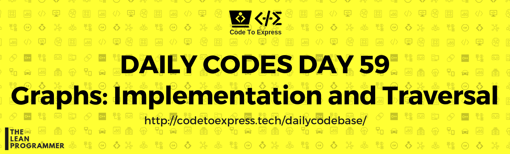

# Day 59- Graphs: Implementation and Traversal

Ques) Write a program to implement a graph data structure, and apply BFS and DFS traversal on it.

Reference: [Geeks4Geeks](https://www.geeksforgeeks.org/graph-data-structure-and-algorithms/)

## Solution

## JavaScript Implementation

### [Solution](./JavaScript/binaryHeap.js)

```js
// To Be Added
```