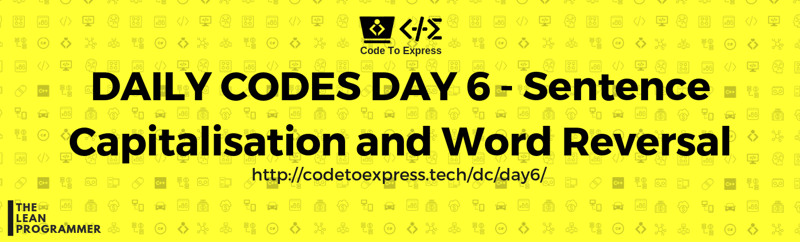
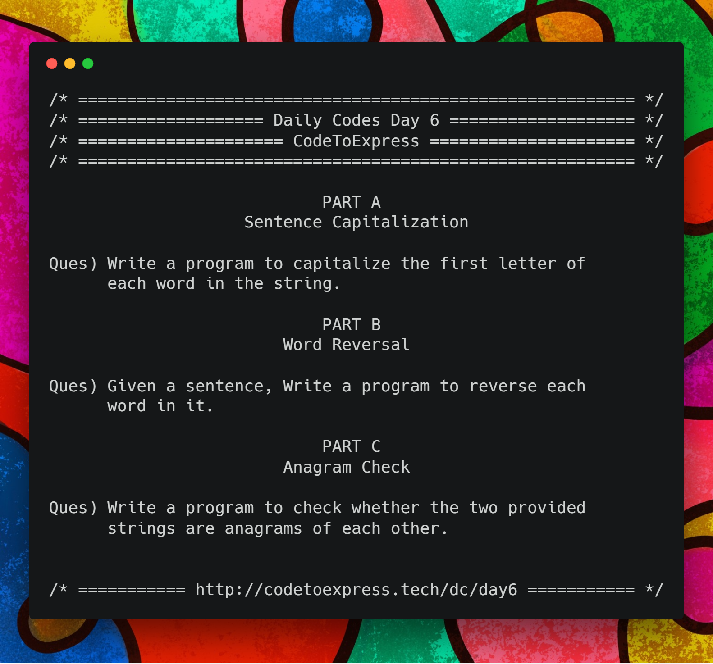

# Day 6 

## Questions for today

Welcome back to the Day 3 of Daily Codes, as you might have noticed we are slowly stepping up our game in Strings. So today let's do 3 cool questions that seems pretty straightforward while reading the question but can be a little challenging when you actually try to solve them

#### Part A - Sentence Capitalization 

**Question** - Write a program to capitalize the first letter of each word in the string.

#### Part B - Word Reversal

**Question** - Given a sentence, Write a program to reverse each word in it.

#### Part C - Anagram Check

**Question** - Write a program to check whether the two provided strings are anagrams of each other. (Do not ignore the letter case)



## Part A -- Sentence Capitalization

**Question** - Write a program to capitalize the first letter of each word in the string.

## JavaScript Implementation

### [Solution 1](./JavaScript/sentenceCap1.js)

```js
/**
 * @author MadhavBahlMD
 * @date 27/12/2018
 */

function capitalize (str) {
    // spit the string to array
    let wordArr = str.split(' ');
    
    // loop through each element of array and capitalize the first letter

    for (let i=0; i<wordArr.length; i++) {

        // Some people might proceed like this, but strings are immutable
        // let currentWord = wordArr[i];
        // currentWord[0] = currentWord[0].toUpperCase();
        // console.log(currentWord);

        // Append the first letter (capitalized)
        let currentWord = '';
        currentWord += wordArr[i][0].toUpperCase();
        
        // Append the rest of the word (can be easily done by String slice)
        for (let j=1; j<wordArr[i].length; j++) {
            currentWord += wordArr[i][j];
        }

        // replace the current word by currentWord
        wordArr[i] = currentWord;
    }

    // join the array into string
    return wordArr.join(' ');
}

console.log(capitalize ('hello world'));
```

### [Solution 2](./JavaScript/sentenceCap1.js)

```js
/**
 * @author MadhavBahlMD
 * @date 27/12/2018
 */

function capitalize (str) {
    // declare an empty array
    let capitalied = [];

    // loop through each word and capitalize the first letter
    for (let word of str.split(' ')) {
        capitalied.push(word[0].toUpperCase() + word.slice(1));
    }

    // join the array into string
    return capitalied.join(' ');
}
```

### [Solution 3](./JavaScript/sentenceCap1.js)

```js
/**
 * @author MadhavBahlMD
 * @date 27/12/2018
 */

 function capitalize (str) {
    let result = str[0].toUpperCase();

    for (let i=1; i<str.length; i++) {
        if (str[i-1] === ' ') {
            result += str[i].toUpperCase();
        } else { 
            result += str[i];
        }
    }

    return result;
}
```

## Java Implementation

### [Solution 1](./Java/SentenceCap1.java)

```java
/**
 * @author MadhavBahlMD
 * @date 27/12/2018
 */

import java.util.Scanner;

public class SentenceCap1 {
    public static void main(String[] args) {
        Scanner input = new Scanner(System.in);
        System.out.print("Enter the sentence: ");
        String str = input.nextLine();

        String[] words = str.split("\\s+");

        for (int i=0; i<words.length; i++) {
            words[i] = Character.toUpperCase(words[i].charAt(0)) + words[i].substring(1, words[i].length());
        }

        // Join the array
        System.out.print(String.join(" ", words));
    }
}

```

### [Solution 2](./Java/SentenceCap2.java)

```java
/**
 * @author MadhavBahlMD
 * @date 27/12/2018
 */
 
import java.util.Scanner;

public class SentenceCap2 {
    public static void main(String[] args) {
        Scanner input = new Scanner (System.in);
        System.out.print("Enter the sentence: ");
        String sentence = input.nextLine();
        String capitalized = "";

        for (int i=0; i<sentence.length(); i++) {
            if (i==0)   capitalized += Character.toUpperCase(sentence.charAt(i));
            else {
                if (sentence.charAt(i-1) == ' ') {
                    capitalized  += Character.toUpperCase(sentence.charAt(i));
                } else {
                    capitalized += sentence.charAt(i);
                }
            }
        }

        // Print the results
        System.out.println("Capitalized String is: " + capitalized);
    }
}
```
## Python Implementation

### [sentence_capitalization.py](./Python/sentence_capitalization.py)

```python
'''
@author: aaditkamat
@date: 27/12/2018
'''

#short version
from string import capwords
def capitalize_sentence_short(string):
    return capwords(string)

#slightly long version
def capitalize_sentence_long(string):
    new_string = ''
    for word in string.split(' '):
        new_string += word.capitalize() + ' '
    return new_string

print("Enter a string: ", end= ' ')
string = input()
print("String \'", string, "\' with first letter of each word capitalized (short version): ", capitalize_sentence_short(string))
print("String \'", string, "\' with first letter of each word capitalized (slightly long version): ", capitalize_sentence_long(string))
```

## Part B -- Word Reversal

**Question** - Given a sentence, Write a program to reverse each word in it.

## JavaScript Implementation

### [Solution 1](./JavaScript/wordRev1.js)

```js
/**
 * @author MadhavBahlMD
 * @date 27/12/2018
 */

function wordRev (line) {
    // Split the line
    let words = line.split(' ');

    // reverse each word
    for (let i=0; i<words.length; i++) {
        words[i] = words[i].split('').reverse().join('');
    }

    // Join and return
    return words.join(' ');
}

console.log (wordRev("hello world Greetings"));
```

### [Solution 2](./JavaScript/wordRev2.js)

```js
/**
 * @author MadhavBahlMD
 * @date 27/12/2018
 */

 function wordRev (line) {
    let reversed = [];

    for(let word of line.split(' ')) {
        reversed.push(word.split('').reverse().join(''));
    }

    return reversed.join(' ');
}

console.log (wordRev("  hello  wow   world Greetings"));
```

### [Solution 3](./JavaScript/wordRev3.js)

```js
/**
 * @author MadhavBahlMD
 * @date 27/12/2018
 */

// Without inbuilt reverse or split, a straightforward method

function wordRev (line) {
    // iterate through the string and add each word in a new array (splitting it on white space)
    let words = [], count = 0, word = '';

    for (let i=0; i<line.length; i++) {
        if (line[i] !== ' ') {
            word += line[i];
        } else {
            words[count] = word;
            word = '';
            count++;
        }
    }
    // Add the last word as well to the words array as well
    words[count] = word;
    count++;

    // Reverse the words
    let temp;
    for (let i=0; i<count; i++) {
        temp = '';
        for (let j=words[i].length-1; j>=0; j--) {
            temp += words[i][j];
        }
        words[i] = temp;
    }

    // join the elements (Ok, let's not use the traditional join() method -_-)
    let reversed = '';
    for (let i=0; i<count; i++) {
        if (i!=count-1) {
            reversed += words[i] + ' ';
        } else {
            reversed += words[i];
        }
    }

    // print the result
    return reversed;
}

console.log(wordRev ('hello world greetings'));
```

## Java Implementation

### [Solution](./Java/WordRev.java)

```java
/**
 * @author MadhavBahlMD
 * @date 27/12/2018
 */

import java.util.Scanner;
import java.lang.*;

public class WordRev {
    public static void main(String[] args) {
        Scanner input = new Scanner (System.in);
        System.out.print("Enter the sentence: ");
        String sentence = input.nextLine();

        String[] words = sentence.split("\\s+");
        String reversed;

        for (int i=0; i<words.length; i++) {
            reversed = "";
            for (int j=0; j<words[i].length(); j++) {
                reversed = words[i].charAt(j) + reversed;
            }
            words[i] = reversed;
        }

        String wordsReversed = String.join(" ", words);
        System.out.println("String with reversed words: " + wordsReversed);
    }
}
```

## Python Implementation

### [reverse_words.py](./Python/reverse_words.py)
```python
'''
@author: aaditkamat
@date: 27/12/2018
'''

def reverse_words(string):
    new_string = ''
    for word in string.split(' '):
        new_string += word[::-1] + ' '
    return new_string

print("Enter a string: ", end= '')
string = input()
print("Reverse of string: ", reverse_words(string)})
```
## Part C -- Anagram Check

**Question** - Write a program to check whether the two provided strings are anagrams of each other.

## JavaScript Implementation

### [Solution 1](./JavaScript/anagram1.js)

```js
/**
 * @author MadhavBahlMD
 * @date 27/12/2018
 * METHOD -- Check the lengths of both strings, sort them and then check whether they are same
 */

function anagram (str1, str2) {
    let len1 = str1.length,
        len2 = str2.length;
    
    // Compare lengths
    if (len1 !== len2) {
        console.log ('Invalid Input');
        return -1;
    }

    // sort the strings
    let sortedStr1 = str1.split('').sort().join(''),
        sortedStr2 = str2.split('').sort().join('');

    // Compare both strings
    if (sortedStr1 === sortedStr2) {
        console.log(`"${str1}" and "${str2}" are Anagrams`);
        return 1;
    } else {
        console.log(`"${str1}" and "${str2}" are not Anagrams`);
        return 0;
    }
}

anagram ('LISTEN', 'SILENT');
```

### [Solution 2](./JavaScript/anagram2.js)

```js
/**
 * @author MadhavBahlMD
 * @date 27/12/2018
 * METHOD -- Prepare 2 objects which stores frequency of every character in both strings, compare those 2 objects  (dictionaries in python)
 */

function anagram (str1, str2) {
    let len1 = str1.length,
        len2 = str2.length;
    
    // Compare lengths
    if (len1 !== len2) {
        console.log ('Invalid Input');
        return -1;
    }

    // Make  frequency objects
    let countObj1 = {},
        countObj2 = {};

    for (let i=0; i<len1; i++) {
        countObj1[str1[i]] = countObj1[str1[i]] + 1 || 1;
    }

    for (let i=0; i<len2; i++) {
        countObj2[str2[i]] = countObj2[str2[i]] + 1 || 1;
    }

    // compare frequency objects
    // Please note that there is no direct way of comparing 2 objects.
    // We can either use some librries like Lowdash, or we can check the equality of each key value pair in objects, which is indeed a tedious task, but still, lets do it :)
    for (let key in countObj1) {
        if (countObj1[key] !== countObj2[key]) {
            console.log(`"${str1}" and "${str2}" are not Anagrams`);
            return 0;
        }
    }

    console.log(`"${str1}" and "${str2}" are Anagrams`);
}   

anagram ('LISTEN', 'MILENT');
```

### [Solution 3](./JavaScript/anagram3.js)

```js
/**
 * @author MadhavBahlMD
 * @date 27/12/2018
 * A simple method which first compares the lengths of strings and then iterates through the characters of any string and check whether it exists in the other one as well and does same for the other string
 * Please note that this is not at all an efficient method. Do not use this.
 */

function anagram (str1, str2) {
    let len1 = str1.length,
        len2 = str2.length;

    // Lengths of both strings must be same
    if (len1 !== len2) {
        console.log ('Invalid Input');
        return -1;
    }

    // check characters of string 1 are there in string 2
    let flag = 1;
    for (let char of str1) {
        if (str2.indexOf(char) < 0) {
            flag = 0;
            break;
        }
    }

    if (flag !== 1) {
        console.log (`${str1} and ${str2} are not Anagrams`);
        return 0;
    }

    for (let char of str2) {
        if (str1.indexOf(char) < 0) {
            flag = 0;
            break;
        }
    }

    if (flag !== 1) {
        console.log (`${str1} and ${str2} are not Anagrams`);
        return 0;
    } 
    else {
        console.log (`${str1} and ${str2} are Anagrams`);
        return 1;
    }
}

anagram ('LISTEN', 'SILENT');
```

## Python Implementation

### [reverse_words.py](./Python/reverse_words.py)
```python
'''
@author: aaditkamat
@date: 27/12/2018
'''

def check_anagram(first_str, second_str):
    first_word_dict = {}
    second_word_dict = {}
    first_str = first_str.replace(' ', '').lower()
    second_str = first_str.replace(' ', '').lower()
    for ch in first_str:
        if ch not in first_word_dict:
            first_word_dict[ch] = 1
        else:
            first_word_dict[ch] += 1
    
    for ch in second_str:
        if ch not in second_word_dict:
            second_word_dict[ch] = 1
        else:
            second_word_dict[ch] += 1
    return first_word_dict == second_word_dict

print("Enter two strings: ")
first_str = input()
second_str = input()
print("Are ", first_str, "and ", second_str, "anagrams? ", check_anagram(first_str, second_str))
```
