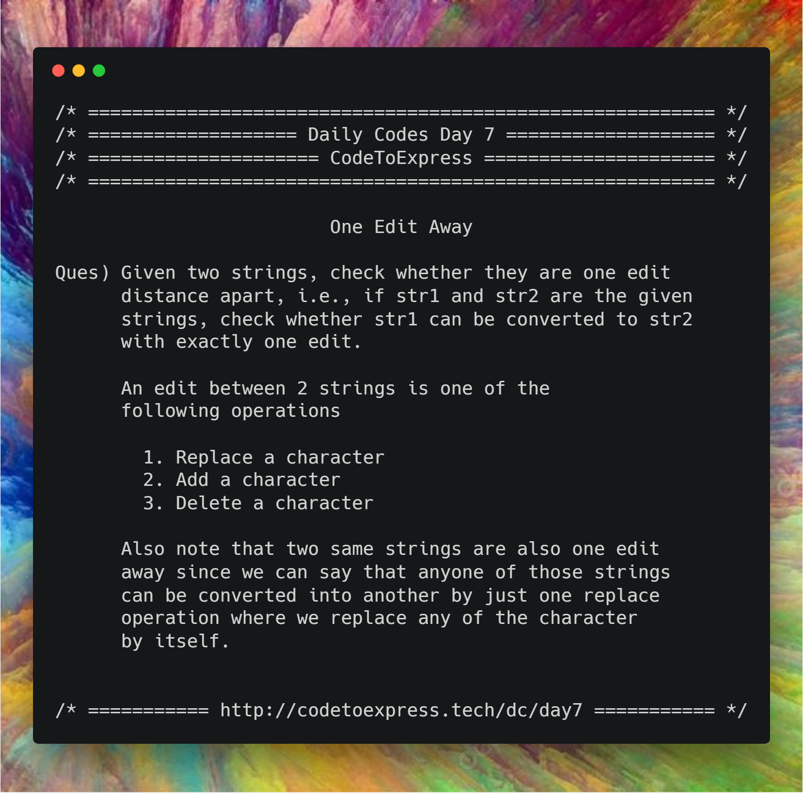

# Day 7 -- One Edit Away

**Question** -- Given two strings, check whether they are one edit distance apart, i.e., if str1 and str2 are the given strings, check whether str1 can be converted to str2 with exactly one edit.

An edit between 2 strings is one of the following operations

1. Replace a character
2. Add a character
3. Delete a character

Also note that two same strings are also one edit away since we can say that anyone of those strings can be converted into another by just one replace operation where we replace any of the character by itself.

**Example**

```
Input:
  str1 = 'abc', str2 = 'abc'
Output: yes
```

```
Input:
  str1 = 'abc', str2 = 'abd'
Output: yes
```

```
Input:
  str1 = 'abc', str2 = 'ab'
Output: yes
```

```
Input:
  str1 = 'abc', str2 = 'abcd'
Output: yes
```

```
Input:
  str1 = 'abc', str2 = 'abdef'
Output: no
```



## JavaScript Implementatiom

### [Solution](./JavaScript/sol.js)

```js
/**
 * @author MadhavBahlMD
 * @date 28/12/2018
 * METHOD - Consider the 3 cases separately,
 *   1) If difference in lengths is more than 1 then print no and exit
 *   2) If the length is same and the hamming distance is 1, print yes
 *   3) If difference in length equals 1, then loop through the bigger string and check for the corresponding elements of smaller string
 */

function oneEditAway (str1, str2) {
    let len1 = str1.length,
        len2 = str2.length;

        if (Math.abs(len1-len2) > 1) {
            // If difference in lengths is greater than 1
            console.log (`Strings "${str1}" and "${str2}" are not one edit away`);
            return 0;
        } else if(len1 === len2) {
            // if lengths are equal
            let count = 0;

            for (let i=0; i<len1; i++) {
                if (str1[i] !== str2[i])    count++;
            }

            if (count < 2) {    // hamming distance is 0 or 1
                console.log (`Strings "${str1}" and "${str2}" are one edit away`);
                return 1;
            } else {            // hamming distance >= 2
                console.log (`Strings "${str1}" and "${str2}" are not one edit away`);
                return 0;
            }

        } else {
            // Difference in lenghts = 1
            if (len1 > len2)    return checkOneEdit (str1, str2);
            else    return checkOneEdit (str2, str1);
        }
}

function checkOneEdit (str1, str2) {
    let edit = 0, j=0;
    for (let i=0; i<str1.length; i++) {
        if (str1[i] !== str2[j]) {
            edit++;
        } else {
            j++;
        }
    }

    if (edit >= 2) {
        console.log (`Strings "${str1}" and "${str2}" are not one edit away`);
        return 0;
    } else {
        console.log (`Strings "${str1}" and "${str2}" are one edit away`);
        return 1;
    }
}

// Test Cases
oneEditAway ('abc', 'abc'); // true
oneEditAway ('abc', 'abd'); // true
oneEditAway ('abc', 'ab'); // true
oneEditAway ("a", "a");  // true
oneEditAway ("abcdef", "abqdef");  // true
oneEditAway ("abcdef", "abccef");  // true
oneEditAway ("abcdef", "abcde");  // true
oneEditAway ("aaa", "abc");  // false
oneEditAway ('bc', 'abc'); // true
oneEditAway ('abc', 'abced'); // false
```

## Python Implementatiom

### [Solution 1](./Python/onewordaway.py)

```python
"""
  @author : vishalshirke7
  @date : 28/12/2018

  Method - There are 2 test cases
      1) Difference of length between 2 characters is more than one, then answer is False
      2) Traverse both the strings simultaneously
          2.1) if characters at 1st position in both strings doesn't match then increment count and if 
               it is greater than one return False
              2.1.1) increment the pointer of max length string else if equal increment both pointers
          2.2) If characters match then increment both pointers
      3) Lastly increment count if any extra remaining character is present in any string
      4) Return True if count is either 0 or 1 else return False
            
"""

def check_one_edit_away(str1, str2):
    l1, l2 = len(str1), len(str2)
    if abs(l1 - l2) > 1:
        return False
    count = 0
    i, j = 0, 0
    while i < l1 and j < l2:
        if str1[i] != str2[j]:
            if count == 1:
                return False

            if l1 > l2:
                i += 1
            elif l2 > l1:
                j += 1
            else:
                i += 1
                j += 1

            count += 1
        else:
            i += 1
            j += 1
    
    # check for last remaining character in any string, if length are not equal
    if i < l1 or j < l2: 
        count += 1

    return count <= 1


check_one_edit_away(*(input().split())) # here list unpacking is used
```

### [One Edit Distance by imkaka](./Python/one_edit_distance.py)

```py
"""
  @author : imkaka
  @date : 28/12/2018
"""
# Merges the Insert/Remove and Replace Operation in One.
# Insert and Remove are Identical Operation logically.

import sys
import math


def oneEditDistance(str1, str2):
    if(abs(len(str1) - len(str2)) > 1):
        return False
    short = str1 if len(str1) < len(str2) else str2
    longg = str1 if len(str1) > len(str2) else str2

    id1 = 0
    id2 = 0
    flag = False

    while(id2 < len(longg) and id1 < len(short)):
        if(short[id1] != longg[id2]):
            if(flag):
                return False
            flag = True
            if(len(short) == len(longg)):
                id1 += 1
        else:
            id1 += 1
        id2 += 1
    return True


def main():
    strings = input().split(' ')
    str1 = strings[0]
    str2 = strings[1]

    print(f"{str1} , {str2} : {oneEditDistance(str1, str2)}.")

    print(f" {'abcd'} , {'acd'} : {oneEditDistance('abcd', 'acd')}.")
    print(f"{'cake'} , {'bake'} : {oneEditDistance('cake', 'bake')}.")
    print(f"{'sue'} , {'chikuu'}: {oneEditDistance('sue', 'chikuu')}.")


if __name__ == '__main__':
    main()
```


## C++ Implementation

### [Solution 1](./C++/day7.cpp)

```cpp
/*
* @author : dhruv-gupta14
* @date : 28/12/2018
*/

#include<bits/stdc++.h>
using namespace std;

int main()
{
    int flag=0,x=0;
    string str1;
    getline(cin,str1);

    string str2;
    getline(cin,str2);

    int n = str1.length();
    int m = str2.length();

    if(str1 == str2)
        cout << "Yes";
    else if(n==m && str1 !=str2){
        for(int i=0; i<n; i++)
        {
            if(str1[i] != str2[i])
                flag++;
        }
        if(flag == 1)
            cout << "Yes";
        else
            cout << "No";
    } else{
        if(n == m+1)
        {
            x=0;
            for(int j=0; j<n; j++)
            {
                if(str1[j] != str2[x])
                {
                    flag++;
                }else{
                    x++;
                }
            }
        }else if(m == n+1){
            x=0;
            for(int k=0; k<m; k++)
            {
                if(str1[x] != str2[k])
                {
                    flag++;
                }else{
                    x++;
                }
            }
        }
        if(flag == 1)
            cout << "Yes";
        else
            cout << "No";
    }

    return 0;
}
```

### [OneEditDistance by @imkaka](./C++/oneEditDistance.cpp)


```cpp
/*
* @author : imkaka
* @date   : 28/12/2018
*/

#include<iostream>
#include<string>

using namespace std;

string isOneEditDistanceAway(string str1, string str2){

    int mi = str1.size() <= str2.size() ? str1.size() : str2.size();
    int ma = str1.size() > str2.size() ? str1.size() : str2.size();
    if( (ma - mi) > 1){
        return " No! ";
    }

    string sho = str1.size() < str2.size() ? str1 : str2;
    string lon = str1.size() > str2.size() ? str1 : str2;

    bool diff = false;
    int id1 = 0;
    int id2 = 0;

    while(id2 < lon.size() && id1 < sho.size()){

        if(sho[id1] != lon[id2]) {

            if(diff) return "No!";
            diff = true;

            if(sho.size() == lon.size()){
                id1++;
            }
        }else{
            id1++;
        }
        id2++;
    }
    return "Yes!";
}

int main(){

    string str1 , str2;

    cout << "Enter two strings with space in between: ";
    cin >> str1 >> str2;

    cout << str1 << " " << str2 << " => " <<isOneEditDistanceAway(str1, str2) << endl;
    cout << "======= Hard Coded Strings ======= " << endl;
    cout << "pale" << " pal" << " " << " => " <<isOneEditDistanceAway("pale", "pal") << endl;
    cout << "bake" << " cake" << " " << " => " <<isOneEditDistanceAway("bake", "cake") << endl;

    return 0;
}
```

### [Solution 3](./C++/one_edit_away.cpp)

```cpp
/*
 * @author: aaditkamat
 * @date: 28/12/2018
 */

#include <iostream>

using namespace std;

bool can_replace_a_character(string str1, string str2) {
    if (str1.size() != str2.size()) {
        return false;
    }

    int change = 0;
    
    for (int i = 0; i < str1.size(); i++) {
        if (str1[i] != str2[i]) {
            change++;
        }
    }
    
    return change == 1;
}

bool is_a_modified_substring(string str1, string str2) {
    if (str1.empty()) {
        return true;
    }

    if (str1[0] != str2[1] && str1[0] != str2[0]) {
        return false;
    }

    int found = str2.find(str1[0]);
    
    if (found == 1) {
        return str2.find(str1) != string::npos;
    }

    int j = 0, ctr = 0;
    for (int i = 0; i < str1.size(); j++) {
        if (j >= str2.size()) {
                return false;
        }
        if (str1[i] != str2[j] && ctr == 0) {
            ctr++;
            continue;
        }
        if (str1[i] != str2[j]) {
            return false;
        }
        i++;
    }
    return true;
}

bool can_add_a_character(string str1, string str2) {
    return str2.size() - str1.size() == 1 && is_a_modified_substring(str1, str2);  
}

bool can_delete_a_character(string str1, string str2) {
    return str1.size() - str2.size() == 1 && is_a_modified_substring(str2, str1);
}

bool are_one_edit_away(string str1, string str2) {
    if (str1 == str2) {
        return true;
    }
    return can_replace_a_character(str1, str2) || can_add_a_character(str1, str2) || can_delete_a_character(str1, str2);
}

int main() {
    string str1, str2;
    cout << "Enter two strings: " << endl;
    getline(cin, str1);
    getline(cin, str2);
    cout << "Are \"" << str1 << "\" and \"" << str2 << "\" one edit away? " << are_one_edit_away(str1, str2) << endl;
}
```

### [Solution](./C++/EditDistanceday7.cpp)

```cpp
/**
 * @author:divyakhetan
 * @date: 30/12/2018
 */


#include<bits/stdc++.h>
using namespace std;

int min(int x, int y, int z) 
{ 
    return min(min(x, y), z); 
} 

int main(){
	string s1, s2;
	cin >> s1 >> s2;
	
	int m = s1.length();
	int n = s2.length();
	int edit[m + 1][n + 1]; 
	
	for(int i = 0; i <= n; i++){
		edit[0][i] = i;
	}
	
	
	for(int i = 0; i <= m; i++){
		edit[i][0] = i;
	}
	
	for(int i =  1; i <= m; i++){
		for(int j = 1; j <= n; j++){
			if(s1[i - 1] == s2[j - 1]) edit[i][j] = edit[i -1 ][j - 1];
			else edit[i][j] = 1 + min(edit[ i -1][j], edit[i - 1][j - 1], edit[i][j - 1]);  
		}
	}
	
	if(edit[m][n] <= 1) cout << "At edit distance 1";
	else cout << "Not at edit distance 1";
	return 0;
}
```


## C Implementation

### [Solution 1](./C/One_edit_away.c)

```c
/**
 * @author: Rajdeep Roy Chowdhury<rrajdeeproychowdhury@gmail.com>
 * @github: https://github.com/razdeep
 * @date: 24/12/2018
 */

#include <stdio.h>
#include <string.h>
int replacable(const char *s1, const char *s2)
{
    int diff_count = 0;
    int s1_len = strlen(s1);
    int s2_len = strlen(s2);
    if (s1_len == s2_len)
    {
        for (int i = 0; i < s1_len; i++)
        {
            if (s1[i] != s2[i])
                diff_count++;
        }
        if (diff_count == 1)
            return 1;
    }
    return 0;
}
int addable(const char *s1, const char *s2)
{
    int diff_count = 0;
    int s1_len = strlen(s1);
    int s2_len = strlen(s2);
    if (s1_len == s2_len + 1)
    {
        int j = 0;
        for (int i = 0; i < s1_len; i++)
        {
            if (s1[i] == s2[j])
            {
                j++;
            }
            else
            {
                diff_count++;
            }
        }
        if (diff_count <= 1)
            return 1;
        else
            return 0;
    }
    return 0;
}
int deletable(const char *s1, const char *s2)
{
    int diff_count = 0;
    int s1_len = strlen(s1);
    int s2_len = strlen(s2);
    if (s1_len + 1 == s2_len)
    {
        int j = 0;
        for (int i = 0; i < s2_len; i++)
        {
            if (s2[i] == s1[j])
            {
                j++;
            }
            else
            {
                diff_count++;
            }
        }
        if (diff_count <= 1)
            return 1;
        else
            return 0;
    }
    return 0;
}
int main()
{
    char s1[100], s2[100];
    printf("Enter the first string ");
    scanf("%s", s1);
    printf("Enter the second string ");
    scanf("%s", s2);
    if (strcmp(s1, s2) == 0 || replacable(s1, s2) || addable(s1, s2) || deletable(s1, s2))
    {
        printf("Yes\n");
    }
    else
    {
        printf("No\n");
    }
    return 0;
}
```

### [Solution 2](./C/oneEditAway.c)

```c
/* *
   * @author : ashwek
   * @date : 29/12/2018
   */

#include <stdio.h>
#include <string.h>
#include <stdlib.h>

int oneEditAway(char Str1[], char Str2[]){

    int l1 = strlen(Str1), l2 = strlen(Str2);
    int i=0, j=0, diff=0;

    if( abs(l1 - l2) > 1 )
        return 0;

    while( diff<2 && (i < l1) && (j < l2) ){

        if( Str1[i] == Str2[j] ){
            i++;
            j++;
        }
        else{
            diff++;
            if( l1 == l2 ){
                i++;
                j++;
            }
            else if( l1 < l2 )
                j++;
            else
                i++;
        }
    }

    return diff < 2;

}

void main(){

    char Str1[20];
    char Str2[20];

    printf("Enter string 1 = ");
    scanf("%s", Str1);
    printf("Enter string 2 = ");
    scanf("%s", Str2);

    printf("%s & %s are ", Str1, Str2);
    if( oneEditAway(Str1, Str2) == 0 )
        printf("NOT ");
    printf("one edit away\n");
}
```

## Java Implementation

### [Solution](./Java/OneEditAway.java)

```java
/**
 * @author: aaditkamat
 * @date: 28/12/2018
 */
import java.util.Scanner;

class OneEditAway {
    static boolean canReplaceACharacter(String str1, String str2) {
        if (str1.length() != str2.length()) {
            return false;
        }
        int change = 0;
        for (int i = 0; i < str1.length(); i++) {
            if (str1.charAt(i) != str2.charAt(i)) {
                change++;
            }
        }
        return change == 1;
    }

    static boolean isASubstring(String str1, String str2) {
        if (str1.isEmpty()) {
            return true;
        }

        if (str1.charAt(0) != str2.charAt(1) && str1.charAt(0) != str2.charAt(0)) {
            return false;
        }

        int found = str2.indexOf(str1.charAt(0));
        
        if (found == 1) {
            return str2.substring(1).equals(str1);
        }

        int j = 0, ctr = 0;
        for (int i = 0; i < str1.length(); j++) {
            if (j >= str2.length()) {
                return false;
            }
            if (str1.charAt(i) != str2.charAt(j) && ctr == 0) {
                ctr++;
                continue;
            }
            if (str1.charAt(i) != str2.charAt(j)) {
                return false;
            }
            i++;
        }
        return true;        
    }

    static boolean canAddACharacter(String str1, String str2) {
        return str2.length() - str1.length() == 1 && isASubstring(str1, str2);  
    }

    static boolean canDeleteACharacter(String str1, String str2) {
        return str1.length() - str2.length() == 1 && isASubstring(str2, str1);
    }

    static boolean areOneEditAway(String str1, String str2) {
        if (str1.equals(str2)) {
            return true;
        }
        return canReplaceACharacter(str1, str2) || canAddACharacter(str1, str2) || canDeleteACharacter(str1, str2);
    }

    public static void main(String[] args) {
        Scanner input = new Scanner(System.in);
        String str1, str2;
        System.out.println("Enter two strings: ");
        str1 = input.next();
        str2 = input.next();
        System.out.printf("Are \"%s\" and \"%s\" one edit away? %b\n", str1, str2, areOneEditAway(str1, str2)); 
    }
}
```

## Java Implementation

### [Solution](./Java/Edit.java)

```java
/**
 * @date 28/12/18
 * @author SPREEHA DUTTA
 */
import java.util.*;
public class Edit {
    public static void main(String []args)
    {
        Scanner sc=new Scanner(System.in);
        String s1,s2;int l,c=0;char b;int i;
        System.out.println("Enter two strings ");
        s1=sc.next();
        s2=sc.next();
        
        if(Math.abs(s1.length()-s2.length())<=1)
        {
            if(s1.length()<s2.length())
                l=s1.length();
            else
                l=s2.length();
            for(i=0;i<l;i++)
            {
                if(s1.charAt(i)==s2.charAt(i))
                    c++;
            }
            if((c==l)||((c+1)==l && (s1.length()==s2.length())))
                System.out.println(s1+" and "+s2+" are one edit away");
            else
                System.out.println(s1+" and "+s2+" are not one edit away ");
        }
        else
                System.out.println(s1+" and "+s2+" are not one edit away ");
    }
}
```

## Ruby Implementation

### [Solution](./Ruby/one_edit_away.rb)

```ruby
=begin
@author: aaditkamat
@date: 28/12/2018
=end

def can_replace_a_character(str1, str2) 
    if (str1.size() != str2.size()) 
        return false
    end
    change = 0
    (str1.size()).times do |i|
        if (not str1[i] === str2[i]) 
            change += 1
        end
    end 
    return change === 1
end

def is_a_substring(str1, str2) 
    if (str1.empty?)
        return true
    end

    if (not str1[0] === str2[1] and not str1[0] === str2[0]) 
        return false
    end

    found = str2.index(str1[0])
        
    if (found == 1) 
        return str2[1..str2.length][str1] === str1
    end

    i = 0
    j = 0
    ctr = 0
    until i >= str1.length do 
        if j >= str2.length
            return false
        end
        if (not str1[i] === str2[j] and ctr === 0) 
            ctr += 1
            j += 1
            next
        end
        if (not str1[i] === str2[j]) 
            return false
        end
        i += 1
        j += 1
    end
    true
end

def can_add_a_character(str1, str2) 
    str2.size() - str1.size() === 1 and is_a_substring(str1, str2)  
end

def can_delete_a_character(str1, str2) 
    str1.size() - str2.size() === 1 and is_a_substring(str2, str1)
end

def are_one_edit_away(str1, str2) 
    if (str1 === str2) 
        return true
    end
    can_replace_a_character(str1, str2) or can_add_a_character(str1, str2) or can_delete_a_character(str1, str2)
end 

def main
    puts "Enter two strings: "
    str1 = gets().chomp!
    str2 = gets().chomp!
    puts "Are \"#{str1}\" and \"#{str2}\" one edit away? #{are_one_edit_away(str1, str2)}"
end

main
```