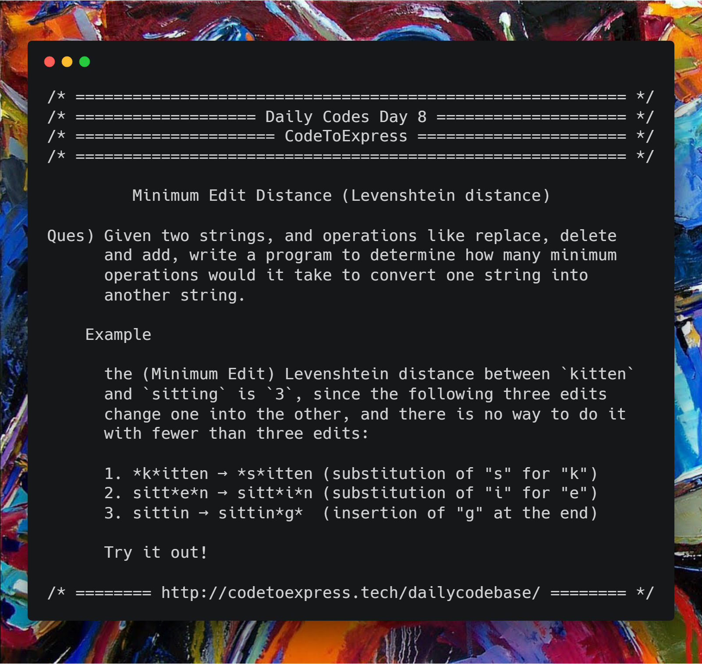

# Day 8 - Maximum Edit Distance (Levenshtein Distance)

Given two strings, and operations like replace, delete and add, write a program to determine how many minimum operations would it take to convert one string into another string.

**Hint: Use Lavenshtein Distance**

## Example (source: [Wikipedia](https://en.wikipedia.org/wiki/Levenshtein_distance))

For example, the (Minimum Edit) Levenshtein distance between `kitten` and
`sitting` is `3`, since the following three edits change one
into the other, and there is no way to do it with fewer than
three edits:

1. **k**itten → **s**itten (substitution of "s" for "k")
2. sitt**e**n → sitt**i**n (substitution of "i" for "e")
3. sittin → sittin**g** (insertion of "g" at the end).

## Levenshtein distance

Levenshtein distance between two words is the minimum number of single-character edits (insertions, deletions or substitutions) required to change one word into the other. It is named after the Soviet mathematician Vladimir Levenshtein, who considered this distance in 1965.

### Definition

Mathematically, the Levenshtein distance between two strings `a` and `b` (of length `|a|` and `|b|` respectively) is given by  where,


where

is the indicator function equal to `0` when

and equal to 1 otherwise, and

is the distance between the first `i` characters of `a` and the first
`j` characters of `b`.

Therefore, the minimum edit distance between `a` and `b` is the last element in the edit distance matrix

Read more at [Wikipedia](https://en.wikipedia.org/wiki/Levenshtein_distance)



## JavaScript Implementation

### [Solution](./JavaScript/sol.js)

```js
/**
 * @author MadhavBahlMD
 * @date 31/12/2018
 */

function minEditDist (str1, str2) {
    // Initialize the distance matrix with all zeroes
    let len1 = str1.length,
        len2 = str2.length,
        distMatrix = [];

    for (let i=0; i<=len2; i++) {
        let row = [];
        for (let j=0; j<=len1; j++) {
            // Initialie the edit distance matrix by all zeroes
            row.push(0);
        }
        distMatrix.push(row);
    }

    // Fill the first row
    for (let i=0; i<=len1; i++) {
        distMatrix[0][i] = i;
    }

    // Fill the first column
    for (let j=0; j<=len2; j++) {
        distMatrix[j][0] = j;
    }

    // Fill the edit distance matrix
    for (let i=1; i<=len2; i++) {
        for (let j=1; j<=len1; j++) {
            if (str1[i-1] === str2[j-1]) {
                distMatrix[i][j] = distMatrix[i-1][j-1];
            } else {
                distMatrix [i][j] = 1 + Math.min (
                                            distMatrix[i-1][j-1],
                                            distMatrix[i-1][j],
                                            distMatrix[i][j-1]
                                          );
            }
        }
    }

    return distMatrix[len2][len1];
}

console.log(minEditDist ('abcdefgs', 'agced'));
console.log(minEditDist('kitten', 'sitting'));
```

## C++ Implementation

### [Solution 1 by @dhruv-gupta14](./Cpp/day8.cpp)

```cpp
/*
* @author : dhruv-gupta14
* @date : 31/12/2018
*/

#include<bits/stdc++.h>
using namespace std;

int min(int x, int y, int z)
{
    return min(min(x, y), z);
}

int levenshtein_distance(string str1, string str2, int m, int n)
{
    int ld[m+1][n+1];

    for (int i=0; i<=m; i++)
    {
        for (int j=0; j<=n; j++)
        {
            if (i==0)
                ld[i][j] = j;

            else if (j==0)
                ld[i][j] = i;


            else if (str1[i-1] == str2[j-1])
                ld[i][j] = ld[i-1][j-1];

            else
                ld[i][j] = 1 + min(ld[i][j-1], ld[i-1][j], ld[i-1][j-1]);
        }
    }

    return ld[m][n];
}

int main()
{
    string str1,str2;
    cin >> str1 >> str2;

    cout << levenshtein_distance(str1, str2, str1.length(), str2.length());

    return 0;
}
```

### [Solution 2 by @profgrammer](./Cpp/profgrammer_editdistance.cpp)
```cpp
/*
  *@author: profgrammer
  *@date: 31-12-2018
*/

#include <bits/stdc++.h>
#define inf 100000000
using namespace std;

string s1, s2;

int dp[1500][1500];

// function that returns minimum edits required to convert s1[0 .. i-1] into s2[0 .. j-1]
int minEdit(int i, int j){
  // base cases. if s1 finishes we need j insertions, if s2 finishes we need i insertions
  if(i == 0) return j;
  if(j == 0) return i;
  // housekeeping for dp with memoisation
  if(dp[i][j] != inf) return dp[i][j];
  // if the last characters are the same, no need to change anything and move both pointers by 1 unit
  if(s1[i-1] == s2[j-1]) {
    return dp[i][j] = minEdit(i-1, j-1);
  }
  // replace s1[i] to be s2[j]. the strings to be checked are still s1[0 .. i-1] and s2[0 .. j-1] but the cost is +1
  int minReplace = 1 + minEdit(i-1, j-1);
  // delete s1[i], cost is +1 and the strings are now s1[0 .. i-1] and s2[0 .. j] because we need to compare the i-1th character with the jth character
  int minDelete = 1 + minEdit(i-1, j); 
  // insert a character into s1 at index i. cost is +1 and now the strings to be checked are s1[0 .. i] because the ith character isn't compared yet and s2[0 .. j-1]
  int minInsert = 1 + minEdit(i, j-1);
  // return min of these 3 values
  return dp[i][j] = min(minReplace, min(minDelete, minInsert));
}

int main() {
  for(int i = 0;i < 1500;i++){
    for(int j = 0;j < 1500;j++) dp[i][j] = inf;
  }
  cin>>s1>>s2;
  cout<<"The minimum edit distance is: ";
  cout<<minEdit(s1.size(), s2.size())<<endl;
}
```

### [Solution 3 by @divyakhetan](./Cpp/EditDistanceday8.cpp)

```cpp
/**
 * @author:divyakhetan
 * @date: 31/12/2018
 */


#include<bits/stdc++.h>
using namespace std;

int min(int x, int y, int z) 
{ 
    return min(min(x, y), z); 
} 

int main(){
	string s1, s2;
	cin >> s1 >> s2;
	
	int m = s1.length();
	int n = s2.length();
	int edit[m + 1][n + 1]; 
	
	for(int i = 0; i <= n; i++){
		edit[0][i] = i;
	}
	
	
	for(int i = 0; i <= m; i++){
		edit[i][0] = i;
	}
	
	for(int i =  1; i <= m; i++){
		for(int j = 1; j <= n; j++){
			if(s1[i - 1] == s2[j - 1]) edit[i][j] = edit[i -1 ][j - 1];
			else edit[i][j] = 1 + min(edit[ i -1][j], edit[i - 1][j - 1], edit[i][j - 1]);  
		}
	}
	
	cout << "min edit distance is " << edit[m][n];
	return 0;
}
``` 


### [Solution 4 by @aaditkamat] (./C++/levenshtein_distance.cpp)

```cpp
/**
 * @author: aaditkamat
 * @date: 31/12/2018
 */
 
#include <string>
#include <iostream>
#include <algorithm>

using namespace std;

int ind(char m, char n) {
    return m == n ? 0 : 1;
}

int dist(string first, string second) {
    int firstLength = first.length(), secondLength = second.length();
    int m[firstLength + 1][secondLength + 1];
    for (int i = 1; i <= firstLength; i++) {
        m[i][0] = i;
    }
    for (int i = 0; i <= secondLength; i++) {
        m[0][i] = i;
    }
    for (int i = 1; i <= firstLength; i++) {
        for (int j = 1; j <= secondLength; j++) {
            int values[] = { m[i - 1][j] + 1, m[i][j - 1] + 1, m[i - 1][j - 1] + ind(first[i], second[j]) };
            m[i][j] = *min_element(begin(values), end(values));
        }
    }
    return m[firstLength][secondLength];
}
int main() {
    string first, second;
    cout << "Enter two strings: " << endl;
    getline(cin, first);
    getline(cin, second);
    cout << "The Levenshtein distance between \"" << first << "\" and \"" << second << "\" is: " << dist(first, second) << endl;
```

### C Implementation

### [Solution 1](./C/levenshtein_distance.c)

```c
/**
 * @author: Rajdeep Roy Chowdhury<rrajdeeproychowdhury@gmail.com>
 * @github: https://github.com/razdeep
 * @date: 31/12/2018
 */
#include <stdio.h>
#include <string.h>

int min(int x, int y, int z)
{
    if (x <= y && x <= z)
        return x;
    else if (y <= x && y <= z)
        return y;
    else
        return z;
}

int levenshtein_distance(const char *str1, const char *str2)
{
    int m = strlen(str1);
    int n = strlen(str2);
    int ld[m + 1][n + 1];

    for (int i = 0; i <= m; i++)
    {
        for (int j = 0; j <= n; j++)
        {
            if (i == 0)
                ld[i][j] = j;

            else if (j == 0)
                ld[i][j] = i;

            else if (str1[i - 1] == str2[j - 1])
                ld[i][j] = ld[i - 1][j - 1];

            else
                ld[i][j] = 1 + min(ld[i][j - 1], ld[i - 1][j], ld[i - 1][j - 1]);
        }
    }

    return ld[m][n];
}

int main()
{
    const int STRING_LENGTH=100;
    char str1[STRING_LENGTH], str2[STRING_LENGTH];
    scanf("%s%s",str1,str2);

    printf("%d\n",levenshtein_distance(str1, str2));

    return 0;
}

```

## Python Implementation

### [Solution](./Python/minimum_edit_distance.py)

```py

"""
 @author : imkaka
 @date   : 31/12/2018

"""

import sys


def min_edit_distance(str1, str2):
    len1 = len(str1)
    len2 = len(str2)

    # Matrix inilization
    dp = [[0 for i in range(len2 + 1)]
          for j in range(len1 + 1)]

    for i in range(1, len1 + 1):
        dp[i][0] = i

    for j in range(1, len2 + 1):
        dp[0][j] = j

    # Fill the DP matrix.

    for j in range(1, len2 + 1):
        for i in range(1, len1 + 1):
            if(str1[i - 1] == str2[j - 1]):
                dp[i][j] = dp[i - 1][j - 1]
            else:
                dp[i][j] = 1 + min(dp[i - 1][j - 1],
                                   dp[i][j - 1],
                                   dp[i - 1][j])
    return dp[len1][len2]


def main():

    print("==================Minimum Edit Distance====================")
    print()

    print(min_edit_distance("kitten", "sitting"))
    print(min_edit_distance("abcdef", "abcdhgikll"))


if __name__ == '__main__':
    main()
    
``` 

## Java Implementation

### [Solution](./Java/Levenshtein.java)

```java
/**
 * @date 31/12/18
 * @author SPREEHA DUTTA
 */
import java.util.*;
public class Levenshtein {
    public static int leven_dist(char []s,char []t)
    {
        int d[][]=new int[s.length+1][t.length+1];
        int i,j;int sub;int a,b,c;
        for(i=0;i<=s.length;i++)
        {
            for(j=0;j<=t.length;j++)
            {
                d[i][j]=0;
            }
        }
        for(i=1;i<=s.length;i++)
            d[i][0]=i;
        for(j=1;j<=t.length;j++)
            d[0][j]=j;
        for(j=1;j<=t.length;j++)
        {
            for(i=1;i<=s.length;i++)
            {
                if(s[i-1]==t[j-1])
                {
                    d[i][j]=d[i-1][j-1];
                }
                else
                {
                    a=d[i-1][j-1]+1;
                    b=d[i][j-1]+1;
                    c=d[i-1][j-1]+1;
                    //System.out.println(a+" "+b+" "+c);
                    d[i][j]=Math.min((Math.min(a,b)),c);
                }
            }
        }
        return d[s.length][t.length];
    }
    public static void main(String []args)
    {
        String s1,s2;int dist;
        Scanner sc=new Scanner(System.in);
        System.out.println("Enter two strings ");
        s1=sc.nextLine();
        s2=sc.nextLine();
        char s[]=s1.toCharArray();
        char t[]=s2.toCharArray();
        if(s.length<t.length)
            dist=leven_dist(s,t);
        else
            dist=leven_dist(t,s);
        System.out.println("Minimum no of operations are "+dist);
    }
}

```

### [Solution 2] (./Java/LevenshteinDistance.java)

```java
/**
 * @author: aaditkamat
 * @date: 31/12/2018
 */

import java.util.Arrays;
import java.util.Scanner;

class LevenshteinDistance {
    public static int ind(char m, char n) {
        return m == n ? 0 : 1;
    }

    public static int dist(String first, String second) {
        int firstLength = first.length(), secondLength = second.length();
        int[][] m = new int[firstLength + 1][secondLength + 1];
        for (int i = 1; i <= firstLength; i++) {
            m[i][0] = i;
        }
        for (int i = 0; i <= secondLength; i++) {
            m[0][i] = i;
        }
        for (int i = 1; i <= firstLength; i++) {
            for (int j = 1; j <= secondLength; j++) {
                int[] values = { m[i - 1][j] + 1, m[i][j - 1] + 1, m[i - 1][j - 1] + ind(first.charAt(i - 1), second.charAt(j - 1)) };
                Arrays.sort(values);
                m[i][j] = values[0];
            }
        }
        return m[firstLength][secondLength];
    }
    public static void main(String[] args) {
        String first, second;
        Scanner input = new Scanner(System.in);
        System.out.println("Enter two strings: ");
        first = input.next();
        second = input.next();
        System.out.printf("The Levenshtein distance between \"%s\" and \"%s\" is: %d\n", first, second, dist(first, second));
     }
```

## Python Implementation

### [Solution](./Python/levenshtein_distance.py)

```python
'''
@author: aaditkamat
@date: 31/12/2018
'''

def ind (m, n):
    return 0 if m == n else 1


def dist(first, second):
    first_length = len(first)
    second_length = len(second)

    m = []
    for i in range(first_length + 1):
        row = []
        for j in range(second_length + 1):
           row.append(0)
        m.append(row)

    for i in range(1, first_length + 1):
        m[i][0] = i;

    for i in range(second_length + 1):
        m[0][i] = i;

    for i in range(1, first_length + 1):
        for j in range(1, second_length + 1):
            values = [m[i - 1][j] + 1, m[i][j - 1] + 1, m[i - 1][j - 1] + ind(first[i - 1], second[j - 1])]
            values.sort()
            m[i][j] = values[0]


    return m[first_length][second_length]

def main():
    print('Enter two strings: ')
    first = input()
    second = input()
    print(f'The Levenshtein distance between \"{first}\" and \"{second}\" is: {dist(first, second)}')

main()
```

## Ruby Implementation

### [Solution](./Ruby/levenshtein_distance.rb)

```ruby
=begin
@author: aaditkamat
@date: 31/12/2018   
=end
def ind (m, n)
    m == n ? 0 : 1
end

def dist(first, second)
    first_length = first.length
    second_length = second.length

    m = Array.new(first_length + 1) { Array.new(second_length + 1) }
    (first.length + 1).times do |i|
        m[i][0] = i;
    end
    (second_length + 1).times do |i|
        m[0][i] = i;
    end
    (1..first_length).each do |i|
        (1..second_length).each do |j|
            values = [m[i - 1][j] + 1, m[i][j - 1] + 1, m[i - 1][j - 1] + ind(first[i - 1], second[j - 1])];
            values.sort!
            m[i][j] = values[0]
        end
    end
    m[first_length][second_length]
end

def main
    puts "Enter two strings: "
    first = gets.chomp!
    second = gets.chomp!
    puts "The Levenshtein distance between \"#{first}\" and \"#{second}\" is: #{dist(first, second)}"
end

main
```

### Have Another solution?

The beauty of programming lies in the fact that there is never a single solution to any problem.

In case you have an alternative way to solve this problem, do contribute to this repository (https://github.com/CodeToExpress/dailycodebase)