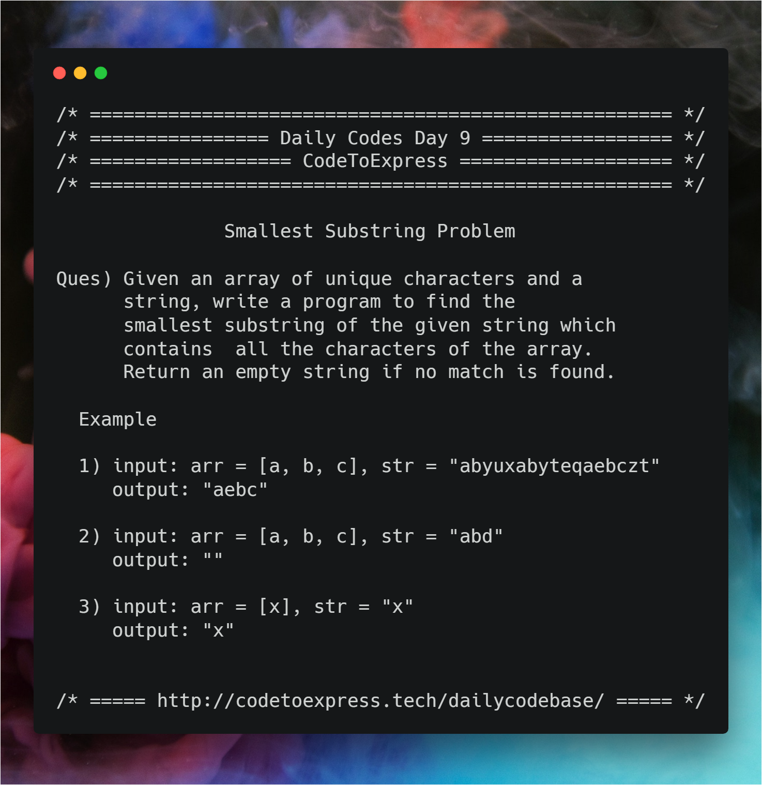

# Day 9 - Smallest Substring Problem

**Question** -- Given an array of unique characters and a string, write a program to find the smallest substring of the given string which contains all the characters of the array.

**Example**

```
input:
    arr = [a, b, c]
    str = "abyuxabyteqaebczt"
output: "aebc"
```



## JavaScript Implementation

### [Solution 1](./JavaScript/sol1.js)

```js
/**
 * @author MadhavBahlMD
 * @date 01/01/2019
 * METHOD (Using Array)
 * - Initalize an empty array `strArr` that will store all the substrings that contains all the array elements
 * - iterate over each character of string and check whether it is present in the array
 * - If it is not present in the array, then continue, else duplicate the array into another temporary array `tempArr` and remove the current letter from the temp arr
 * - Take another variable j, and iterate over the rest of the string till the last remaining element in the tempArr, and keep appending each character in some temporary strinig.
 * - Stop the iteration if either it is the end of the string, or tempArr is empty
 * - if the current (temporary) string contains all elements of the array, store push it to `strArr`
 * - After the iterations are complete
 */

function smallestSubstr (str, arr) {
    let strArr = [],
        strLen = str.length;

    // iterate over the string to find any match
    for (let i=0; i<strLen; i++) {
        // Check whether the current letter exists in array
        let pos = arr.indexOf(str[i]);
        // if there is only one character in the array return that as the smallest substring
        if (arr.length === 1 && str[i] === arr[0])  return str[i];

        // Check for the remaining characters
        if (pos >= 0) {
            // Duplicate the arr (To Prevent Shallow Copy)
            let tempArr = JSON.parse(JSON.stringify(arr));

            // Append to a temporary string and remove that element from tempArr
            let currentStr = tempArr[pos];
            tempArr.splice (pos, 1);

            // Iterate over the remaining string elements
            let j=i+1, flag = 0;
            while (j<strLen) {
                let nextPos = tempArr.indexOf(str[j]);
                currentStr += str[j];
                if (nextPos >= 0) {
                    tempArr.splice (nextPos, 1);
                }
                if (tempArr.length<=0) {
                    flag = 1;
                    break;
                }
                j++;
            }

            if (flag === 1)  strArr.push (currentStr);
        }
    }

    // Return empty string if strArr is empty
    if (strArr.length === 0)   return "";

    // find the minimum index in cntArr
    let minCntIndex = 0;
    for (let i=1; i<strArr.length; i++) {
        if (strArr[minCntIndex].length > strArr[i].length) {
            minCntIndex = i;
        }
    }

    return (strArr[minCntIndex]);
}

console.log (smallestSubstr ('abyuxabyteqaebczt', ['a','b','c']));
console.log (smallestSubstr ("abd", ['x','y','z']));
console.log (smallestSubstr ("x", ['x']));
console.log (smallestSubstr ("afekbtcodebancfeger", ["a","b","c"]));
```

## Java Implementation

### [Solution](./Java/minSubstring.java)

```java
/**
 * @date 01/01/19
 * @author SPREEHA DUTTA
 */
import java.util.*;
public class minSubstring {

    public static boolean check (String s,char []c)
    {
        String str=new String(c);int k=0;
        for(int i=0;i<c.length;i++)
        {
            if(s.contains(str.substring(i,i+1)))
              k++;
        }
        if(k==c.length)
            return true;
        else
            return false;
    }

    public static void generate(String str,char c[]) {
        String s;int min;
        min=str.length();String s1="";
        for(int i=0;i<=str.length()-1;i++)
        {
            for(int j=i+1;j<=str.length();j++)
            {
                s=str.substring(i,j);
                if(check(s,c)==true)
                {
                    if(min>=s.length())
                    {
                        min=s.length();
                        s1=s;
                    }
                }
            }
        }
        System.out.println(s1);
    }

    public static void main(String[] args) {
        Scanner sc=new Scanner(System.in);
        String s;int i,n;
        System.out.println("Enter a string");
        s=sc.next();
        System.out.println("Enter size of character array");
        n=sc.nextInt();
        char a[]=new char[n];
        for(i=0;i<n;i++)
            a[i]=sc.next().charAt(0);
        generate(s,a);
    }
}
```

## C++Implementation

### [Solution](./C++/minStringWindowday9.cpp)

```cpp
/**
 * @author:divyakhetan
 * @date: 2/1/2019
 */


#include <bits/stdc++.h>
using namespace std;

int main() {
  string s;
  cin >> s;
  int n; // no.of char
  cin >> n;
  char pattern[n];
  for(int i = 0; i < n; i++) cin >> pattern[i];


  int hash_str[256];
  int hash_pattern[256];

  memset(hash_str, 0, sizeof(hash_str));
  memset(hash_pattern, 0, sizeof(hash_pattern));

  if(n > s.length()) cout << "Not possible";
  else{

    for(int i = 0; i < n; i++){
      char x = pattern[i];
      hash_pattern[x]++;
    }


    int count = 0;
    int start = 0;
    int start_ind = -1;
    int minlen = INT_MAX;
    for(int i = 0; i < s.length(); i++){
      char x = s[i];
      hash_str[x]++;

      //check if part of pattern also and we need to avoid overcounting for a particular char.

      if(hash_pattern[x] != 0 && hash_str[x] <= hash_pattern[x]) count++;

      // avoid useless char from the start

      if(count == n){

        while(hash_str[s[start]] > hash_pattern[s[start]] ){
          cout << s[start] << " ";
          hash_str[s[start]]--;
          start++; // move start to right
        }

        int len = i - start + 1;
        if(len < minlen){
          minlen = len;
          start_ind = start;
        }
      }


    }
    // if(start_ind == -1) cout << "No such substring";
    // else
    // cout << s.substr(start_ind, minlen);
  }
}
```

### [Solution by @imkaka](./C++/minSubString.cpp)

```cpp

/*
* @author : imkaka
* @date   : 2/1/2019
*/

#include<bits/stdc++.h>

using namespace std;

string minSubString(string str, vector<char> arr){
    // Corner case
    int len  = str.size();
    if(arr.size() > len)
    {
        // cout << "No Answer" << endl;
        return "No Answer";
    }

    set<char> s;
    for(char c : arr){
        s.insert(c);
    }
    int lenMin = len+1;
    string result = "";
    for(int i = 0; i < len; ++i){
        set<char>tempS = s;
        int temp = 0;
        string tempStr = "";
        for(int j = i; j < len; ++j){

           if(tempS.find(str[j]) != tempS.end()){
                tempS.erase(str[j]);
                temp++;
                tempStr += str[j];
            }
            else{
                temp++;
                tempStr += str[j];
            }

            if(tempS.empty()){
                if(lenMin > temp){
                    lenMin = temp;
                    result = tempStr;
                }
                break;
            }

        }
    }

    return result;
}

int main(){

    string str = "abyuxabyteqaebczt";
    vector<char> arr = {'a', 'b', 'c'};
    if(minSubString(str, arr) != "")
     cout << "Substring: " << minSubString(str, arr) <<  endl;
    else cout << "No Sollution" << endl;

    string str2 = "abx";
    vector<char> arr2 = {'a', 'b', 'c'};
    if(minSubString(str2, arr2) != "")
     cout << "Substring: " << minSubString(str2, arr2) <<  endl;
    else cout << "No Sollution" << endl;

    string str3 = "x";
    vector<char> arr3 = {'x'};
    if(minSubString(str3, arr3) != "")
     cout << "Substring: " << minSubString(str3, arr3) <<  endl;
    else cout << "No Sollution" << endl;


    return 0;
}

```

### Have Another solution?

The beauty of programming lies in the fact that there is never a single solution to any problem.

In case you have an alternative way to solve this problem, do contribute to this repository :)
